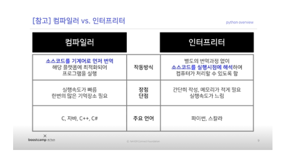

# 강의 복습내용 

## 파이썬 개요
---


- 플랫폼 독립적 
    - 플랫폼  = OS : 프로그램이 실행되는 운영체제를 플랫폼이라고함
- 인터 프린터
    - 소스코드를 바로 실행할 수 있게 지원하는 프로그램 실행 방법
- 객체 지향
- 동적 타이핑 언어




## 파이썬의 특징
---
- 객체 지향적 언어 
    - 실행 순서가 아닌 단위 모듈(객체) 중심으로 프로그램을 작성 하나의 객체는 어떤 목적을 달성하기 위한 행동과 속성을 가지고 있음
- 동적 타이핑 언어
    - 프로그램이 실행하는 시점에프로그램이 사용해야할 데이터에 대한 타입을 결정함

## Why Python ?
---
1. 쉽고 간단하다
    - 이해하기 쉬운 문법 ( 사람의 시간이 기계의 시간보다 중요 )
2. 대부분의 라이브러리가 이미 다른 사용자에 의해 구현되어 있음(특히 통계, 데이터 분석)
3. 압도적 점유율 ( 데이터 분석 분야에서 거의 표준 )

# 피어세션 정리

- [x] 조이름 정하기
    - **연매출20조**
- [x] 모더레이터 정하기
    - 1주일씩 돌아가면서 하기로함
- [x] 피어 규칙 정하기
    - 존중, 지각이나 학습 소홀 시 패널티 등등..
- [x] 스터디 계획 정하기
    - 당일 학습 내용 정리 
    - 필수 논문 스터디 공유
    - 캐글

# 개인공부
---
https://www.youtube.com/watch?v=ZyhVh-qRZPA&list=PL-osiE80TeTsWmV9i9c58mdDCSskIFdDS


```python
import pandas as pd
df = pd.read_csv('survey_results_public.csv')
df.head()
```


```python
print(df.shape)
```

    (64461, 61)
    


```python
df.tail(5)
```


```python
import pandas as pd
scheme_df = pd.read_csv('survey_results_public.csv')
scheme_df.head()
```


```python
pd.set_option('display.max_columns',85)
pd.set_option('display.max_row',85)
```


```python
df.head()
```


```python
people = {
    'first' : ['Corey','Jane','John' ],
    'last' : ['Schafer','Doe','Doe'],
    'email' :['CoreyMschafer@gmail.com','Janedoe@email.com','Johndoe@email.com']
}

df = pd.DataFrame(people)
df
```


```python
df['email']
```


    0    CoreyMschafer@gmail.com
    1          Janedoe@email.com
    2          Johndoe@email.com
    Name: email, dtype: object


```python
type(df['email'])
```


    pandas.core.series.Series


```python
df[['last','email']]
```


<div>
<style scoped>
    .dataframe tbody tr th:only-of-type {
        vertical-align: middle;
    }

    .dataframe tbody tr th {
        vertical-align: top;
    }

    .dataframe thead th {
        text-align: right;
    }
</style>
<table border="1" class="dataframe">
  <thead>
    <tr style="text-align: right;">
      <th></th>
      <th>last</th>
      <th>email</th>
    </tr>
  </thead>
  <tbody>
    <tr>
      <th>0</th>
      <td>Schafer</td>
      <td>CoreyMschafer@gmail.com</td>
    </tr>
    <tr>
      <th>1</th>
      <td>Doe</td>
      <td>Janedoe@email.com</td>
    </tr>
    <tr>
      <th>2</th>
      <td>Doe</td>
      <td>Johndoe@email.com</td>
    </tr>
  </tbody>
</table>
</div>


```python
df.columns
```


    Index(['first', 'last', 'email'], dtype='object')


```python
df.iloc[[0,1],2]
```


    0    CoreyMschafer@gmail.com
    1          Janedoe@email.com
    Name: email, dtype: object


```python
df = pd.read_csv('survey_results_public.csv')
df.columns
```


    Index(['Respondent', 'MainBranch', 'Hobbyist', 'Age', 'Age1stCode', 'CompFreq',
           'CompTotal', 'ConvertedComp', 'Country', 'CurrencyDesc',
           ...
           'WebframeWorkedWith', 'WelcomeChange', 'WorkWeekHrs', 'YearsCode',
           'YearsCodePro'],
          dtype='object')


```python
df['Hobbyist'][:5]
```


    0    Yes
    1     No
    2    Yes
    3    Yes
    4    Yes
    Name: Hobbyist, dtype: object


```python
df['Hobbyist'].value_counts()
```


    Yes    50388
    No     14028
    Name: Hobbyist, dtype: int64


