# 수업복습
---

## 최적화(optimization) 기법
---

### Generalization
---
일반적으로 학습을 시키게되면 train eroor가줄어듬  
그러나 어느정도 시간이지나면 test error 는 오히려 올라간다.

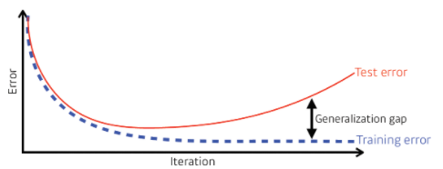
> Generalization 이 좋다 -> 이 모델의 성능이 학습데이터와 비슷하게 나올것이다. 

### Underfitting vs. Overfitting
---
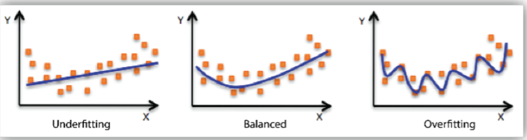
-  `Underfitting`은 학습 데이터에 대한 학습이 덜 된 상태
- `Ovefitting`은 너무 학습 데이터에만 fit되는 학습이 이루어진 사애
- `Balanced Model`은 둘 사이의 적정선을 유지하는 모델
### Cross-validation
---
일반적으로 Corss-validation통해 최적의 하이퍼 파라미터를 찾고,  
마지막에는 train 데이터셋 모두를 사용해서 학습시킴(많은 데이터를 학습시키면 좋으니까)  
 

`학습 데이터를 K개로 나누어서 성능 검증`
  
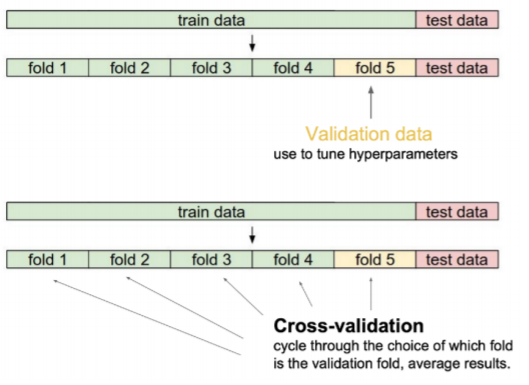

### Bias and Variance
---
- bias, 편향이 높으면 예측값 자체가 정답과 멀리 떨어져 있음을 의미
- Variance, 분산이 낮다는 것은 출력이 일관적이라는 것을 뜻함.
> Bias가 커지면 Variance가 작아지고, Variance가 커지면 Bias가 작아짐
적절한 지점을 찾는게 목표.

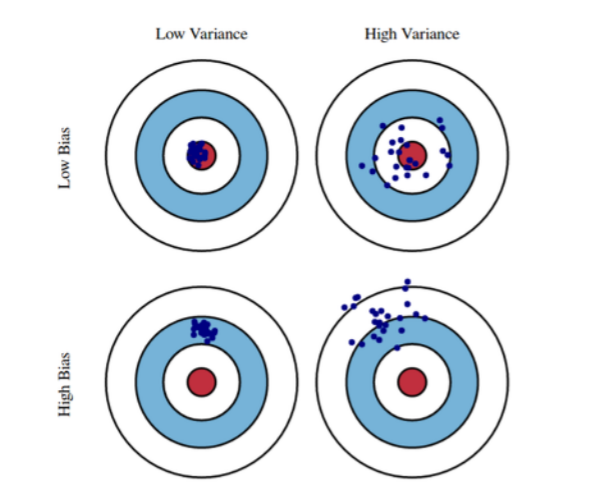

### Bootstrapping
---
학습데이터가 고정되어있을때 그 안에서 서브샘플링을 통해 학습데이터를 여러개를 만들어 여러 모델을 만듦

이 여러개의 모델을 어떻게 활용하느냐에 따라 Bagging과 Boosting으로 갈리게 된다.

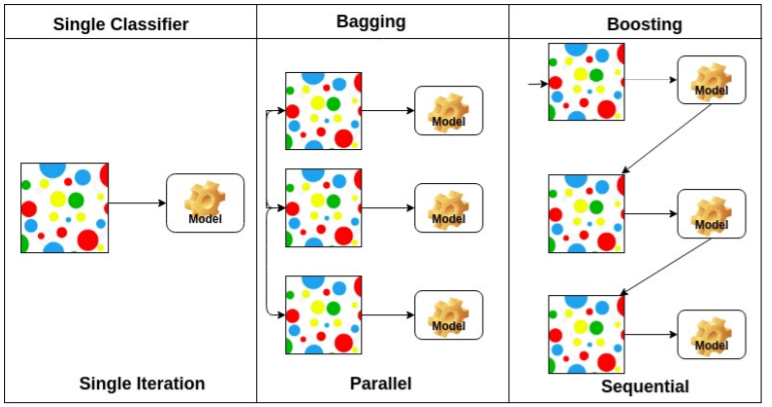

#### Bagging vs. Boosting
---

- Bagging (Booststrapping aggregating)
    - 여러개의 모델을 bootstrapping으로 학습시킴
    - 일반적으로 10만개의 데이터를 한모델로 학습시키는 것보다 2만개씩 5개의 모델로 학습시켜 그 결과값을 평균내는것이 더 좋음.
- Boosting
    - 학습 데이터가 10만개가 있으면 8만개의 데이터는 잘 예측하고 2만개의 데이터를 잘예측못한다 -> 다음 모델은 2만개의 데이터에 집중 -> ...-> 이렇게 모델을 만들어서 모델을 합침.
    

### 경사 하강법 (Gradient Descent Methods)
---
- Stochastic gradient descent
    - 배치 사이즈가 1
    - 10만개의 데이터가 있으면 한번에 한개를 구해서 업데이트하고..반복..

- Mini-batch gradient descent
    - 10만개 데이터를  다 사용하지는 않지만 한개를 사용하지도 않는.. 예를 들어 240개를 뜯어서 거기에 대해 gradient를 구해서 업데이트하고 ... 반복...

- Batch gradient descent
    - 10만개의 gradient 를 한번에 구하고 모델에 업데이트하고 ... 반복 -> GPU 터짐...

### Batch-size Matters
---
Batch-size를 크게하면 sharp minimizer에 도달하고
Batch-size를 작게하면  flat minimizer에 도달한다는 것을 발견.
 

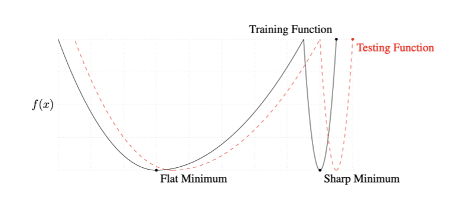

 
우리가 찾고싶은건 tresting funcion에서 Minimum 인데, 
flat Minimun은 train fuction에서 조금멀어져도 test fuction 에서도 적당히 멀어진다.  
그러나 Sharp Minimum은 train function 에서 조금만 멀어져도 test Function에서 엄청 멀어진다. 

## Gradient Descent Methods
---

### GradientDescent
---
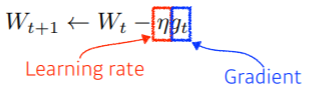
 
문제점 : learning rate를 지정 하는게 너무 어렵다.

### Momentum
---
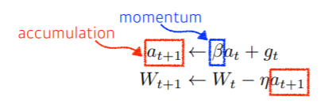
 

장점 : 한번흘러간 gradient 방향을 유지시켜 줌 그래서 gradient가 많이 왔다갔다해도 어느정도 잘 학습이됨.

### Nesterov Accelerated Gradient
---
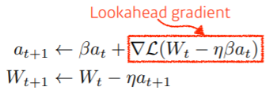
 
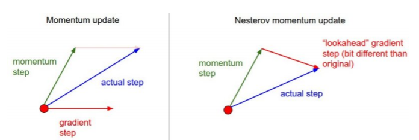
 
한번 이동한  a라고 불리우는 현재 정보가있으면 a로 한번 가보고 거기서의 계산값을 가지고 accumulation 함.
장점 : local minimum에 더빨리 도달

### Adagrad
---
이때까지 파라미터가 많이 변한 파라미터는 적게 변화 시키고, 적게 변화된 파라미터는 많이 변화시킴.
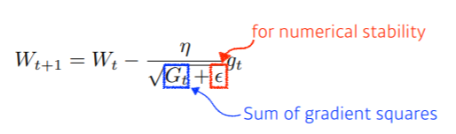
 
단점 : 진행될수록 학습이 되지 않는 현상 

### Adadelta
---
Adagrad는 처음부터 지금까지 모든 파라미터의 변화는 보지만   
Adadelta는 적절한 window size 만큼 파라미터의 변화를 봄

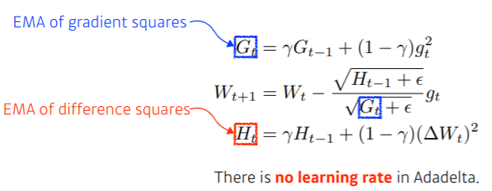

### RMSprop
---
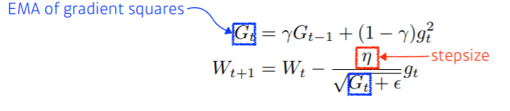
Adaelta에 stepsize를 넣은게 다 ?

### Adam
---
일반적으로 가장 무난하게 사용
RMSprop 에서 Momentum을 같이 사용함. 
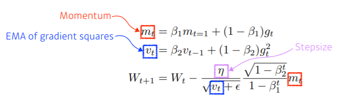

    

## Regularization
---

### Early stopping
---
지금까지 학습된 모델의 성능을 평가해보고 그 loss가 커질 거같은 지점에서 빨리 멈추자 .

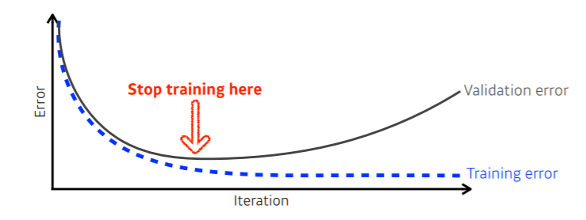

### Parameter Norm Penalty
---
- 파라미터가 너무 커지지 않게 규제 하는 것  

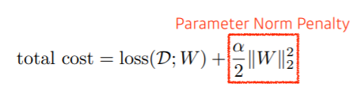

### Data Augmentation 
---
 - 데이터가 무한히 많으면 웬만하면 다 잘됨.
 - 그런데 데이터는 한정적.
 - 그래서 기존의 데이터를 통해 데이터를 늘리는 것
     - ex ) 고양이 사진을 45도 돌려서 데이터 생성 ..
 
 
 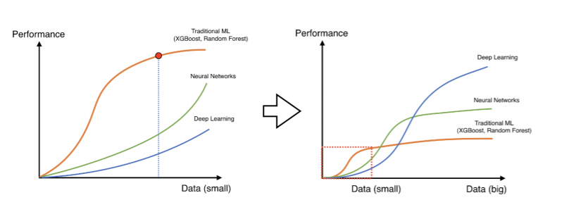

### Noise Robustness
---
입력데이터와 weight에  노이즈를 집어 넣느것 
- 왜 그런지 모르지만 넣으니까 잘되네 ?  
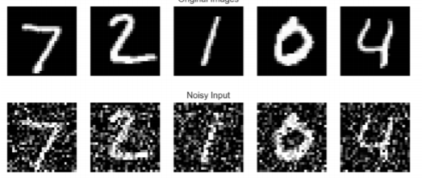

### Label Smoothing
---
학습 데이터 두개를 뽑아서 이거를 막 섞어주는거
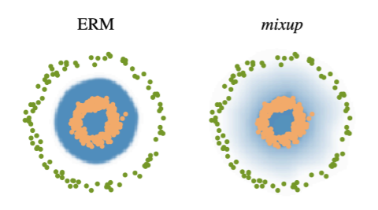
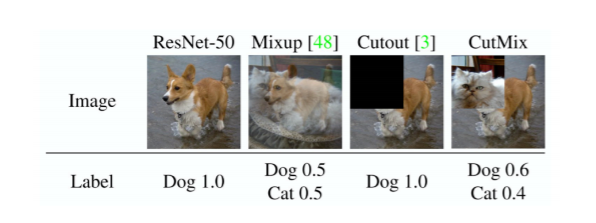  
  
Mixup 같은 경우 성능이 많이 올라감. 코드가 어려운 것도 아니고 시간이 오래 걸리지도 않으니 성능을 올릴때 한번 써보는거 추천. 

### Dropout
---
weight 몇개를 0으로 잡는거 
각각의 뉴런들이 뭐 효과가 있다 이렇게 해석 할 수 있음 

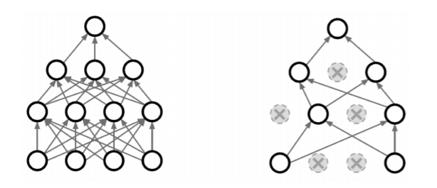

### Batch Normalization 
---
내가 적용하려는 레이어를 정규화
신경망 각각의 레이어가 천개의 파라미터를 정규화 시키는거 
한가지 확실한건 Batch Normalization 을 활용하면 성능이 올라간다 .. 

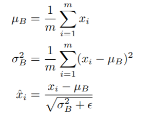
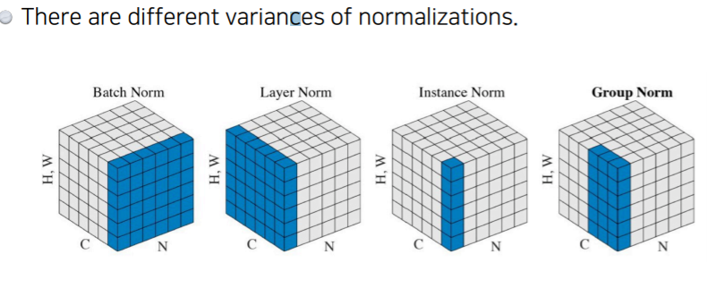

   

## Convolution 연산 이해하기
---
- 지금까지 배운 다층신겨망(MLP)은 각 뉴런들이 선형모델과 활성함수로 모두 연결된(fully connected) 구조 였다.
   

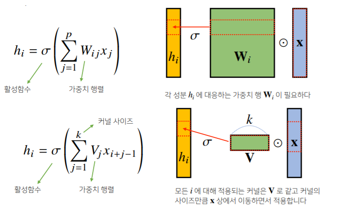

   

- Convolution 연산의 수학적인 의미는 신호(signal)를 **커널을 이용해 국소적으로 증폭 또는 감소**시켜서 정보를 추출 또는 필터링하는 것이다.

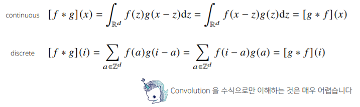

- 커널은 정의역 내에서 움직여도 변하지 않고 주어진 신호에 **국소적(local)**으로 적용한다.

## 영상처리에서 Convolution
---
http://setosa.io/ev/image-kernels/

## 다양한 차원에서의 Convolution
---
- Convolution 연산은 1차원뿐만 아니라 다양한 차원에서 계산 가능하다.
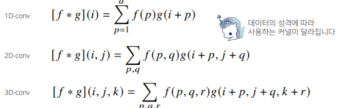

## 2차원 Convolution 연산 이해하기
---
- 2D-Conv 연산은 이와 달리 커널(kernel)을 입력베터 상에서 움직여가면서 선형모델과 합성함수가 적용되는 구조이다.  
   

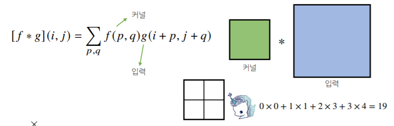

 
- 2D-Conv 연산은 이와 달리 커널을 입력벡터 상에서 움직여가면서 선형 모델과 합성함수가 적용되는 구조이다.
- 입력크기를(H,W), 커널 크기를$(K_H,K_W)$, 출력크기를 ($O_H,O_W$)라 하면 출력 크기는 다음과 같이 계산한다.
   

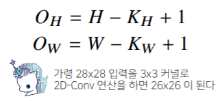

   

## 3차원 Convolution 연산 이해하기
---
- 3차원 Convolution의 경우 2차원 Convolution을 3번 적용 한다고 생각하면 된다.  
  
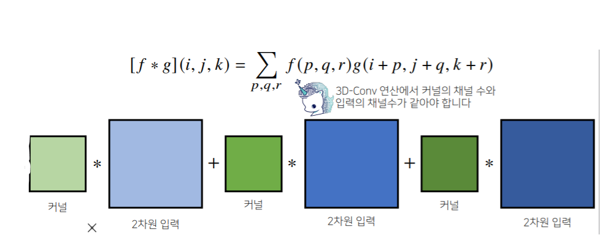

- 3차원 Convolution의 경우 2차원 Convolution을 3번 적용.
- 텐서를 직육면체 블록으로 이해하면 좀 더 이해하기 쉽다.

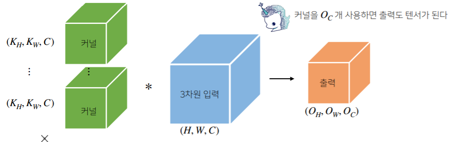

## Convolution 연산의 역전파 이해하기
---
- Convolution 연산은 커널이 모든 입력 데이터에 공통으로 적용되기 때문에 역전파를 계산할 떄도 Convolution 연산이 나오게 된다.  
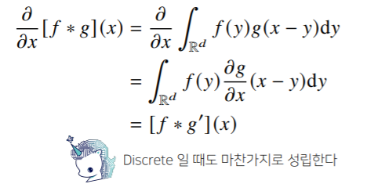
