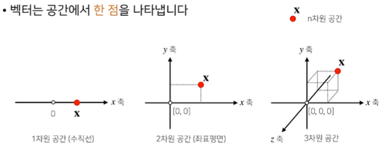
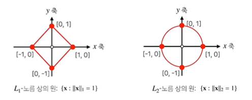
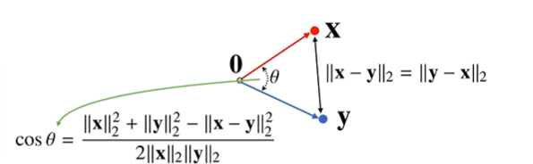

# 강의 리뷰
---

## 벡터
---
- 벡터는 숫자를 원소로 가지는 리스트 또는 배열이다.
- 벡터는 공간에서 **한 점**을 나타낸다.



## 벡터의 덧셈
---
두 벡터의 덧셈은 다른 벡터로부터 상대적 위치이동을 표현한다.


## 벡터의 노름 구해보기 
---
- 벡터의 노름(norm)은 **원점에서부터의 거리**를 말한다.
- L1-norm은 각 성분의 **변화량의 절대값**을 모두 더한다.
- L2-norm은 피타고라스 정리를 이용해 **유클리드 거리**를 계산한다.


```python
def l1_norm(x):
    x_norm= np.abs(x)
    x_norm = np.sum(x_norm)
    return x_norm

def l2_norm(x):
    x_norm = x*x
    n_norm = np.sum(x_norm)
    x_norm = no.sqrt(x_norm)
    return x_norm
```

## 다른 norm을 사용하는 이유 
---
norm의 종류에 따라 **기하학적 성질**이 달라진다




## 두 벡터 사이의 거리를 구해보자
---
- L1,L2 norm 둘다 계산가능
- 두 벡터 사이의 거리를 계산할 때는 **벡터의 뺄셈**을 이용한다.

## 두 벡터 사이의 각도 구해보기
---
- L2 norm 만 가능
- **제 2코사인 법칙**에 의해 두 벡터 사이의 각도를 계산 할 수 있다.




```python
import numpy as np
def angle(x,y):
    v = np.inner(x,y) / (l2_norm(x) * l2_norm(y))
    theta = np.arccos(v)
    return theta


## 행렬

## 행렬 곱셈
---


```python
x = np.array([[1,-2,3],
             [7,5,9],
             [-2,-1,2]])
y = np.array([[0,1],
             [1,-1],
             [-2,1]])
x @ y
```


    array([[ -8,   6],
           [-13,  11],
           [ -5,   1]])


## 역행렬
---


```python
print(x)
print(np.linalg.inv(x))
```

    [[ 1 -2  3]
     [ 7  5  9]
     [-2 -1  2]]
    [[ 0.20652174  0.01086957 -0.35869565]
     [-0.34782609  0.08695652  0.13043478]
     [ 0.0326087   0.05434783  0.20652174]]
    


```python
x = np.array([[1,0,1],
             [0,1,0],
             [1,1,0]])
np.linalg.inv(x)
```


    array([[ 0., -1.,  1.],
           [ 0.,  1.,  0.],
           [ 1.,  1., -1.]])


```python
x =np.array ([[1,0,1],[0,1,0]])
np.linalg.pinv(x)
```


    array([[0.5, 0. ],
           [0. , 1. ],
           [0.5, 0. ]])


```python

```
