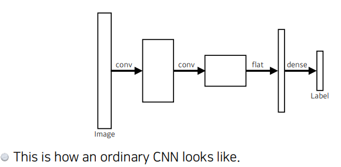

# 수업복습
---


## Convolution
---
층을 깊게 쌓아서 파라미터를 줄임 -> 성능이 높아짐


## Modern CNN
---


### AlexNet
---

<br/>

#### AlexNet의 특징  
<br/>   

- ReLU function 사용
    - 선형 모델이 가지는 좋은 특징을 가짐
    - 학습이 잘됨
    - 기울기 소실 극복
- GPU 사용(2개 사용)
- Overlapping pooling
- Data augmentation
- Dropout

### VGGNet
---


<br/>

#### VGGNet특징

- 3x3 convolution filters 활용
- Dropout


- 왜 3 x 3 convolution 을 활용했을까 ?
    - 파라미터 숫자의 차이


### GoogLeNet
---


#### GoogLeNet 특징
  ---
```Inception blocks 활용 ```  


<br/>  
1 x 1 를 추가하여 파라미터를 줄여줌
     


### ResNet
---
- 신경망을 깊게 쌓으면 모델을 학습시키기 어려움 -> 오버피팅 때문
- ResNet는 오버피팅을 극복하기 위해 skip connection을 활용함. 


- Bottleneck architecture


### DenseNet
---


## 요약
---
- VGG : 3x3 bolcks
- GoogLenet : 1x1 convolution
- ResNet : skip - connection
- DenseNet = concatenation

## Computer Vision Applications
---
 
 <br/>  

 ### Semantic Segamentation
   <br/>    

- 어떤 이미지가 있을 때 이미지의 픽셀마다 분리하는 것.
- 자율주행에 많이 활용 됨.


### Fully Convolutional Network
---



https://medium.com/@msmapark2/fcn-%EB%85%BC%EB%AC%B8-%EB%A6%AC%EB%B7%B0-fully-convolutional-networks-for-semantic-segmentation-81f016d76204

### Deconvolution (conv transpose)
---


### Result
---


## Detection
---
- 이미지 안에서 어떤 물체가 어디에 있는지 알고 싶은것.
- 그런데 픽셀이아닌 ```bounding box```로 찾는것.

### R-CNN
---


### SPPNet
---
- R-CNN의 가장 큰 문제점은 이미지 안에서 바운딩 박스를 2000개 뽑으면 2000개 전부 CNN을 통과하여야한다.
- 그러나 SPPNET은 CNN을 한번만 통과.
 

### Fast R-CNN
---
  
<br/>  
1. input image가 들어오면 bounding box를 뽑고
2. CNN을 한번만 통과
3. 각각의 region 에 대해 ROI pooling으로   Fixed length feature를 뽑는다 .
4. 마지막으로 NN를 통해 bounding box 에 대한 label 을 찾는다.  

### Faster R-CNN
---


- 내가 bounding box를 뽑는 것도 network로 학습하자는 아이디어(Region Propsal Network)가 추가됨 
  
### Region Proposal Network
---


```RPN```의 역할은 bounding box 안에 물체가 있을 것이라고 예측해줌.   
그러기 위해서는 ```Anchor box```가 필요한데 인데 이게 미리 정의된 박스의 크기 이다. 이 ```Anchor box ```를 템플릿으로 두고 이 템플릿에 맞게 물체가 있을 곳을 예측 한다.

### YOLO
---
> Faster R-CNN 에서는 bounding-box 를 예측하고 따로 분류 했다면, YOLO에서는 한번에 bounding box와 물체를 예측  -> 빠르다.  


1. 이미지가 들어오면 S x S grid로 나눔
2. 이 이미지 안에 내가 찾고싶은 물체 중앙이 해당 그리드안에 들어가면
3.  그 grid cell이 해당 물체에 대한 bounding box와 해당 물체가 무엇인지에 대해 동시에 예측
  

# 피어세션
---
- 나만의 데이터셋 만들기 회의
- 데이콘 Mnist 진행 과정 공유


