# 04.nn.Moodule로 구현하는 선형 회귀
---


```python
# 라이브러리 임포트

import torch
import torch.nn as nn
import torch.nn.functional as F
```


```python
torch.manual_seed(100)
```


    <torch._C.Generator at 0x7f58a8505b58>


```python
# 데이터 선언 (y = 2x를 가정-> W = 2, b = 0)

x_train = torch.FloatTensor([[1],[2],[3]])
y_train = torch.FloatTensor([[2],[4],[6]])
```


```python
# 모델을 선언 및 초기화, 단순 선형 회귀 이므로 input_dim = 1, output_dim = 1.
# 입력하나에 출력 하나 
model = nn.Linear(1,1)
```


```python
# 첫번째 값이 W, 두번째 값이 b에 해당
# 아직 학습전이라 랜덤 초기화 되어있음
print(list(model.parameters()))
```

    [Parameter containing:
    tensor([[-0.7767]], requires_grad=True), Parameter containing:
    tensor([0.6317], requires_grad=True)]
    


```python
# 옵티마이저 정의
# 학습률은 0.01

optimizer = torch.optim.SGD(model.parameters(), lr =0.01)
```


```python
# 전체 훈련 데이터에 대해 경사 하강법을 2,000회 반복

np_epochs = 2000

for epoch in range(np_epochs):

    # H(X) 계산
    prediction = model(x_train)

    # ccost 계산
    cost = F.mse_loss(prediction, y_train)

    # cost로 H(x) 개선하는 부분

    # gradient를 0으로 초기화
    optimizer.zero_grad()
    # 비용 함수를 미분하여 gradient 계산
    cost.backward() # backward연산
    # W와 b를 업데이트
    optimizer.step()

    if epoch %100 ==0:

    # 100번마다 로그 출력
        print('Epoch {:4d}/ {} Cost:{:.6f}'.format(
            epoch,np_epochs,cost.item()

        ))
```

    Epoch    0/ 2000 Cost:18.472391
    Epoch  100/ 2000 Cost:0.211665
    Epoch  200/ 2000 Cost:0.130796
    Epoch  300/ 2000 Cost:0.080824
    Epoch  400/ 2000 Cost:0.049944
    Epoch  500/ 2000 Cost:0.030863
    Epoch  600/ 2000 Cost:0.019071
    Epoch  700/ 2000 Cost:0.011785
    Epoch  800/ 2000 Cost:0.007282
    Epoch  900/ 2000 Cost:0.004500
    Epoch 1000/ 2000 Cost:0.002781
    Epoch 1100/ 2000 Cost:0.001718
    Epoch 1200/ 2000 Cost:0.001062
    Epoch 1300/ 2000 Cost:0.000656
    Epoch 1400/ 2000 Cost:0.000405
    Epoch 1500/ 2000 Cost:0.000251
    Epoch 1600/ 2000 Cost:0.000155
    Epoch 1700/ 2000 Cost:0.000096
    Epoch 1800/ 2000 Cost:0.000059
    Epoch 1900/ 2000 Cost:0.000037
    


```python
# x에 임의의 값 4를 넣어 모델이 예측하는 y 출력

new_var = torch.FloatTensor([[4.0]])

#입력한 값 4에 대해서 예측값 y를 리턴받아서 pred_y에 저장
pred_y = model(new_var)

print('훈련후 입력이 4일 때의 예측값: ',pred_y)
```

    훈련후 입력이 4일 때의 예측값:  tensor([[7.9905]], grad_fn=<AddmmBackward>)
    


```python
# 학습후의 W와 b를 출력
# W는 2에 가깝고 b를 0에가까운 것을 알 수 있음.
print(list(model.parameters()))
```

    [Parameter containing:
    tensor([[1.9945]], requires_grad=True), Parameter containing:
    tensor([0.0125], requires_grad=True)]
    

# 클래스로 파이토치 모델 구현하기
---


```python
# 단순 선형 회귀 클래스 구현하기

import torch
import torch.nn as nn
import torch.nn.functional as F
```


```python
torch.manual_seed(100)
```


    <torch._C.Generator at 0x7f58a8505b58>


```python
# 데이터
x_train = torch.FloatTensor([[1],[2],[3]])
y_train = torch.FloatTensor([[2],[4],[6]])
```


```python
# 모델 구현

class LinearRegressionModel(nn.Module):
    def __init__(self):
        super().__init__()
        self.linear = nn.Linear(1,1)

    def forward(self,x):
        return self.linear(x)
```


```python
model = LinearRegressionModel()
```


```python
# 옵티마이저 정의
# 학습률은 0.01

optimizer = torch.optim.SGD(model.parameters(), lr =0.01)
```


```python
# 전체 훈련 데이터에 대해 경사 하강법을 2,000회 반복
nb_epochs = 2000
for epoch in range(nb_epochs+1):

    # H(x) 계산
    prediction = model(x_train)

    # cost 계산
    cost = F.mse_loss(prediction, y_train) # <== 파이토치에서 제공하는 평균 제곱 오차 함수

    # cost로 H(x) 개선하는 부분
    # gradient를 0으로 초기화
    optimizer.zero_grad()
    # 비용 함수를 미분하여 gradient 계산
    cost.backward() # backward 연산
    # W와 b를 업데이트
    optimizer.step()

    if epoch % 100 == 0:
    # 100번마다 로그 출력
      print('Epoch {:4d}/{} Cost: {:.6f}'.format(
          epoch, nb_epochs, cost.item()
      ))
```

    Epoch    0/2000 Cost: 28.903635
    Epoch  100/2000 Cost: 0.069457
    Epoch  200/2000 Cost: 0.042920
    Epoch  300/2000 Cost: 0.026522
    Epoch  400/2000 Cost: 0.016389
    Epoch  500/2000 Cost: 0.010127
    Epoch  600/2000 Cost: 0.006258
    Epoch  700/2000 Cost: 0.003867
    Epoch  800/2000 Cost: 0.002390
    Epoch  900/2000 Cost: 0.001477
    Epoch 1000/2000 Cost: 0.000912
    Epoch 1100/2000 Cost: 0.000564
    Epoch 1200/2000 Cost: 0.000348
    Epoch 1300/2000 Cost: 0.000215
    Epoch 1400/2000 Cost: 0.000133
    Epoch 1500/2000 Cost: 0.000082
    Epoch 1600/2000 Cost: 0.000051
    Epoch 1700/2000 Cost: 0.000031
    Epoch 1800/2000 Cost: 0.000019
    Epoch 1900/2000 Cost: 0.000012
    Epoch 2000/2000 Cost: 0.000007
    


```python

```

# 미니 배치와 데이터 로드
---

## Mini - batch
---
- 미니 배치 : 전체 데이터를 더 작은 단위로 나누어서 해당 단위로 학습하는 개념
- 배치 크기는 보통 2의 제곱수를 사용.
- 그 이유는 CPU와 GPU의 메모리가 2의 배수이므로 배치크기가 2의 제곱수일 경우에 데이터 송수신의 효율을 높일 수 있다.

## 데이터 로드
---
- 파이토치에서는 데이터를 좀 더 쉽게 다룰 수 있도록 유용한 도구로서 Dataset과 DataLoader를 제공.
- 이를 사용하면 **미니 배치 학습**, 데이터 shuffle, 병렬 처리 까지 간단히 수행 할 수 있다. 
- 기본적인 사용 방법은 Dataset을 정의하고, 이를 DataLoader에 전달 하는 것


```python
# 라이브러리 불러오기
import torch
import torch.nn as nn
import torch.nn.functional as F

#
from torch.utils.data import TensorDataset #텐서 데이터셋 
from torch.utils.data import DataLoader # 데이터로더 
```


```python

# 텐서 형태로 데이터 정의
x_train  =  torch.FloatTensor([[73,  80,  75], 
                               [93,  88,  93], 
                               [89,  91,  90], 
                               [96,  98,  100],   
                               [73,  66,  70]])  
y_train  =  torch.FloatTensor([[152],  [185],  [180],  [196],  [142]])
```


```python
# dataset 저장
dataset = TensorDataset(x_train,y_train)
```


```python
# dataloader 
# shuffle 는 True 로 하는것 권장
dataloader = DataLoader(dataset, batch_size = 2,shuffle =True)

```


```python
# 모델과 optimizer 정의
model = nn.Linear(3,1)
optimizer = torch.optim.SGD(model.parameters(), lr = 1e-5)
```


```python
nb_epochs = 20
for epoch in range(nb_epochs + 1):
  for batch_idx, samples in enumerate(dataloader):
    print(batch_idx)
    print(samples)
    x_train, y_train = samples
    # H(x) 계산
    prediction = model(x_train)

    # cost 계산
    cost = F.mse_loss(prediction, y_train)

    # cost로 H(x) 계산
    optimizer.zero_grad()
    cost.backward()
    optimizer.step()

    print('Epoch {:4d}/{} Batch {}/{} Cost: {:.6f}'.format(
        epoch, nb_epochs, batch_idx+1, len(dataloader),
        cost.item()
        ))
```

    0
    [tensor([[73., 66., 70.],
            [89., 91., 90.]]), tensor([[142.],
            [180.]])]
    Epoch    0/20 Batch 1/3 Cost: 9.443661
    1
    [tensor([[ 96.,  98., 100.],
            [ 93.,  88.,  93.]]), tensor([[196.],
            [185.]])]
    Epoch    0/20 Batch 2/3 Cost: 6.406250
    2
    [tensor([[73., 80., 75.]]), tensor([[152.]])]
    Epoch    0/20 Batch 3/3 Cost: 15.186396

    ...
   
    0
    [tensor([[ 73.,  80.,  75.],
            [ 96.,  98., 100.]]), tensor([[152.],
            [196.]])]
    Epoch   20/20 Batch 1/3 Cost: 12.962784
    1
    [tensor([[93., 88., 93.],
            [73., 66., 70.]]), tensor([[185.],
            [142.]])]
    Epoch   20/20 Batch 2/3 Cost: 16.469215
    2
    [tensor([[89., 91., 90.]]), tensor([[180.]])]
    Epoch   20/20 Batch 3/3 Cost: 7.838394
    


```python
# 모델의 입력으로 임의의 값을 넣어 예측값을 확인

new_var = torch.FloatTensor([[73, 80, 75]])

# 입력한 값 [73, 80, 75] 에 대해서 예측값 y를 리턴받아서 pred_y에 저장
pred_y = model(new_var)
print('훈련 후 입력이 73, 80, 75 일 때의 예측값 : ', pred_y)
```

    훈련 후 입력이 73, 80, 75 일 때의 예측값 :  tensor([[155.0134]], grad_fn=<AddmmBackward>)
    

# 커스텀 데이터 셋
---
- torch.utils.data.Dataset은 파이토치에서 데이터셋을 제공하는 추상클래스 이다. 
<br/>
Dataset을 상속받아 다음 메소드들을 오버라이드 하여 커스텀 데이터셋을 만들어 보장


```python
# 기본 뼈대
class CustomDataset(troch.utils.data.Dataset):
    def __init__(self):
        데이터셋의 전처리를 해주는 부분

    def __len__(self):
        데이터셋의 길이. 즉, 총 샘플의 수를 적어주는 부분
    
    def __getitem__ (self,idx):
        데이터셋에서 특정 1개의 샘플을 가져온느 함수
```


```python
# 커스텀 데이터셋으로 선형 회귀 구현
```


```python
import torch
import torch.nn.functional as F
```


```python
from torch.utils.data import Dataset
from torch.utils.data import DataLoader


```


```python
# 기본 뼈대
class CustomDataset(Dataset):
    
    #데이터셋의 전처리를 해주는 부분
    def __init__(self):
        self.x_data = [[73, 80, 75],
                    [93, 88, 93],
                    [89, 91, 90],
                    [96, 98, 100],
                    [73, 66, 70]]
        self.y_data = [[152], [185], [180], [196], [142]]
    
    #데이터셋의 길이. 즉, 총 샘플의 수를 적어주는 부분
    def __len__(self):
        return len(self.x_data)    
    
     # 데이터셋에서 특정 1개의 샘플을 가져오는 함수
    # 인덱스를 입력받아 그에 맵핑되는 입출력 데이터를 파이토치의 Tensor 형태로 리턴
    def __getitem__ (self,idx):
        x = torch.FloatTensor(self.x_data[idx])
        y = torch.FloatTensor(self.y_data[idx])
        return x,y
          
```


```python
# Dataset 상속
class CustomDataset(Dataset): 
  def __init__(self):
    self.x_data = [[73, 80, 75],
                   [93, 88, 93],
                   [89, 91, 90],
                   [96, 98, 100],
                   [73, 66, 70]]
    self.y_data = [[152], [185], [180], [196], [142]]

  # 총 데이터의 개수를 리턴
  def __len__(self): 
    return len(self.x_data)

  # 인덱스를 입력받아 그에 맵핑되는 입출력 데이터를 파이토치의 Tensor 형태로 리턴
  def __getitem__(self, idx): 
    x = torch.FloatTensor(self.x_data[idx])
    y = torch.FloatTensor(self.y_data[idx])
    return x, y
```


```python
dataset = CustomDataset()
dataloader = DataLoader(dataset,batch_size = 2, shuffle = True)
```


```python
model = torch.nn.Linear(3,1)
potimizer = torch.optim.SGD(model.parameters(), lr= 1e-5)
```


```python
nb_epochs = 20
for epoch in range(nb_epochs + 1):
  for batch_idx, samples in enumerate(dataloader):
    # print(batch_idx)
    # print(samples)
    x_train, y_train = samples
    # H(x) 계산
    prediction = model(x_train)

    # cost 계산
    cost = F.mse_loss(prediction, y_train)

    # cost로 H(x) 계산
    optimizer.zero_grad()
    cost.backward()
    optimizer.step()

    print('Epoch {:4d}/{} Batch {}/{} Cost: {:.6f}'.format(
        epoch, nb_epochs, batch_idx+1, len(dataloader),
        cost.item()
        ))
```

    Epoch    0/20 Batch 1/3 Cost: 37626.578125
    Epoch    0/20 Batch 2/3 Cost: 30278.246094
    Epoch    0/20 Batch 3/3 Cost: 20694.369141
    Epoch    1/20 Batch 1/3 Cost: 30803.402344
    Epoch    1/20 Batch 2/3 Cost: 35005.593750
    Epoch    1/20 Batch 3/3 Cost: 24886.021484
    ...
    Epoch   19/20 Batch 1/3 Cost: 38291.453125
    Epoch   19/20 Batch 2/3 Cost: 27517.542969
    Epoch   19/20 Batch 3/3 Cost: 24886.021484
    Epoch   20/20 Batch 1/3 Cost: 38291.453125
    Epoch   20/20 Batch 2/3 Cost: 22790.195312
    Epoch   20/20 Batch 3/3 Cost: 34340.718750
    


```python
# 임의의 입력 [73, 80, 75]를 선언
new_var =  torch.FloatTensor([[73, 80, 75]]) 
# 입력한 값 [73, 80, 75]에 대해서 예측값 y를 리턴받아서 pred_y에 저장
pred_y = model(new_var) 
print("훈련 후 입력이 73, 80, 75일 때의 예측값 :", pred_y) 
```

    훈련 후 입력이 73, 80, 75일 때의 예측값 : tensor([[-5.7530]], grad_fn=<AddmmBackward>)
    

# CNN으로 MNIST 분류하기
---


```python
# 1번 레이어 : 합성곱 층(Convolutional layer)
합성곱(in_channel) = 1, outchannel = 32, kernerl_size = 3, stride = 1, padding = 1) 
+ 활성화 함수 Relu
max-polling (kerner_size = 2 , stride = 2)

# 2번 레이어 : 합성곱층 (Convolutional layer)
합성곱(in_channle = 32, out_channel = 64, kernel_size = 3, stride = 1, padding+ 1)
+ 활성화 함수 ReLU
max_polling (kerner_size = 2, stride = 2)

# 3번 레이어 : 전결합층(Fully - Connected layer)
특성맵을 펼친다 # batch_size * 7 * 7 * 64 -> batch_Size * 3136
전결합층(뉴런 10개) + 활성화 함수 softmax
```

## 모델 구현하기
---


```python
# 라이브러리 불러오기 
import torch 
import torch.nn as nn
```


```python
# 데이터 정의
inputs = torch.Tensor(1,1,28,28)
print('텐서의 크기 : {} '.format(inputs.shape))
```

    텐서의 크기 : torch.Size([1, 1, 28, 28]) 
    


```python
# 합성곱층과 풀링 선언
# 1채널 짜리를 입력받아서 32채널을 뽑아내고, 커널 사이즈는 3 패딩은 1
conv1 = nn.Conv2d(1,32,3, padding = 1)
print(conv1)
```

    Conv2d(1, 32, kernel_size=(3, 3), stride=(1, 1), padding=(1, 1))
    


```python
conv2 = nn.Conv2d(32,64,kernel_size = 3, padding = 1)
print(conv2)
```

    Conv2d(32, 64, kernel_size=(3, 3), stride=(1, 1), padding=(1, 1))
    


```python
# 맥스풀링 구현
pool = nn.MaxPool2d(2)
print(pool)
```

    MaxPool2d(kernel_size=2, stride=2, padding=0, dilation=1, ceil_mode=False)
    


```python
# 구현체를 이용하여 모델 만들기
# input 데이터를 conv1으로 통과 시킴
out = conv1(inputs)
print(out.shape)
```

    torch.Size([1, 32, 28, 28])
    


```python
# conv1을 통과하여 나온 데이터를 맥스풀링으로 통과 시킴
out =  pool(out)
print(out.shape)

```

    torch.Size([1, 32, 14, 14])
    


```python
# 두번째 합성곱층과 풀링 통과
out = conv2(out)
print(out.shape)
out = pool(out)
print(out.shape)
```

    torch.Size([1, 64, 14, 14])
    torch.Size([1, 64, 7, 7])
    


```python
# 이 텐서를 펼쳐줘야됨.
# .view()를 사용하여 텐서를 펼침/
# 첫번째 차원인 배치 차원은 그대로 두고, 나머지는 펼침
out = out.view(out.size(0), -1)
print(out.shape)
```

    torch.Size([1, 3136])
    


```python
# 마지막으로 Fully-Connteced layer를 통과 시킴
# 출력층은 10개의 뉴런으 ㄹ배치하여 10개의 차원의 텐서로 변환

fc = nn.Linear(3136,10)
out = fc(out)
print(out.shape)
```

    torch.Size([1, 10])
    

## CNN으로 MNIST 분류하기


```python
import torch
import torchvision.datasets as dsets
import torchvision.transforms as transforms
import torch.nn.init
```


```python
device = 'cuda' if torch.cuda.is_available() else 'cpu'
device
```


    'cuda'


```python
# 학습에 사용할 파라미터 설정
learning_rate = 0.001
training_epochs = 15
batch_size = 128
```


```python
# 데이터로더를 사용하여 데이터 셋 정의

mnist_train = dsets.MNIST(root='MNIST_data/', # 다운로드 경로 지정
                          train=True, # True를 지정하면 훈련 데이터로 다운로드
                          transform=transforms.ToTensor(), # 텐서로 변환
                          download=True)

mnist_test = dsets.MNIST(root='MNIST_data/', # 다운로드 경로 지정
                         train=False, # False를 지정하면 테스트 데이터로 다운로드
                         transform=transforms.ToTensor(), # 텐서로 변환
                         download=True)
```

```python
# 데이터로더를 사용하여 미니 배치 크기 지정
data_loader = torch.utils.data.DataLoader(dataset = mnist_train,
                                          batch_size = batch_size,
                                          shuffle = True,
                                          drop_last= True)
```


```python
# 클래스로 모델 설계

class CNN(torch.nn.Module):

    def __init__(self):
        super(CNN,self).__init__()

        # 첫번째 층
        self.layer1 = torch.nn.Sequential(
            torch.nn.Conv2d(1,32,kernel_size=  3, stride= 1,padding=1),
            torch.nn.ReLU(),
            torch.nn.MaxPool2d(kernel_size = 2, stride = 2)
        )

        # 두번쨰 층
        self.layer2 = torch.nn.Sequential(
            torch.nn.Conv2d(32,64,kernel_size = 3,stride = 1,padding=1),
            torch.nn.ReLU(),
            torch.nn.MaxPool2d(kernel_size=2,stride =2)
        )

        # 전결합층 7 x 7 x 64 -> 10outputs
        self.fc = torch.nn.Linear(7*7*64,10,bias = True)

        # 전결합층 한정으로 가중치 초기화
        torch.nn.init.xavier_uniform_(self.fc.weight)

    def forward(self,x):
        out = self.layer1(x)
        out = self.layer2(out)
        out = out.view(out.size(0),-1) # Flatten
        out = self.fc(out)
        return out
```


```python
# CNN모델 정의
model = CNN().to(device)
```


```python
# 비용 함수와 옵티마이저 정의

criterion = torch.nn.CrossEntropyLoss().to(device) 
optimizer = torch.optim.Adam(model.parameters(), lr = learning_rate)
```


```python
total_batch = len(data_loader)
print('총 배치의 수 = {}'.format(total_batch))
```

    총 배치의 수 = 468
    


```python
# 모델 학습
for epoch in range(training_epochs):

    avg_cost = 0

    for X,Y in data_loader:

        X = X.to(device)
        Y = Y.to(device)

        optimizer.zero_grad()
        hypothesis = model(X)

        cost = criterion(hypothesis, Y)
        cost.backward()
        optimizer.step()

        avg_cost +=cost/total_batch

    print('[Epoch:{:>4}] cost = {:>.9}'.format(epoch + 1 ,avg_cost))
```

    [Epoch:   1] cost = 0.0666601285
    [Epoch:   2] cost = 0.0508788712
    [Epoch:   3] cost = 0.0405966938
    [Epoch:   4] cost = 0.0336873122
    [Epoch:   5] cost = 0.0280040223
    [Epoch:   6] cost = 0.0235793181
    [Epoch:   7] cost = 0.0204491317
    [Epoch:   8] cost = 0.0173515081
    [Epoch:   9] cost = 0.0150424028
    [Epoch:  10] cost = 0.0129447412
    [Epoch:  11] cost = 0.0106258541
    [Epoch:  12] cost = 0.00997850858
    [Epoch:  13] cost = 0.00899630506
    [Epoch:  14] cost = 0.00718943775
    [Epoch:  15] cost = 0.00606831117
    


```python
# 테스트 
# 학습을 진행하지 않을 것이므로 torch.no_grad()

with torch.no_grad():
    X_test = mnist_test.test_data.view(len(mnist_test),1,28,28).float().to(device)
    Y_test = mnist_test.test_labels.to(device)

    prediction = model(X_test)
    correct_prediction = torch.argmax(prediction, 1) ==Y_test
    accuracy = correct_prediction.float().mean()
    print('Accuracy : ', accuracy.item())

```

    Accuracy :  0.9835999608039856
    

    /usr/local/lib/python3.6/dist-packages/torchvision/datasets/mnist.py:63: UserWarning: test_data has been renamed data
      warnings.warn("test_data has been renamed data")
    /usr/local/lib/python3.6/dist-packages/torchvision/datasets/mnist.py:53: UserWarning: test_labels has been renamed targets
      warnings.warn("test_labels has been renamed targets")
    


# 11일차
---

## 조건부 확률
---


## 베이즈 정리 
---
- 베이즈 정리는 새로운 정보를 토대로 어떤 사건이 발생했다는 주장에 대한 신뢰도를 갱신해 나가는 방법(a method to update belief on the basis of new information)이다.


`사후확률` : 데이터를 관찰한 이후에 측정한 확률  
`사전확률` : 데이터가 주어지지 않은 상황에서 모델링을 하기전 사전에 측정한 확률   
`가능도` : 어떤 값이 관측되었을 때, 이것이 어떤 확률분포에서 왔을지에 대한 확률  
`Evidence` : 데이터 자체의 분포 

```
COVID-99의 발별률이 10%로 알려져있다.  

COVID-99에 실제로 걸렸을 때 검진될 확률은 99%,  
실제로 걸리지 않았을 때 오검진될 확률이 1%라고 할때,   

어떤 사람이 질병에 걸렸다고 검진결과가 나왔을 때,
 정말로 COVID-99에 감염되었을 확률은 ?
```


## 베이즈 정리를 통한 정보의 갱신
---
- 베이즈 정리를 통해 새로운 데이터가 들어 왔을 때 앞서 계산한 사후확률을 사전확률로 사용하여 **갱신된 사후확률을 계산** 할 수 있다.
- 정보의 갱신을 통해 모델의 성능을 높일 수 있음 .  


## 조건부 확률 -> 인과관계 ?
---
- 조건부 확률은 유용한 통계적 해석을   제공하지만 **인과관계**를 추론할 때 함부로 사용해서는 안된다.
- 인과관계는 **데이터 분포의 변화에 강건한 예측 모형**을 만들 때 필요함.


<br/>

- 인과관계를 알아내기 위해서는 **중첩요인의 효과를 제거**하고 원인에 해당하는 변수만의 인과관계를 개선해야 한다.

<br/>

## 딥러닝 기초
---


### Key Components of Deep Learning

1. the **data** that the model can learn from
2. the **model** how to transform the data
3. The **loss** function that quantifies the badness of the model
4. The **algorithm** to adjust the parameters to minimize the loss

### Linear Neural Networks
---


# 12일차
---

## optimization
---

### Generalization
---
- 일반적으로 학습을 시키게 되면 train error 가 줄어듦
- 그러나 어느정도 시간이 지나면 test error는 오히려 올라간다.(과적합)

> Generalization이 좋다 -> 이 모델의 성능이 학습데이터와 비슷하게 나올 것이다.


### Cross-validation (교차 검증)
---
일반적으로 Corss-validation통해 최적의 하이퍼 파라미터를 찾고,  
마지막에는 train 데이터셋 모두를 사용해서 학습시킴(많은 데이터를 학습시키면 좋으니까)  


### Bias ans Variance
---
- 보통 Bias가 커지면 Variance가 작아지고, Variance가 커지면 Bias가 작아짐 -> 분산-편향 trade off

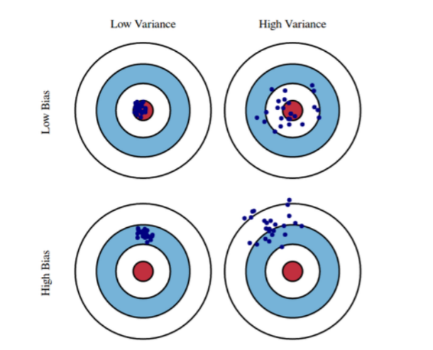


### Bootstrapping
---
학습 데이터가 고정되어 있을 때 그 안에서 서브샘플링을 이용하여 학습데이터를 여러개로 만드는 방법.

### Bagging vc Boosting
---
- Bagging(Booststrapping aggregation)
        - 여러개의 모델을 bootstrapping으로 학습시킴
        - 일반적으로 10만개의 데이터를 한 모델로 학습 시키는 것 보다 2만개씩 5개의 모델로 학습시켜 그 결과값을 평균내는 것이 더 성능이 좋음  

<br/>
          
- Boosting
        - 학습 데이터가 10만개가 있으면 8만개의 데이터는 잘 예측하고 2만개의 데이터를 잘 예측 못한다 -> 다음 모델은 2만개의 데이터에 집중 ->...-> 이렇게 모델을 만들어서 합침

<br/>

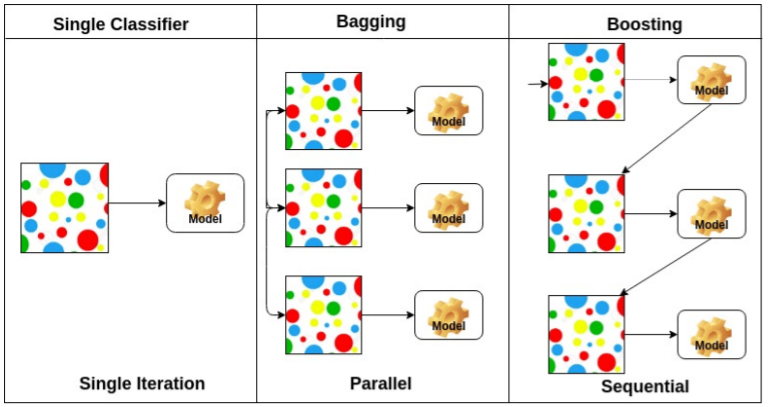


### Batch-size Matters
---
Batch_size를 크게하면 sharp minimizer에 도달하고
Batch_size를 작게하면 flat minimizer에 도달함.

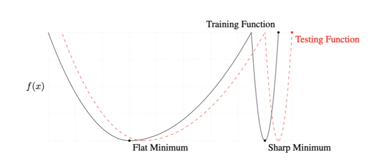
<br/>

우리가 찾고 싶은건 test function 에서의 Minimum인데,
flat Minimun은 train fuction에서 조금 멀어지면 test function 도 조금만 멀어진다.
그러나 Sharp Minimum은 train function에서 조금만 멀어져도 test function에서 많이 멀어지는 것을 알 수 있다.

### Gradient Descent
---
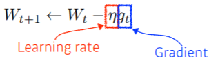
<br/>
문제점 : learning rate를 지정 하는게 너무 어렵다.

### Momentum
---


<br/>

장점 : 한번흘러간 gradient 방향을 유지시켜 줌 그래서 gradient가 많이 왔다갔다해도 어느정도 잘 학습이됨.


### Nesterov Accelerated Gradient
---

<br/>

<br/>
한번 이동한  a라고 불리우는 현재 정보가있으면 a로 한번 가보고 거기서의 계산값을 가지고 accumulation 함.
장점 : local minimum에 더빨리 도달


### Adagrad
---
이때까지 파라미터가 많이 변한 파라미터는 적게 변화 시키고, 적게 변화된 파라미터는 많이 변화시킴.
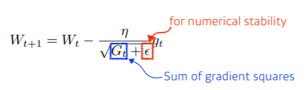
<br/>
단점 : 진행될수록 학습이 되지 않는 현상 

### Adadelta 
---
Adagrad는 처음부터 지금까지 모든 파라미터의 변화를 반영하지만,
Adadelta는 적절한 window size 만큼 파라미터의 변화를 봄.
> 진행될 수록 학습이 되지 않는 현상 해결

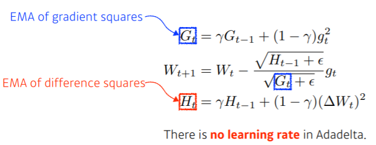

### RMSprop
---
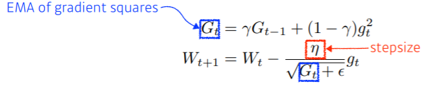
Adaelta에 stepsize를 넣은게 다 ?

### Adam
---
일반적으로 가장 무난하게 사용
RMSprop 에서 Momentum을 같이 사용함. 


## 규제(Regularization)
---

### Early stopping
---
지금까지 학습된 모델의 성능을 평가해보고 그 loss가 커질 거같은 지점에서 빨리 멈추자 .


### Parameter Norm Penalty
---
- 파라미터가 너무 커지지 않게 규제 하는 것  

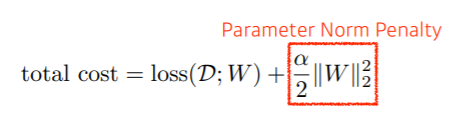


### Data Augmentation 
---
 - 데이터가 무한히 많으면 웬만하면 다 잘됨.
 - 그런데 데이터는 한정적.
 - 그래서 기존의 데이터를 통해 데이터를 늘리는 것
     - ex ) 고양이 사진을 45도 돌려서 데이터 생성 ..
 
 
 

### Noise Robustness
---
입력데이터와 weight에  노이즈를 집어 넣느것 
- 왜 그런지 모르지만 넣으니까 잘되네 ?  


### Label Smoothing
---
학습 데이터 두개를 뽑아서 이거를 막 섞어주는거
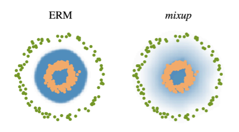
  
  
Mixup 같은 경우 성능이 많이 올라감. 코드가 어려운 것도 아니고 시간이 오래 걸리지도 않으니 성능을 올릴때 한번 써보는거 추천. 


### Dropout
---
weight 몇개를 0으로 잡는거 
각각의 뉴런들이 뭐 효과가 있다 이렇게 해석 할 수 있음 


### Batch Normalization 
---
내가 적용하려는 레이어를 정규화
신경망 각각의 레이어가 천개의 파라미터를 정규화 시키는거 
한가지 확실한건 Batch Normalization 을 활용하면 성능이 올라간다 .. 


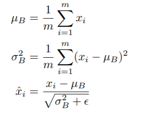


# 13일차
---

## Convolution
---
층을 깊게 쌓아서 파라미터를 줄임 -> 성능이 높아짐


## Modern CNN
---


### AlexNet
---

<br/>

#### AlexNet의 특징  
<br/>   

- ReLU function 사용
    - 선형 모델이 가지는 좋은 특징을 가짐
    - 학습이 잘됨
    - 기울기 소실 극복
- GPU 사용(2개 사용)
- Overlapping pooling
- Data augmentation
- Dropout

### VGGNet
---


<br/>

#### VGGNet특징

- 3x3 convolution filters 활용
- Dropout


- 왜 3 x 3 convolution 을 활용했을까 ?
    - 파라미터 숫자의 차이
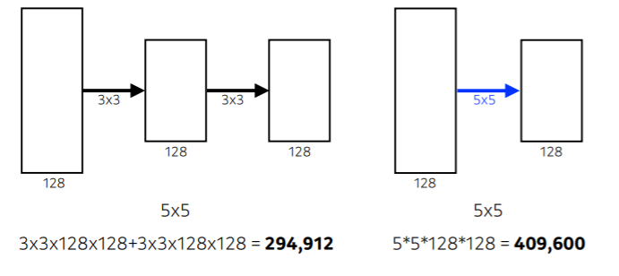

### GoogLeNet
---


#### GoogLeNet 특징
  ---
```Inception blocks 활용 ```  


<br/>  
1 x 1 를 추가하여 파라미터를 줄여줌
     


### ResNet
---
- 신경망을 깊게 쌓으면 모델을 학습시키기 어려움 -> 오버피팅 때문
- ResNet는 오버피팅을 극복하기 위해 skip connection을 활용함. 


- Bottleneck architecture


### DenseNet
---
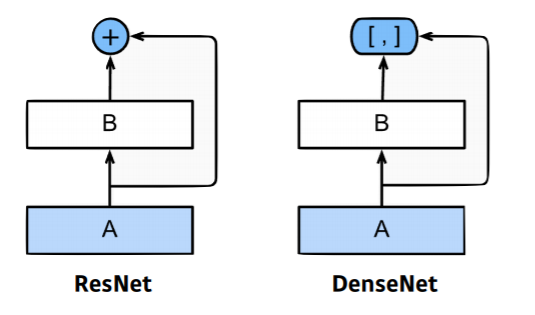

## 요약
---
- VGG : 3x3 bolcks
- GoogLenet : 1x1 convolution
- ResNet : skip - connection
- DenseNet = concatenation

## Computer Vision Applications
---
 
 <br/>  

 ### Semantic Segamentation
   <br/>    

- 어떤 이미지가 있을 때 이미지의 픽셀마다 분리하는 것.
- 자율주행에 많이 활용 됨.


### Fully Convolutional Network
---


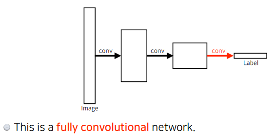

https://medium.com/@msmapark2/fcn-%EB%85%BC%EB%AC%B8-%EB%A6%AC%EB%B7%B0-fully-convolutional-networks-for-semantic-segmentation-81f016d76204

### Deconvolution (conv transpose)
---


### Result
---
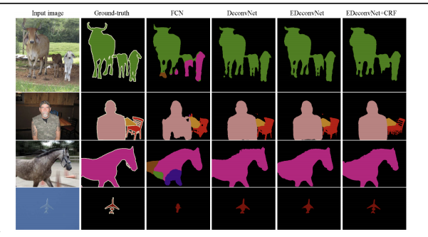

## Detection
---
- 이미지 안에서 어떤 물체가 어디에 있는지 알고 싶은것.
- 그런데 픽셀이아닌 ```bounding box```로 찾는것.

### R-CNN
---
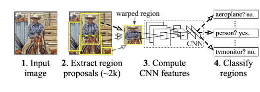

### SPPNet
---
- R-CNN의 가장 큰 문제점은 이미지 안에서 바운딩 박스를 2000개 뽑으면 2000개 전부 CNN을 통과하여야한다.
- 그러나 SPPNET은 CNN을 한번만 통과.
 

### Fast R-CNN
---
  
<br/>  
1. input image가 들어오면 bounding box를 뽑고
2. CNN을 한번만 통과
3. 각각의 구역에 대해 ROI pooling으로   Fixed length feature를 뽑는다 .
4. 마지막으로 NN를 통해 bounding box 에 대한 label 을 찾는다.  

### Faster R-CNN
---


- 내가 bounding box를 뽑는 것도 network로 학습하자는 아이디어(Region Propsal Network)가 추가됨 
  
### Region Proposal Network
---
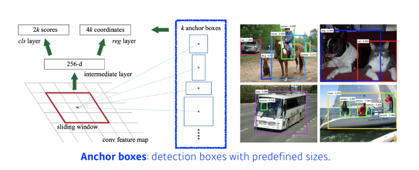

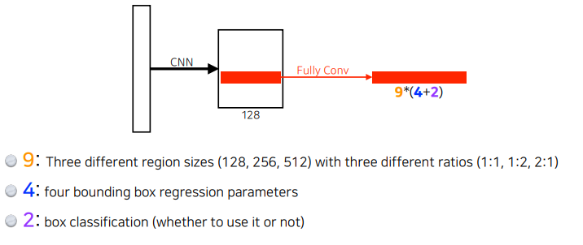

```RPN```의 역할은 bounding box 안에 물체가 있을 것이라고 예측해줌.   
그러기 위해서는 ```Anchor box```가 필요한데 인데 이게 미리 정의된 박스의 크기 이다. 이 ```Anchor box ```를 템플릿으로 두고 이 템플릿에 맞게 물체가 있을 곳을 예측 한다.

### YOLO
---
> Faster R-CNN 에서는 bounding-box 를 예측하고 따로 분류 했다면, YOLO에서는 한번에 bounding box와 물체를 예측  -> 빠르다.  


1. 이미지가 들어오면 S x S grid로 나눔
2. 이 이미지 안에 내가 찾고싶은 물체 중앙이 해당 그리드안에 들어가면
3.  그 grid cell이 해당 물체에 대한 bounding box와 해당 물체가 무엇인지에 대해 동시에 예측
# 14일차
---

## 시퀀스 데이터 이해하기
---
- 소리, 문자열, 주가 등의 데이터를 시퀀스 데이터라고 한다
- 시퀀스 데이터는 순서를 바꾸거나 과거 정보에 손실이 발생하면 데이터의 확률 분포도 바뀌게 됨.

## 시퀀스 데이터는 어떻게 다룰까 ?
---
이전 시퀀스의 정보를 가지고 앞으로 발생할 데이터의 확률분포를 다루기 위해 조건부 확률을 이용.


> 위 조건부 확률은 과거의 모든 정보를 사용하지만 시퀀스 데이터를 분석할 때 모든 과거 정보들이 필요한 것은 아니다.

- 시퀀스 데이터를 다루기 위해선 길이가 가변적인 데이터를 다룰 수 있는 모델이 필요하다.


- 조건부에 들어가는 데이터 길이는 가변적이다.
- 고정된 길이 $\tau$만큼의 시퀀스만 사용하는 경우 `AR($\tau$)(Autoregressive Model)` 자기 회뒤모델이라고 부른다.
- 또 다른 방법은 바로 이전 정보를 제외한 나머지 정보들을 $H_t$라는 잠재변수로 인코딩해서 활용하는 잠재 AR 모델이다. 
- 잠재변수 $H_t$를 신경망을 통해 반복해서 사용하여 시퀀스 데이터의 패턴을 학습하는 모델이 RNN 이다.

## RNN (Recurrent Neural Network)
---
- 가장 기본적인 RNN 모형은 MLP와 유사한 모양이다.
- $w^{(1)},w^{(2)}$은 시퀀스와 상관없이 불변인 행렬이다.
- 이 모델의 과거의 정보는 다룰 수 없다.


- RNN은 이전  순서의 잠재 변수와 현재의 입력을 활용하여 모델링한다.
- 잠재변수 $H_t$를 복제해서 다음 순서의 잠재변수를 인코딩하는데 사용한다.
- 이를 ```Backpropagation Through Time(BPTT)```라 하며 RNN의 역전파 방법이다.


### BPTT
---
BPTT를 통해 RNN의 가중치행렬 미분을 계산해보면 아래와 같이 미분의 곱으로 이루어진 항이 계산된다.


### 기울기 소실의 해결책? 
---
- 시퀀스 길이가 길어지는 경우 BPTT를 통한 역전파 알고리즘의 계산이 불안정 해지므로 길이를 끊는 것이   필요하다 이를
`trucated BPTT` 라고 부른다.

  

- 이런 문제들 때문에 Vanila RNN은 길이가 긴 시퀀스를 처리하는데 문제가 있다.
- 이를 해결하기위해 등장한 RNN네트워크가 LSTM과 GRU다.


## Sequential Model - 최성준 교수님
---

#### Naive sequence model

  

- Suquentail Model의 문제점은 입력의 차원을 알수 없다 -> CNN같은 것을 사용 불가.

#### Autoregressive model
<br/>   
- 과거의 몇개만 정해서 보는것   


#### Markov model (first-order autoregressive model)
<br/> 
- 나의 현재는 바로 이전의 과거에만 의존한다는 가정 -> 허무맹랑한 소리 ..수능 점수는 수능 전날 공부한 것을 기준으로 나오지 않음 


#### Latent autoregessive model
<br/>  

- 중간에 ```Hidden state``` 가 들어 있고 이 Hidden state가 과거의 정보를 요약.  


## RNN
---
- MLP와의 차이점은 자기 자신으로 돌아오는 구조가 하나 추가됨.


- RNN은 현재에서 멀리 떨어진 정보에 대한 반영이 어렵다.


## RNN학습 구조
---


## LSTM
---


```Forget Gate``` : 이전의 cell state와 현재 input data 를 바탕으로 필요 없는 데이터를 지움
```InputGate``` :  이전의 cell state와 현재 input data 를 조합
```update cell``` : 현재의 cell state를 forget gate 데이터를 바탕으로 지우고 input gate를 바탕으로 업데이트
``` ouput Gate``` : updeate cell 을 한번더 조작해서 어떤 값을 밖으로 내보낼지 정함

### GRU
<br/>  
  


- 게이트가 2개  (reste gate , update gate)

- cell state 가 없고 hidden state 만 존재 - > output gate가 필요 없음 


## Transformer
---

### Sequence model의 문제점
<br/>    

중간에 어떤 데이터가 빠지거나, 순서가 바뀌면 학습이 어려움 .

<br/>    


<br/>  

Transformer 는 sequence를 다루는 모델인데 attetion 구조를 활용한 모델이라고 생각하면 된다.


<br/>    

- 어떤 sequence 데이터를 다른 sequence 데이터로 바꿔 주는 것.  
    - ex ) 영어 입력 -> 한글 출력

<br/>    


<br/>    

- 아래의 사진을 살펴보면 알 수 있듯이 Transformer는 입력 시퀀스와 출력 시퀀스의 갯수가 다를 수 있음
- 그리고 도메인도 다를 수 있다. 
    - 불어, 영어
- RNN의 경우 입력으로 세개의 단어가 주어지면 모델을 3번 돌려야 되는데 Transformer는  RNN과 달리 한번만 돌아간다.
- 


- n개의 단어가 어떻게 인코더에서 한번에 처리 ?
- 인코더와 디코더 사이에 어떤 정보를 주고 받는지 ?
- 디코더가 어떻게 generation 할수 있는지 ?

<br/>    


<br/>    

- 인코더에 n개의 단어가 들어가고, 한개의 인코더에는 Self-Attention과 FFNN으로 나눠 져있다. 
- 그리고 모든 인코더가 그림과 같이 쌓임.


### `self-attention` : transfomer 구조에서 가장 중요함.
---

<br/>  

먼저 아래와 같이 3개의 단어가 있으면 ```self-attention``` 에서는 세개의 단어에 대해 벡터를 찾아준다.


<br/>  


<br/>  

그리고 나머지 단어의 벡터도 함께 고려해서 $x_i$ 를 $z_i$로 바꿔준다.

<br/>  


<br/>

```self-attetion```은 한개의 단어에서 각각의 NN을 통해 Querise, Keys, Values 벡터를 만들어 낸다.


<br/>  


<br/>  

그리고 score 값을 구해주는데 score 값은 내가 인코딩 하고자 하는 단어의 쿼리 벡터와,   
자기 자신을 포함한 모든 단어에 대한 key 벡터를 내적 한후 합한 값이다.


<br/>  


<br/>  

그리고나서 정규화된 score 벡터를 softmax 함수에 넣어준다.  
최종적으로 사용할 값은 각각의 단어에서 나오는 value  * score 를 사용.  

위 작업을 거치면 하나의 단어에 대한 인코딩 벡터를 구할 수 있다.

<br/>  


### Positional Encoding
---
```self-attention```을 거쳐 나온 벡터에는 순서에 대한 정보가 사실 포함이 되어 있지않음 .
문장에서 앞뒤 단어 순서는 중요하기 때문에 그것에 대한 작업을 해주는 것이 ```Positional Encoding```이다.

<br/>  


<br/>  

### Decoders
---
**참고 블로그 (http://jalammar.github.io/illustrated-transformer/)**


- ```transformer는``` ```Decoders```로 key와 value를 보냄

- ```Decoders```에 들어가는 단어들로 만들어지는 쿼리벡터와 ```Encoder```에서 가져온 key ,value 벡터를 바탕으로 최종 값을 출력


## Vision Transformer
---
이미지 분류를 할때 활용 .
이미지를 특정 영역으로 나눔 ->  인코더만 활용.


# 15일차
---