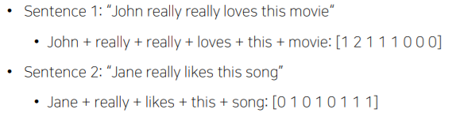
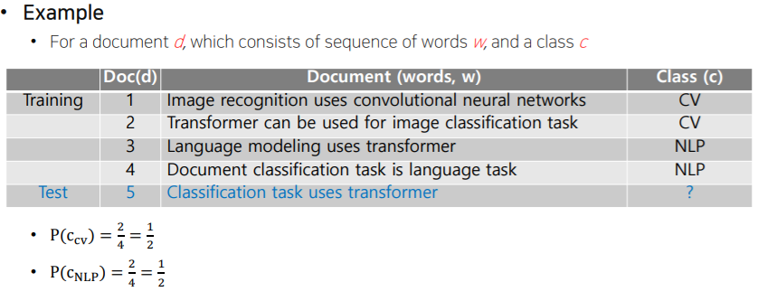
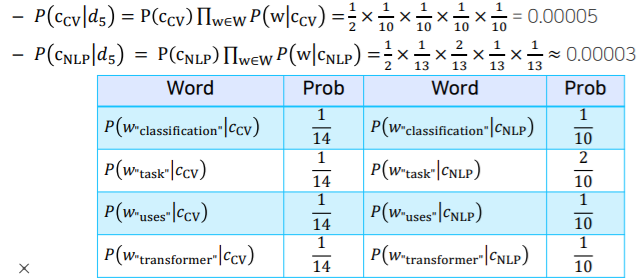
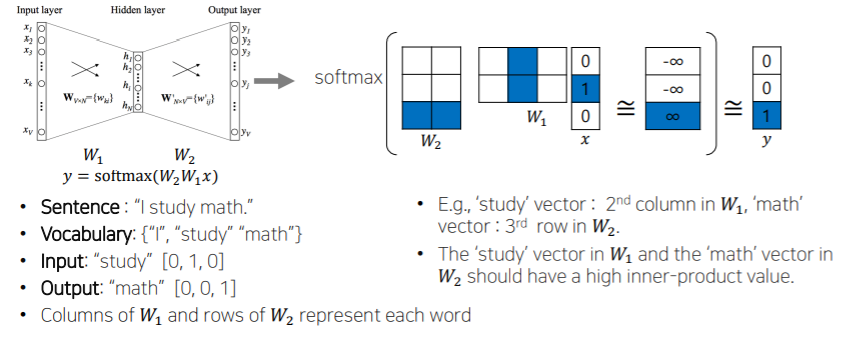
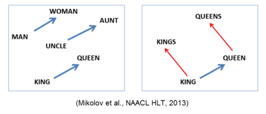

# 수업복습
---

## 자연어 처리의 다양한 task
  1. Low-level parsing
    - `Tokenization` : 문장을 이루는 단어, 정보 단위로 쪼갬, 문장은 토큰의 나열
    - `stemming`: 어미의 변화가 있더라도 본래의 의미를 보존하는 어근을 추출
  2. Word and phrase level
    - `NER(Named entity recognitaion)` : 단일 단어, 여러 단어로 이뤄진 고유명사를 인식하는 task
    - `POS(Part-of-speech) tagging` : 단어의 품사(부사구, 형용사구)
  3. Sentence level
    - `sentiment analysis`: 긍정/부정의  어조 분류
    - `machine translation` : 영어 -> 한글, 주어진 각 단어를 번역, 타겟 언어의 어순에 맞게
  4. Multi-sentence and paragraph level
    - `Entaliment predciont`: 두 문장 간의 논린적인 내포, 모순관계를 예측, 
          - ex. 어제 존이 결혼을 했다. 어제 최소한 한명이 결혼을 했다. -> 첫문장이 참이면 두번째 문장도 참 ,
          - 그런데 두번째 문장이 거짓이라고 하면 첫번째 문장도 당연히 거짓
    - `questoin answereing` : 구글에 어떤 질문을 검색하면 그 질문이 포함된 키워드를 결과창에 뛰우지않고, 질문자체에 답을함.
    - `dialog systems` : 챗봇 대화 
    - `summarization` : 주어진 문서를 요약

---
## text mining 

1. 유용한 정보 및 인사이트를 문자와 문서 데이터를 통해 추출
  - 빅데이터에서 AI 관련 단어들을 추출 하여 분석
2. 문서 군집화 Document clustering(e.g. topic modeling)
  - 비슷한 내용의 뉴스 데이터 그룹화, 특정 제품의 특성과 의견을 빠르게 얻어낼 수 있음
3. Highly related to computational social science
  - 소셜 미디어 데이터로 분석한 최근 신조어, 사회 현상 발견

    
## Inforamtion retrieval
  - 검색기술 연구
  - 현재 검색기술의 성능은 점차 고도화되면서 검색기술은 어느정도 완성됬다고 할 수 있음.
  - 따라서 기술발전도 앞서 말한 텍스트마이닝이나 nlp보다 느림 (거의 완성이니까)
  - `추천 시스템`은   적극적이고 자동화된 새로운 검색이라 볼 수 있음(활발히 활용 중)
    
## Trends of NLP

- `word embedding` : 문장 내 각 단어가 의미를 갖도록 벡터 공간 내 하나의 점과 매핑(word2vec)
- `RNN-family models` : 문장이라는 시퀀스 데이터에 맞는 모델들(LSTM, GRU, transformer)

    - 각 언어의 어순 등 rule 기반으로 수행되던 알고리즘을 벗어나(많은 예외사항과 다양한 사용 패턴이 존재)

    - 영어와 한글이 잘 번역된 문장을 학습하여 특별한 언어학적인 룰을 배제하고, 단지 시퀀스 데이터를 학습할 수 있는 RNN 기반의 모델을 활용하자 성능이 크게 증가했음

- `Transformer model` : 현재 가장 활발히 활용 및 연구되고 있는 모델

    - 핵심 모듈인 self-attention 모듈을 단순히 계속 쌓아 나가는 식으로 모델의 크기를 키움

    - 이 모델은 대규모 텍스트 데이터를 통해 소위 자가지도학습 수행(태스크를 위한 별도의 레이블이 필요하지 않은, 범용적 태스크)

    - 다른 여러 태스크에 전이학습의 형태로 적용할 시 각 태스크에 특화되도록 설계된 기존 모델들보다 훨씬 월등한 성능을 냄

    - **범용 인공지능 기술** : BERT, GPT-2, GPT-3

- `자가지도학습(self supervised learning)` : 입력 문장이 주어져 있을 때 일부 단어를 masking 하여 그 단어를 맞추도록 하는 태스크(그 의미와 품사가 어울리도록 예측)

    - 대규모의 데이터와 엄청난 GPU resource가 필요함
    - GPT-3는 모델 학습하는 데만 엄청난 전기세가 사용됨..막강한 자본력 필요
## bag-of words
--- 
1.  문장이 주어졌을때 문장을 단어단위로 나눠서 사전을 만듦
2.  사전을 원-핫 인코딩 해준다.
    - bag-of-words는 각 단어간 거리는 $
\sqrt{2}$, 코사인 유사도 0
    
3. 문장이나 문서를 대표하는 원핫 벡터는 다음과 같이 나타낼 수 있음.

## NaiveBayes Classifier for Document Classification
---
$\begin{aligned} c_{M A P} &=\underset{c \in C}{\operatorname{argmax}} P(c \mid d) \\ &=\underset{c \in C}{\operatorname{argmax}} \frac{P(d \mid c) P(c)}{P(d)} \\ &=\underset{c \in C}{\operatorname{argmax}} P(d \mid c) P(c) \end{aligned}$

- 가장 큰 확률 값을 갖는 클래스로 할당(예측)
- 특정 클래스에 해당하는 단어가 한 번도 등장하지 않는 경우 확률이 0으로 예측됨
  -> 여러가지 기법을 적용하여 해결

## word embedding
---
- 단어를 벡터로 변환해주는 기법
- 비슷한 의미를 가지는 단어가 좌표상에서 비슷한 위치에 위치하게됨.

### word2 vec
---
- 비슷한 의미를 가진단어가 좌표공간상에서 가까운 위치에 표시
- 가까운 위치에 있는 단어끼리 비슷할것이라는 가정을 사용

https://wikidocs.net/22660

### prorperty of word2vec - Intrusion Detection
---

- 여러단어가 주어질떄 나머지 단어와 의미가 가장 상의한 단어를 찾아내는것
- word2vec의 임베딩 벡터 활용
    - 유클리드거리를 구해서 평균 거리가 가장 먼 단어 를구함
    - 그단어가 가장 의미가 상의한 단어

## Glove : word embedding model
---
⇒ 각 단어 쌍의 유클리디안 거리를 계산하여 가장 먼 단어 추출

#### Word2vec과 가장 큰 차이점
---
- 새로운 형태의 loss function : $J(\theta)=\frac{1}{2} \sum_{i, j=1}^{W} f\left(P_{i j}\right)\left(u_{i}^{T} v_{j}-\log P_{i j}\right)^{2}$  
$\log P_{i j}$ : 말뭉치 전체에서의 동시에 나타나는 경우의수 $P_{ij}$에 로그를 취한 값
$u_{i}^{T} v_{j}$ : 입력 워드의 임베딩 벡터($U_i$), 출력 워드의 임베딩 벡터($v_i$)간의 내적값 
**위 두값이 최대한 같아지도록 학습**
 
- 빠른 학습 및 적은 데이터(corpus)에서도 잘 동작

  ⇒ `Word2vec` : 자주 등장한 특정 입출력 간의 학습이 더욱 빈번하게 되어 내적 값이 더 커짐

  ⇒ `GloVe` : 애초에 어떤 단어 쌍이 특정 윈도우 내에서 동시에 등장한 횟수를 미리 계산하여 로그를 취한 값을 입출력 두 단어의 내적 값의 ground-truth로 사용해서 학습을 진행(중복 계산 방지)

## CBOW (Continuous Bag-of-Words)
---
- 주변 단어들을 가지고 중심 단어를 예측하는 방식으로 학습합니다.
- 주변 단어들의 one-hot encoding 벡터를 각각 embedding layer에 projection하여 각각의 embedding 벡터를 얻고 이 embedding들을 element-wise한 덧셈으로 합친 뒤, 다시 linear transformation하여 예측하고자 하는 중심 단어의 one-hot encoding 벡터와 같은 사이즈의 벡터로 만든 뒤, 중심 단어의 one-hot encoding 벡터와의 loss를 계산합니다.
- 예) A cute puppy is walking in the park. & window size: 2
    - Input(주변 단어): "A", "cute", "is", "walking"
    - Output(중심 단어): "puppy"
---    
## Skip-gram

- 중심 단어를 가지고 주변 단어들을 예측하는 방식으로 학습합니다.
- 중심 단어의 one-hot encoding 벡터를 embedding layer에 projection하여 해당 단어의 embedding 벡터를 얻고 이 벡터를 다시 linear transformation하여 예측하고자 하는 각각의 주변 단어들과의 one-hot encoding 벡터와 같은 사이즈의 벡터로 만든 뒤, 그 주변 단어들의 one-hot encoding 벡터와의 loss를 각각 계산합니다.
- 예) A cute puppy is walking in the park. & window size: 2
    - Input(중심 단어): "puppy"
    - Output(주변 단어): "A", "cute", "is", "walking"

## further Questions
---
`Word2Vec`과 `Glove` 알고리즘이 가지고 있는 단점 ?
1. **'어떤 단어 쌍이 비슷하다(similar)'**는 말의 의미

    ⇒ `춥다`와 `덥다`는 반의어(antonyms)지만 '기온'이라는 속성을 매개로 강한 관련을 갖는다

    e.g., `흑`과 `백`, `소음`과 `적막` 등 특정 속성의 관점에서 보면 반의 관계에 있는 단어 쌍들도 **서로 비슷하다고 볼 수 있음**

    ⇒ `코사인 유사도` : 유의 관계, 반의 관계, 상하 관계 등 **관련성(relevance)을 대변**함 

2. **훈련 데이터에 함께 등장하는 쌍이 없는 경우** : 스무딩
3. **동음이의어 처리** : 동음이의어를 동일한 벡터로 임베딩 ⇒ `ELMo` 사용
4. **윈도우 내 동시 등장한 단어들 중에서도 중요도가 있지 않을까?** : `가중 임베딩`
5. **OOV 문제, rare word 문제** : 각 단어를 문자(자,모) 단위의 n-gram으로 표현하는 `FastText` 활용
6. GloVe는 우선 학습말뭉치를 대상으로 co-occurrence 행렬 X를 만드는 것에서부터 학습을 시작합니다. 단어 개수가 1만개 정도 되는 말뭉치라면 요소 개수가 1억(10000 x 10000)이나 되는 큰 행렬을 만들어야 하는 것이죠. 이후 지금까지 설명드린 목적함수를 최소화하는 임베딩 벡터를 찾기 위해 matrix factorization을 수행해야 합니다. 계산복잡성이 꽤 크다는 이야기이죠.