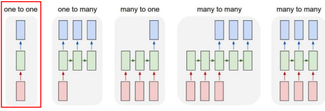

# 수업복습


## RNN(
---

- rnn모델을 정의하는 파라미터 w는 모든 타임스텝에서 동일한 값을 공유한다는 것이 가장 중요한 특징
### RNN 수식
---


### Tpyes of RNNs
---



- One-to-one
    - 시퀀스 데이터가아닌 일반적인구조
    - 사림의 키,몸무게,나이로 이뤄진 3차원 벡터를 입력 -> hidden-layer를 거친뒤
    - 최종적으로 이사람의 혈압이 고혈압/정상/저혈압 3가지중 하나로 분류
- one-to-many
    - 입력으로 하나의 이미지
    - 이미지를에대한 설명들을 순차적으로 예측 또는 생성 
    - 입력이 첫번째 time step에만 
    - 
- many- to-one
    - 입력을 각 time-step에서 받고
    - 최종 출력을 마지막 time-step 에서만
    - 감정분석 같은 거 ..
- many-to-many(1)
    - 입력과 출력이 모두 sequence 형태
    - 기계 번역 의 경우
    - time step가 5개인데 입력이 다된후에 출력하는 time step이 이어지는 구조이기때문임.
- mant-to-mant(2)
    - 입력이 될때마다 바로 바로 출력 
    - 각 단어별로 문장 성분이나 품사를 예측하는 경우..
    
    

### Character-level Language Model
---
- language model : 주어진 문자열을 바탕으로 다음단어를 맞추는 task


### Character-level Language Model 활용
---
- 연극 대사 작성 
- 논문 작성
- C 언어 작성

### 학습과정
---
한꺼번에 하기에는 gpu가 버티기힘듦 
그래서 부분적으로 학습하는 방식을 주로 이용.


## Simple RNN(Vanila RNN)의 문제점 ?
--- 
- 기울기 소실.


## LSTM(Long Short-Term Memory
---
- 기울기 소실을 해결

### LSTM의 원리?? 수식?


## GRU(Gated Recurrent Unin)
---
- LSTM의 모델을 경량화하여 적은량의 메모리와 빠른시간 보장.
- LSTM에서 두가지 종류로 존재하던 CELL STATE VECTOR ,HIDDEN STATE VECTOR -> 일원화해서 HIDDEN STATE VECTOR만 존재 
- 원리는 비슷함
- 그러나 GRU에서 일원화된 HIDDEN STATE VECTOR 


## Backpropagation in LSTM/GRU
---
cell state vector가 업데이트 되는 과정이 곱하는 게아니라 forget gate를 곱하고 필요한 정보를 덧셈으로 하기대문에 기울기 소실이 없다.
더하기 연산은  backprorpagtion 할때 복사 ? 한다.

## LSTM/GRU 요약 
---
- rnn은 다양한 길이를 가질 수 있는 시퀀스데이터에 트고하된 유연한 형태의 딥러닝 모델 구조
- vanila rnns 은 구조가 간단하지만 거의 잘 안씀
- 보다진보된형태인 lstm/gruㄹ르 실제로 많이 사용하고 cellstate vector hidden state vector 업데이트하는 방식이 덧셈이므로 기울기 소실을 해결.


```python

```
