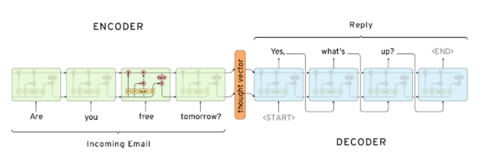
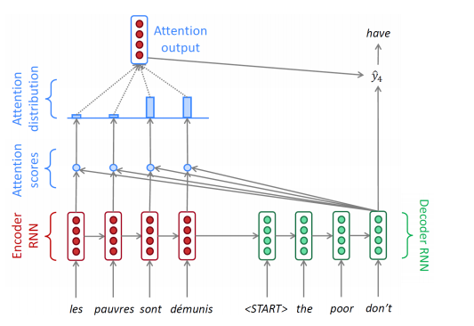
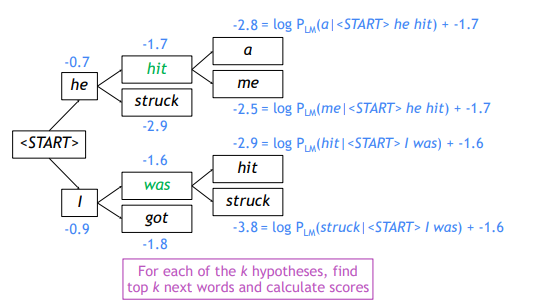
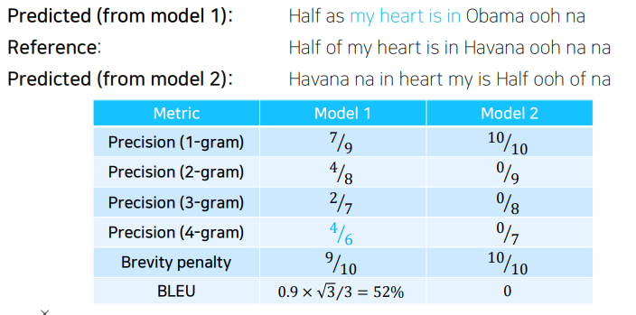

# 수업 복습
---

## Seq2Seq Model
---

- 위 구조에서 입력 문장을 읽어내는 RNN  모델을 인코더라고 부르고
- 문장을 한 단어씩 출력 하는 RNN 모델을 디코더 라고 한다.
- Rnn모델로는 LSTM을 사용
- encoder의 마지막 hidden state는 앞의 정보들을 모두 가지고 있다가 decoder로 넘겨준다.

- RNN기반의 모델 구조 이기 떄문에 hidden state의 dim이 고정된 상태로 계속해서 정보를 누적한다. 길이가 짧을 때는 괜찮지만 길어지게 되면 앞부분의 정보를 잃을 수 있다.
- decoder에서 SOS가 들어오면 encoder의 최종 output을 고려해 첫 단어를 생성해야하는데, 위와 같은 문제로 encoder의 앞부분 정보를 잃어 첫 단어부터 제대로 생성할 수 없을 수 있다.
- 문제를 해결하기 위해 attention module를 사용한다. attention module는 decoder의 hidden state하나와 encoder의 각 time step의 hidden state를 입력을 받아 현재 decoder에서 어떤 time step의 encoder hidden  state를 어느정도 사용할지 encoder state vector의 가중 평균을 구해준다.

## Seq2Seq Model with Attentnion
---

- Encoder 의 입력에 decoder 값을 사용 .
- Decoder의 hidden state와 Encoder의 각 time step의 hidden state의 유사도(Attetntion scores)를 구한다. 
- 이후 softmax를 통해 각 hidden state가 필요한 비율?을 알 수 있는데, 이러한 벡터를 attention vector라 한다.(Attention distribution vector )

`Attention Score(유사도) 구하는 방법`

1. 단순히 두 vector의 내적으로 계산 
    - $score(h_t, \bar{h_s})=h_t^T\bar{h_s}$
2. 단순한 내적을 구하는 것이아닌 학습 가능한 가중치 행렬을 추가하는 방법 
    - $score(h_t,\bar{h}_s)=h_t^TW_a\bar{h_s}$
3. 두 hidden state를 concat 하여 FC_Layer의 입력으로 넣어 유사도를 구하는 방법
    - $score(h_t, \bar{h_s})=v_a^Ttanh(W_a[h_t;\bar{h_s}])$

- ` Teacher forcing`
    - 디코더에 input 데이터를 넣을때 이전 스텝에서 잘못된 단어를 예측하더라도
    - 올바른 단어를 다음 디코더에 넣어주면서 학습 .

## Attention is great
---
- attention 모듈이 추가되면서 `기계번역`에서 성능을 많이 올림
- 원인은 decoder의 매 time-step마다 입력시퀀스에서 어떤 부분에 정보를 집중해서 직접적으로 그 정보를 사용할지를 활용
- encoder의 마지막 time-step의 hidden-state만 사용했어야되는 문제 해결
- 학습의 관점에서 기울기 소실 문제 해결 .
- 모델이 어떤 단어에 집중했는지를 알수 있음  -> 해석가능 . . ? 

# Beam search
---

## Greedy decoding
---
- sequence로서의 전체적인 문장의 확률값을 보는게아니라 현재 타입스탭에서 가장 좋아보이는 단어를 선택하는 것

## Exhaustive search
---
- 입력 문장을 x 출력 문장을 y 라고 하고 출력 문장의 첫번째 단어를 $y_1$이라고 생각하면 아래와 같이 확률을 구할 수 있음
- $
P(y|x)=P(y_1|x)P(y_2|y_1,x)P(y_3|y_2,y_1,x)...P(y_{T}|y_1,...,y_{T-1},x)=\prod_1^TP(y_t|y_1,..y_{t-1},x)$
- 위의 식을 보면 첫번째 단어를 높은 확률인 단어로 선택했지만, 뒤로 진행됨에 따라 전 체적인 확률이 높지 않을 수 있다. 현 재 단어에 대한 확률값이 조금 낮지만 전체적인 확률값이 높아지도록 선택하는 것이 좋은 결과를 얻을 수 있다. 하지만 모든 경우의 수를 구하기 위해서는 경우의 수가 너무 많아 불가능함.
- 하나의  tiem step만 사용하는 greedy decoding 방법과 모든 time sstep의 경우를 다 따져보는 두가지 방법을 적절하게 사용하는 것이 `beam search`이다.

## Beam search
---
- 전체 문장의 확률값을 보는거 -> 너무 복잡하고 오래걸림 그래서 등장한게 `Beam search`
- beam search는 디코더의 각 time step마다 k개의 가능한 경우를 고려해 최종k(beam size)개의 output중에서 가장 확률이 높은것을 선택하는 방식이다.(보통 beam size는 5~10)
- k개의 출력은 hypothesis라고 한다. 각 확률을 곱하는 것으로 각 hypothesis의 확률을 구해야 하지만 log를 사용해 곱셈을 덧셈으로 계산할 수 있다.
- $
score(y_1,...,y_t)=logP_{LM}(y_1,...,t_t|x)=\sum_{i = 1}^t logP_{LM}(y_i|y_1,...,y_{i-1},x)$

###  예시 : k = 2 일떄 beam search

- 가장 높은 확률을 가지는 k개를 계속해서 업데이트 해 가져간다.
위의 예에서 처음 문장을 생성할 때 가장 확률이 높은 2개 he, i가 선택되고 다음 tiem step에서는 he,i에서 각각 가장 확률이 높은 2개씩을 선택해 확률을 계산하고 가장 확률 이 높은 2개를 사용한다.
- beam search decoding에서는 각 hypothesis가 다른 timestep에 <END\>token으로 문장을 끝낼 수 있다. 만약 특정 time step에서 <END\> toekn을 생성한 경우 임시 저장해놓고 다른 후보는 계속해서 위의 과정을 계산함 -> 가장 확률이 높은 2개를 사용한다.
- beam search decoding 종료시기
    - 미리 정해놓은 timestep T까지 도달할 때 종료
    - 저장해놓은 완성본이 n개 이상이 되었을 때 종료
- completed hypothesis중에서 선택을 해야하는데 길이가 짧을 수록 확률이 높게 나오기 떄문에 Normalize를 해주어야 한다. 
$score(y_1,...,y_t)=\frac{1}{t}\sum_{i=1}^tlogP_{LM}(y_i|y_1,...,y_{i-1},x)$
   

# 문장 번역 평가 방법
---
실제 결과와 예측결과를 단순 위치 기반으로 구분하게되면 정확한 정확도를 계산할 수 없다.
예를 들어 I love you와 oh i love you의 경우 위치 기반으로 구분하면 0%의 결과가 나온다.
- `precision 방법(정밀도)`
    - 예측 문장에서 위치를 고려하지 않고 정답 문장과 일치하는 단어의 수를 예측 문장의 단ㅇ어의 수로 나누어 주는것으로 계산
    - $
precision = \frac{correct word}{length\_of\_prediction}$

- `recall 방법(재현율)`
    - 분자는 precision방법과 똑같지만 분모로 예측결과의 길이가 아닌 정답의 길이를 사용
    - $
recall=\frac{correctword}{length\_of\_reference}$
- `F measure`
    - precision, recall의 조화 평균 사용
    - $
F-measure = \frac{precision *recall}{\frac{1}{2}(precision+recall)}$

이러한 방법들은 단어의 위치를 전혀 고려하지 않기 때문에 문법적으로 맞지 않지만 특정 단어들이 포함되어만 있으면 높은 정확도로 계산된다.
## BLEU score
---
- N-gram overlap (n개의 연속된 단어)를 사용
- 4개의(1~4 N-gram) precision의 기하평균을 사용

>    $BLEU=min(1,\frac{length\_of\_prediction}{length\_of\_reference})(\prod_{i=1}^4precision_i)^{\frac{1}{4}}$

