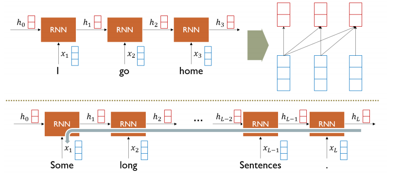
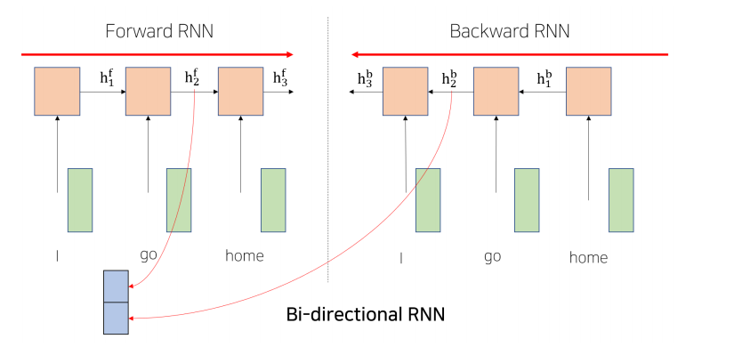
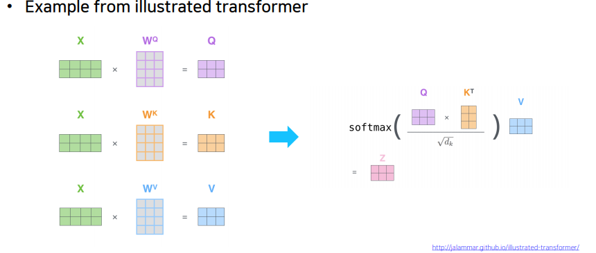
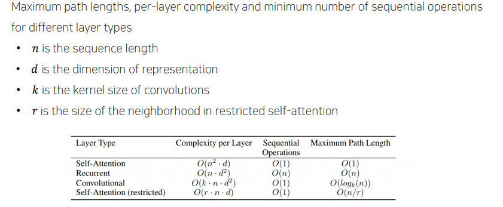
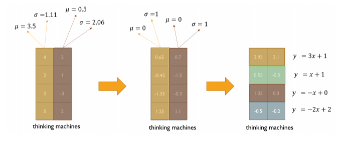
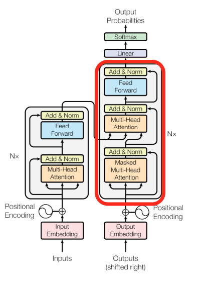
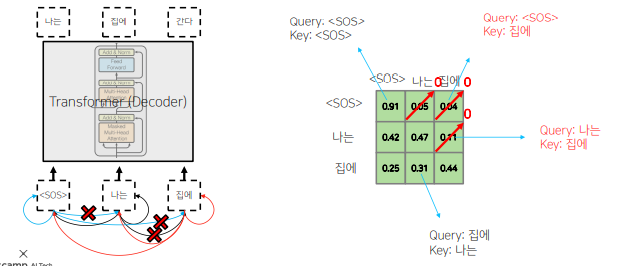

# 수업복습
---
  

## Transformer
---
- sequence 데이터를 attention 만으로 입력으로받고 attention만으로 예측할 수있는 모델

## RNN: Long-Term Dependency
---

기존의 RNN 모델은 멀리있는 time-step의 데이터를 전달받기에는 한계가 분명함

## Bi-Directional RNNs
---

- 양방향의 hidden state를 모두 고려하는 방법
- 병렬적으로 두 개의 모듈을 만들고 hidden state를 concat하여 사용.

## Transformer (14일차 내용 참고)
---
https://github.com/parkchanghyup/boostcamp2021/blob/master/1~3%EC%A3%BC%EC%B0%A8/DAY14.md

---
## 추가적인 부분
---

## Scaled Dot-Product Attention
---

- $A(Q, K, V) = softmax(QK^T)V=softmax(\frac{QK^T}{\sqrt{d_k}})V$
- Q,K의 차원에 따라 내적값의 분산이 크게 영향을 받게 됨
- Softmax함수를 취하게되면 어떤 하나의 Key에만 100%로 몰릴 수 있다.( 차원이 커서 )
- ${QK^T}$에$\sqrt{d_k}$를 나누어주게되면 Q와 K의 차원에 상관없이 항상 분산이 1인 형태로 나오게 됨
- softmax의 값이 한쪽으로 극단적으로 치우치면 학습을 진행하면서 gradient vanishing이 발생 될 위험이 있다.

## Multi-Head Attention
---
- 여러개의 Atttention 모듈을 사용하는것을 말함.

- RNN 보다 attention 이 메모리는 다 많이 먹음 
- 그러나 속도는 월등히 빠름 ( 병렬처리가 가능하기 때문 )
- RNN은 구조적으로 병렬 처리 불가.

##  Layer normalization
---
- 특정 노드에서 나와야 하는값에 가장 최적화된 평균과 분산을 가지도록 해준다.
- 각 sample에 대해서 평균을 빼주고, 표준 편차로 나누어 주면 된다.

## positionmal encoding
---
- 순서마다 특정 scala를 곱해 순서를 고려하지않는 한계를 해결

## Warm-up Learning Rate Scheduler
---

## Transformer: Decoder
---

## Masked Self-Attention
---

