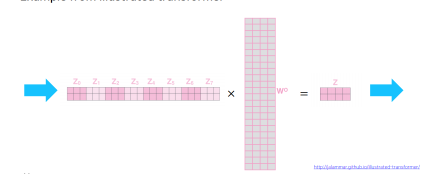

# 수업복습
---
  

## Transformer
---
- sequence 데이터를 attention 만으로 입력으로받고 attention만으로 예측할 수있는 모델

## RNN: Long-Term Dependency
---

기존의 RNN 모델은 멀리있는 time-step의 데이터를 전달받기에는 한계가 분명함

## Bi-Directional RNNs
---

- 양방향의 hidden state를 모두 고려하는 방법
- 병렬적으로 두 개의 모듈을 만들고 hidden state를 concat하여 사용.

## Transformer (14일차 내용 참고)
---
https://github.com/parkchanghyup/boostcamp2021/blob/master/1~3%EC%A3%BC%EC%B0%A8/DAY14.md

---
## 추가적인 부분
---

## Scaled Dot-Product Attention
---

- $A(Q, K, V) = softmax(QK^T)V=softmax(\frac{QK^T}{\sqrt{d_k}})V$
- Q,K의 차원에 따라 내적값의 분산이 크게 영향을 받게 됨
- Softmax함수를 취하게되면 어떤 하나의 Key에만 100%로 몰릴 수 있다.( 차원이 커서 )
- ${QK^T}$에$\sqrt{d_k}$를 나누어주게되면 Q와 K의 차원에 상관없이 항상 분산이 1인 형태로 나오게 됨
- softmax의 값이 한쪽으로 극단적으로 치우치면 학습을 진행하면서 gradient vanishing이 발생 될 위험이 있다.

## Multi-Head Attention
---
- 여러개의 Atttention 모듈을 사용하는것을 말함.

- 계산 복잡도를 위해 주요 연산에 대해 살펴보자
`self-attention` : 주요 연산은 k,q의 내적으로 각각 n개만큼 있으며 d개의 entry에 대한 내적을 수행 해야하므로 이에 소모되는 시간 복잡도는 레이어당 $O(dn^2)$이다.
`RNN`의 경우 hidden state vector가 매 time-step마다 $W_hh$는 d x d 행렬이므로 계산량이 $O(d^2n)$ 이 된다.
- 이렇게 되면 공간적 측면에서도 연산량에 비례하는 공간복잡도를가지게되는데, backpropagation을 수행하려면 연산된 모든 값들을 저장하고 있어야 하기 때문.
- self- attention의 경우 sequence 길이가 늘어남에 따라 저장해야하는 정보량이 $n^2$으로 늘어나게 되므로 문장의 길이가 길면 길수록 메모리가 많이 필요함 결론적으로 attetntion이 RNN보다 메모리를 많이 먹게됨
- 다만 RNN은 timestep마다 이전의 hidden state vector를 활용하므로 병렬연산이 불가하여 sequential operation에 $O(n)$이 필요히자미나, self-attention 모델은 input이 한번에 들어가며 이전 연산에 대한 의존성이 없으므로 모두 한번에 병렬처리가 가능하여 $O(1)$에 연산이 가능. 

-마지막으로 maximum path length는 long-term dependency와 관련이 되는데, 
$n$번째 정보는 첫번째 정보를 참조하기 위해 self-attention은 
$O(1)$, RNN은 앞서 sequential operation에서와 같은 이유로 $O(n)$의 연산이 필요하다.

## Block-based Model
---
- 트랜스포머 구조는 self-attention 구조가 여러개 쌓여있는 형태를 띤다.
- Multi-Head attention과 함께 two-layer로 이루어진 feed-forward NN(with ReLU)를 사용.
- 이 구조에서 확인되는 Add $ Norm 단계, Positional Encoding 단계에 대해 알아보자.
##  Layer normalization
---
- Add & Norm 단계에서는 이전에 보았듯이 Residual Connectoin 기법을 사용하여 gradient vanishing을 해결하고 학습을 안정화 시킬 수 있다. 앞서 말했듯 이걸 쓰려면 Multi-Head Attentio에서는 최종 output이 input과 size가 같도록 마지막 linear layer를 구성해줘야 한다.
- 여기서 Layer Normalization도 추가적으로 행해지는데 이는 아래와 같은 두 단계로 이루어 진다.
  

1. 특정 노드에서 나와야 하는값에 가장 최적화된 평균과 분산을 가지도록 해준다. 각 sample에 대해서 평균을 빼주고, 표준 편차로 나누어 주면 된다.
2. 각 sequence에 대하여 학습이 가능한 affine transoformation($ y = ax + b $ )를 행해준다.
(normalization 대상과 affine transformation 대상이 다르다는 점에 주의.)

## positionmal encoding
---
- attention은 구조적 특성으로 위치에 대한 정보를 담을 수 수없다. 그래서 추가적인 인코딩 작업을 해줘야 하는데 그것이 `positional encoding`이다.
- 주기 함수를 사용하여 순서를 특정지을 수 있는 unique한 vector를 생성하고 이를 각 position을 담당하는 input vector에 더해주는 것이다.

## Warm-up Learning Rate Scheduler
---

위와 같은 warm-up learning rate scheduler를 사용하기도 한다.
1. 초반에는 최적 위치와 동떨어진, 즉 gradient가 매우 큰 위치에 있을 것으로 예상되므로 learning rate를 작게 가져간다.
2. 이후 어느정도 평탄한 위치에 도달할 때까지 점점 줄어드는 gradient를 보정해주기 위해 learning rate를 끌어올리며 학습한다.
3. 어느정도 평탄한 위치에 도달했으면 구 주변이 최적 위치일 것이므로 learning rate를 점점 감소시켜준다.
## Transformer: Decoder
---

Decoder는 encoder와 완전히 동일한 self-attention 구조로 이루어져 있다. 다만 Encoder에서 최종 출력으로 얻은 각 encoding vector에서 key/value vector를 뽕아내고 이를 decoder의 input에서 뽑아온 query vector와 함께 활용한다는 점만 다르다

또한 여기서는 `Masked Self-Attention`이라는 구조를 추가적으로 활용한다.

## Masked Self-Attention
---

- 학습단계에서는 batch processing을 위해 전체 sequence를 decoder에 동시에 input으로 주지만, 아래와 같이 뒷 단어에 대한 sfotmax 결과를 0 등을 활용하여 가려주어야(mask)한다.

이후 각 row에 대하여 확률값을 다시 normalize한다.
예를 들어 첫번째 행은[1, 0, 0] 이 될 것이고 두번째 행은 약[0.47, 0.53, 0] 정도의 값이 될 것이다.

self-attention의 장점이 모든 시점을 vanishing 없이 고려할 수 있다는 점이었지만, 실제 추론(inference)에 서는 미래 시점까지 고려할 수 없으므로 이와 같이 decoder 단에서는 과거 시점의 정보만고려한다고 볼 수 있다.

## Hyperparameter Tuning
---
Hyperparameter Tuning
오늘 과제 해설 시간에는 hyperparameter tuning에 대해 다루었다.

## Learning rate
learning rate는 정말 중요한 parameter 중 하나이다. 이를 튜닝하기 위해 아래와 같은 방법을 써볼 수 있다.

1. learning rate scheduler를 끄고 early stage에서 어느정도 loss가 내려가는 learning rate를 찾는다.
2. learning rate scheduler를 켜고 early stage에서 어느정도 loss가 내려가는 learning rate를 찾는다. 배치 사이즈는 최대한 크게 잡는다.
3. 먼저 train set으로만 loss가 어떻게 변화하는지 판단해본다. 잘 움직이지 않는다면 initialization의 문제를 의심해보자. loss가 너무 안떨어지면 learning rate를 줄여보자.
4. 이후 어느정도 train set에 tuning이 되었으면, validation set을 함께 활용하여 식별되는 overfitting/underfitting 등을 regularization을 통해 해결한다.

## 그 외 hyperparameter tuning TIP
- 대개 중요한 hyper parameter는 learning rate, batch size 정도가 있다.
- hyperparameter tuning시 grid search보다는 random search를 하는 것이 보통 낫다.
전체적으로 random seed를 잘 두는 것도 중요한데, random seed는 고정해둘 수 없는 경우가 많다는 점을 주의하자. (하드웨어, OS 등의 gap으로 인해)
- 리소스가 얼마 없을 경우 cross-validation보다는 그냥 validation set 하나를 두고 그걸로 validation을 하는 것이 차라리 낫다.
- 배치 사이즈는 최대한 크게 놓는 것이 좋지만, 리소스가 부족하면 accumulation(작은 사이즈로 나누어 gradient를 구한 후 이에 대한 평균으로 업데이트) 기법을 사용하기도 한다. 하지만 이 경우 같은 사이즈의 batch / accumulation을 사용하더라도 그냥 batch 자체로 두는 것이 성능이 더 낫다.
- 앙상블 기법은 최종적으로 예측 성능을 2~3% 정도 올릴 가능성이 보장되어있다. 따라서 모델 성능을 어느정도 한계까지 올렸다고 생각되면 그때는 앙상블 기법을 적용해볼 수 있다. 앙상블 적용시 random seed를 다르게 한다던지 등의 생각을 해볼 수 있다.
- 모델은 최대한 유명한 라이브러리/많이 사용된 라이브러리를 최대한 사용하고, 너무 어렵게 코딩되어있는 기법,(스스로 뜯어볼 수 없는) 너무 최신식인 기법은 기피하도록 하자.
- 어찌됐든 가장 좋은 것은 남들이 이미 해놓은 것을 참고하는 것이다.

