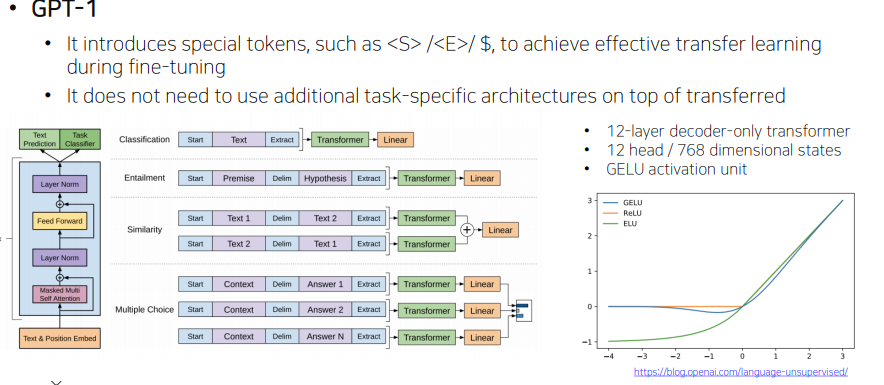
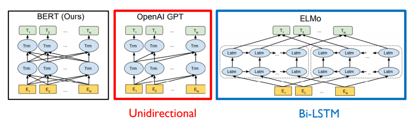
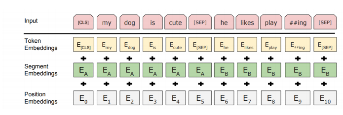
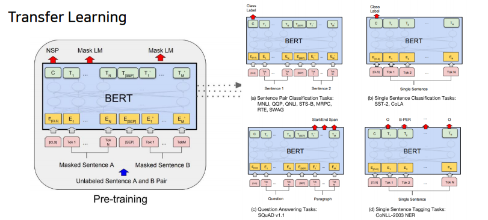
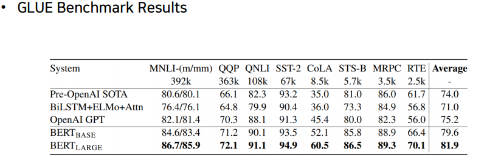
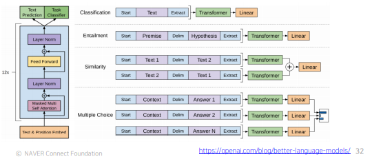
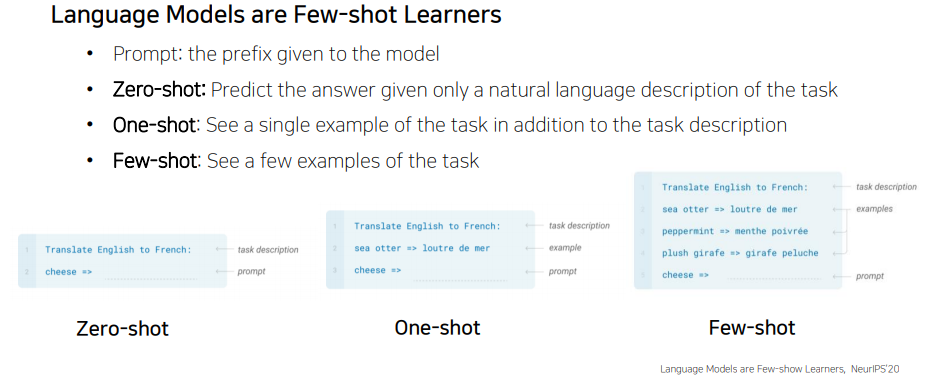
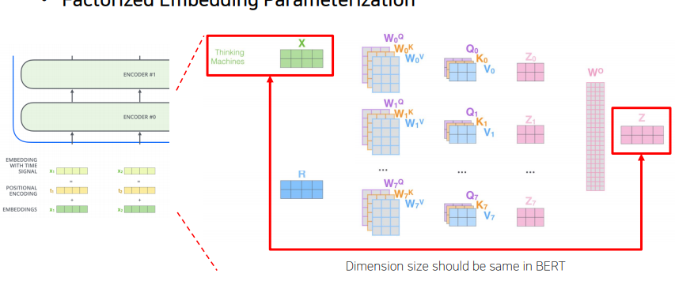
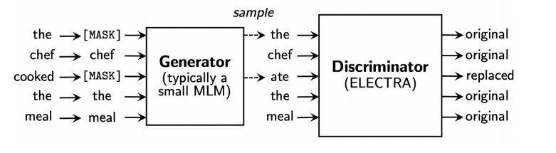

# 수업 복습

## Self Supervised pre-Training model
---
 Transformer의 Self-Attention block은 범용적인 Encoder, Decoder로써 NLP뿐만 아니라 다양한 곳에 활용되고 있다.
 기존 Transformer는 6개의 block를 stack해서 encoder, decoder로 사용했지만 이후 나오는 것들은 더 많은 block과 대규모 학습 데이터를 사용해 self-supervised learning framework로 학습한 뒤 다양한 Task의 Transfer learning 형태로 Fine tuning 해서 사용한다.
 자연어 처리에서 아직까지의 한계점은 greedy decoding을 근본적으로 해결하지 못한다는 것이다. 단어 생성시에는 왼쪽부터 하나하나 생성해야하며 sequence 하나를 한 번에 생성하는 방법에 대해서는 아직까지 연구가 진행중이다.

# GPT-1
---

 
GPT-1(Generative Pre-trainig) 에서는 <S\>, <E\>,$등의 다양한 special token을 활용하여 fine-tuning시의 성능을 극대화 한다.
 
또한 pre-training구조를 활용하였는데, 이 구조를 활용하면 미리 학습된 일부 모델에 fine_tuning을 위한 layer만 덧붙여 하나의 모델을 다양한 tak에 활용할 수 있다는 장점이 있다.

## 모델 구조
---

- self-attention을 12개 쌓은 구조

앞에서 이야기한 special token에 대해 알아보면, 기존처럼 문장의 시작에는 Start token을 넣어주고 위 그림에서는 문장의 끝에 Extract토큰을 넣어주었다. 여기서 이 extract token은 EoS의 기능 뿐만 아니라 우리가 원하는 downward task의 query벡터로 활용 된다.

 

예를 들어 사진의 첫번째 taks의 classificatoin 문제를 푼다고 하면, transformer 구조의 마지막 output으로 나온 extrack token을 별도의 linear layer에 통과 시켜 분류를 수행한다.

 

두번째 task인 entailment에는 Delim(delimiter) token이 활용 되는데, 이것은 서로 다른 두 문장을 이어주는 역할을 한다. 두 문장을 각각 넣지 않고 Delim 토큰을 활용해 한꺼번에 넣어 두문장의 논리적 관계(참/거짓)을 파악한다.
이것 역시도 마지막 Extract token을 finetuning된 linear layer에 통과시켜 정답을 얻을 수 있다.

 

이러한 구조의 장점은, 같은 transformer 구조를 별도의 학습 없이 여러 task에서 활용할 수 있다는 것이다.
우리는 downward task를 위한 마지막 linear layer만 별도로 학습시켜서 우리가 원하는 task에 활용하면 된다. 여기서 transformer 구조 부분이 미리 학습되어 활용할 수 있다는 의미로 `pre-training model`, 그 뒤 linear layer 부분은 `finetuning model`이라고 부른다.

 

이 때 수행하고자하는 task에 대한 데이터가 거의 없을 때 pre-training model만 대규모의 데이터로 학습시킬수 있다면 어느정도 target task에도 보장되는 성능이 있다. 즉, pre-training model 의 지식을 finetuning 부분에 자연스럽게 전이학습 시킬 수 있다.

 

활용한 구조를 더 자세히 보면 GPT-1에서는 12개의 decoder-only transformer layer를 활용하였고, multihead의 개수는 12개, 인코딩 벡터의 차원은 768차원으로 해주었다. 또한 ReLU와 비슷한 생김새를 가진 GeLU라는 activation unit을 활용하였다. pre-training단계에서는 language modeling 즉 이전과 같은 text prediction(seq2seq에서처럼)으로 transformer 모델을 학습시킨다.

## BERT
---

- 현재까지도 가장 널리쓰이는 PRE-TRAINING 모델
- GPT-1의 경우 전후 문맥을 보지 않고 앞의 단어만 보고 단어를 예측하는 방식으로 학습을 시켰는데 BERT는 양쪽의 정보를 모두 고려하여 학습한다. (Transformer에서 encoder에서 사용하는 self attention을 사용)
    - 독해 빈칸추론 , 전화 하다가 중간이 끊켜서 들리면 전후 의 정보를 다 활용해서 예측.

- BERT에서는 모델이 학습할 때 이전과 같이 next word language modelin(다음 단어 예측) 이 아니라, 일부 단어를 가려놓고(마스킹) 이를 맞추는 방식의 language modeling을 활용한다.
- BERT는 15%의 단어를 MASK하여 MASK된 단어를 예측하도록 학습된다. 이러한 학습으로 인해 모델이 MASK가 포함되어 있는 처리한 모델로 학습이 될것이다.
- pre training된 BERT를 문서 분류에 사용하려고하면 input data에 더이상 MASK가 존재하지 않아 학습이 제대로 되지 않을 것이다.
    - 해결
        - 15%의 MASK로 치환될 단어들 중 80%를 MASK Token으로 변경한다.
        - 15%의 MASK로 치환될 단어들 중 10%은 random word로 치환한다.
            - 문법에 맞지 않는 단어도 원래의 단어로 잘 복원할 수 있도록 문제의 난이도를 높힘
        - 15%의 MASK로 치환될 단어들 중 10%은 변경하지 않는다.
            - 결과에서 해당단어는 변경되지 않고 나올 수 있도록 문제의 난이도를 높힘
- WordPiece embedding
    - 좀더 세밀한 단위로 단어를 구별한다 (pre-training의 경우 pre, training 같이)
- Segmentation embedding
    - 문장 레벨에서의 position을 반영한 벡터
    
    - He의 경우 전체 위치를 볼 경우 6번째 위치이지만 문장별로 본다면 2번째 문장의 첫번째 단어가 된다. 이를 고려해기 위해 segment embedding vector를 추가로 사용한다.

---

## bert _summary
1. model architecture
- bert base : L12, H = 768, A= 12
- Bert Lagre : : L = 12, H  =1024, A = 16
    - L: self attention 모델수
    - A: 각 레이어별로 정의되는 attention head의 수
    - H : 인코딩 벡터의 차원수 
2. input Representation
    - Wordpiece embeddings
    - Learned positional embedding
    - [CLS] - Classification embedding
    - segment embedding
    - 

## Fine tunning
---

- 내포, 모순관계를 알기위한 모델의 경우 두개의 문장을 [SEP]를 사용해 하나의 input으로 사용하고 [CLS]에 해당하는 encoding vector를 output layer로 주어 Task를 수행한다.
- 단인 문장 분류 문제의 경우도 [CLS]에 해당하는 encoding vector를 output layer로 주어 Task를 수행한다.

## bert vs gpt-1
---
- training-data size
    - GPT는 800M word, BERT는 2500M word를 사용해 학습
- Batch size
    - 일반적으로 큰 size의 batch 를 사용하면 최종 모델성능이 더 좋아지고 학습도 안정화가 된다. → Gradient descent를 수행할 때 더 많은 데이터를 고려해 업데이트하기 떄문
    - BERT : 128000words
    - GPT : 32000words
- Task-specific fine-tuning
    - GPT의 경우 5e-5라는 동일한 lr을 사용
    - BERT는 Task별로 다른 lr을 사용

## BERT : GLUE banchmark

BERT는 자연어 처리의 다양한 분야에서 높은 성능을 보임 ( 사기임 )

# Machine Reading Comprehension (MRC)

- Document를 해석하고 Question에 대답해주는 Task이다.
- 이러한 Task를 위한 Dataset으로 SQuAD가 있다.
- BERT를 사용해서...

## GPT-2
---

- Motivation
    - Multitask learning as Question Answering
        - 해당 논문에서는 다양한 자연어 처리Task가 질의응답으로 바꾸어 통합된 자연어 생성으로 다양한 Task를 처리할 수 있다고 말하였다.
        - 예를들어 문장이 긍정, 부정인지 분류하고자하면 "해당 문장이 긍정이냐 부정이냐" 라는 answer을 한것이다.
        - 요약 Task의 경우 "주어진 문장의 요약이 무엇이냐" 라는 answer을 한것이다.
- Dataset
    - 높은 수준의 글을 선별적으로 사용(Reddit..)
- Preprocess
    - Byte pair encoding
- Modification
    - Layer가 위로 올라감에 따라 index에 따라 init값을 더 작게 하였다.

        → Layer가 위로 갈 수록 선형변환의 값이 0에 가까워지도록

        →위쪽의 Layer가 하는일이 더 줄어들도록

- 번역, 요약등을 zero shot setting으로 잘 동작할 수 있다는 가능성을 보여주었음

    → 번역, 요약을 위한 학습 데이터를 학습한것이 아닌 Language modeling을 통해 학습한 모델을 가지고 ............?

---

# GPT-3

- GPT-2에 비해서 구조적 변화가 아닌 더 많은 Layer, 더 많은 학습데이터를 사용
- GPT-2로 보여주었던 Zero shot setting에서의 가능성을 놀라운 수준으로 올렸다.

- 별도의 fine tuning 없이 번역 등의 Task가 잘 수행된다.
- 모델이 커질수록 더 좋은 성능이 나온다는 통계를 보여주었음

---

## ALBERT

- 기존 BERT가 가지던 성능의 하락없이 모델 size와 학습 시간이 빨라지는것을 목표로 모델제시

- Cross-Layer Parameter sharing
- Sentence order Prediction

---

## ELECTRA
---

- Language model을 통해 단어를 복원해주는 generator라는 모델을 두고, 주어진 Masked Language를 generator를 통해 Masked된 단어를 예측하고 Discriminator(ELECTRA)모델을 사용해 각각의 단어가 원래의 단어인지 replace된것인지  확인하는것으로 학습한다.
- 학습된 Discriminator를 pre-training model로 사용한다.

---

# Light-weight models

### DistillBERT

- Transformer의 구현체를

### TinyBERT

---

# Fusing Knowledge Graph