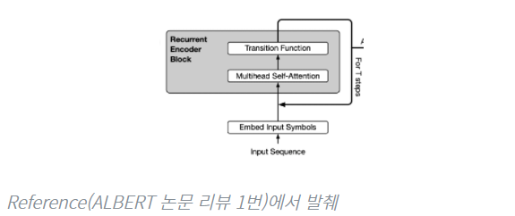
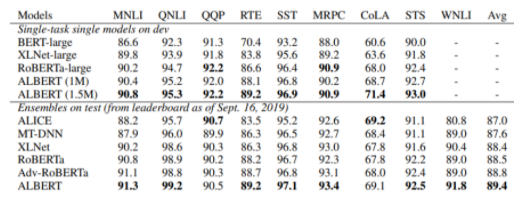
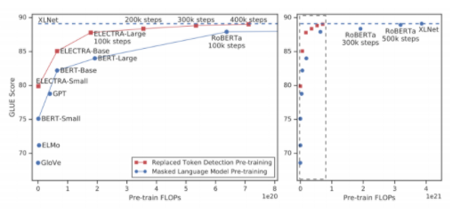

# 수업 복습

[참고블로그](https://olenmg.github.io/2021/02/19/boostcamp-day20.html)
## Self Supervised pre-Training model
---
 Transformer의 Self-Attention block은 범용적인 Encoder, Decoder로써 NLP뿐만 아니라 다양한 곳에 활용되고 있다.
 기존 Transformer는 6개의 block를 stack해서 encoder, decoder로 사용했지만 이후 나오는 것들은 더 많은 block과 대규모 학습 데이터를 사용해 self-supervised learning framework로 학습한 뒤 다양한 Task의 Transfer learning 형태로 Fine tuning 해서 사용한다.
 자연어 처리에서 아직까지의 한계점은 greedy decoding을 근본적으로 해결하지 못한다는 것이다. 단어 생성시에는 왼쪽부터 하나하나 생성해야하며 sequence 하나를 한 번에 생성하는 방법에 대해서는 아직까지 연구가 진행중이다.

# GPT-1
---

 
GPT-1(Generative Pre-trainig) 에서는 < S > / < E > / $등의 다양한 special token을 활용하여 fine-tuning시의 성능을 극대화 한다.
 
또한 pre-training구조를 활용하였는데, 이 구조를 활용하면 미리 학습된 일부 모델에 fine_tuning을 위한 layer만 덧붙여 하나의 모델을 다양한 tak에 활용할 수 있다는 장점이 있다.

## 모델 구조
---

- self-attention을 12개 쌓은 구조

앞에서 이야기한 special token에 대해 알아보면, 기존처럼 문장의 시작에는 Start token을 넣어주고 위 그림에서는 문장의 끝에 Extract토큰을 넣어주었다. 여기서 이 extract token은 EoS의 기능 뿐만 아니라 우리가 원하는 downward task의 query벡터로 활용 된다.

 

예를 들어 사진의 첫번째 taks의 classificatoin 문제를 푼다고 하면, transformer 구조의 마지막 output으로 나온 extrack token을 별도의 linear layer에 통과 시켜 분류를 수행한다.

 

두번째 task인 entailment에는 Delim(delimiter) token이 활용 되는데, 이것은 서로 다른 두 문장을 이어주는 역할을 한다. 두 문장을 각각 넣지 않고 Delim 토큰을 활용해 한꺼번에 넣어 두문장의 논리적 관계(참/거짓)을 파악한다.
이것 역시도 마지막 Extract token을 finetuning된 linear layer에 통과시켜 정답을 얻을 수 있다.

 

이러한 구조의 장점은, 같은 transformer 구조를 별도의 학습 없이 여러 task에서 활용할 수 있다는 것이다.
우리는 downward task를 위한 마지막 linear layer만 별도로 학습시켜서 우리가 원하는 task에 활용하면 된다. 여기서 transformer 구조 부분이 미리 학습되어 활용할 수 있다는 의미로 `pre-training model`, 그 뒤 linear layer 부분은 `finetuning model`이라고 부른다.

 

이 때 수행하고자하는 task에 대한 데이터가 거의 없을 때 pre-training model만 대규모의 데이터로 학습시킬수 있다면 어느정도 target task에도 보장되는 성능이 있다. 즉, pre-training model 의 지식을 finetuning 부분에 자연스럽게 전이학습 시킬 수 있다.

 

활용한 구조를 더 자세히 보면 GPT-1에서는 12개의 decoder-only transformer layer를 활용하였고, multihead의 개수는 12개, 인코딩 벡터의 차원은 768차원으로 해주었다. 또한 ReLU와 비슷한 생김새를 가진 GeLU라는 activation unit을 활용하였다. pre-training단계에서는 language modeling 즉 이전과 같은 text prediction(seq2seq에서처럼)으로 transformer 모델을 학습시킨다.

## BERT
---

- 현재까지도 가장 널리쓰이는 PRE-TRAINING 모델
 
- GPT-1의 경우 전후 문맥을 보지 않고 앞의 단어만 보고 단어를 예측하는 방식으로 학습을 시켰는데 BERT는 양쪽의 정보를 모두 고려하여 학습한다. (Transformer에서 encoder에서 사용하는 self attention을 사용)
    - 독해 빈칸추론 , 전화 하다가 중간이 끊켜서 들리면 전후 의 정보를 다 활용해서 예측.
 
- BERT에서는 모델이 학습할 때 이전과 같이 next word language modelin(다음 단어 예측) 이 아니라, 일부 단어를 가려놓고(마스킹) 이를 맞추는 방식의 language modeling을 활용한다.
 
- BERT에서는 학습을 할 때 전체 글에서 일정 퍼센트만큼의 단어를 가려놓고 그 단어가 무엇인지 맞히는 학습(Masked Language Model,MLM)을 하게된다. 여기서 몇%를 가를지도 하나의 hyperparameter가 되는데, 일반적으로 15%가 최적이라고 알려져있다. 

 

- pre training된 BERT를 문서 분류에 사용하려고하면 input data에는 MASK가 존재하지 않아 학습이 제대로 되지 않을 것이다.
    - 해결
        - 15% 중 80%는 실제로 masking 한다.
        - 10%는 임의의 단어로 바꿈
            - 문법에 맞지 않는 단어도 원래의 단어로 잘 복원할 수 있도록 문제의 난이도를 높힘
        - 10%는 바꾸지 않고 그대로 둔다.
            - 결과에서 해당단어는 변경되지 않고 나올 수 있도록 문제의 난이도를 높힘

또한 language modeling 뿐만 아니라, 두 문장 A, B를 주고 B가 A의 뒤에 올 수 있는지 분류하는 학습(Next Sentence Prediction, NSP)도 하게 된다. 이 task는 binary classification task가 될 것이며, 모델은 Label로 IsNext혹은 NotNext를 내놓게 된다. 

 

그리고 GPT-1에서의 sepcial token을 BERT에서도 비슷하게 활용하는데, 앞서 본 NSP에서의 classification task를 위해 이번에는 문장 맨 앞에(GPT-1에서는 맨 뒤에 Extract token을 놓았다) CLS(classification)token을 두어 이 token에 대한 output을 분류에 활용한다.
CLS token의 output은 layer에 통과되어 분류를 위한 결과를 내놓게 된다.

 

 

위 두학습에 더불어 positional encoding시 SEP(seperate)토큰으로 나눠진 문장이 있으면 각 문장에 별도의 위치정보를 주입해주기 위해 segment  embedding을 추가적으로 더해주었다. 그리고 BERT에서는 positional encoding 자체도 기존 주기함수가 아니라 별도의 학습을 통해 구하여 더해주었다.

 

BERT에서는 base model에 self-aeention layer 12개,
multihead 12개, 인코딩 벡터의 차원을 768개로 두었으며(GPT-1 과 동일) 보다 성능을 끄어올린 large model에서는 self-aeention layer 24개, multihead 16개 인코딩 벡터의  차원을 1024개로 주었다. 그리고 데이터로써 byte pair encoding의 변형 알고리즘인 WordPiece  model을 활용하여 인코딩된 WordPiece embedding 30000개를 활용하였다. 
 
 
- WordPiece embedding
    - 좀더 세밀한 단위로 단어를 구별한다 (pre-training의 경우 pre, training 같이)
- Segmentation embedding
    - 문장 레벨에서의 position을 반영한 벡터
    
    - He의 경우 전체 위치를 볼 경우 6번째 위치이지만 문장별로 본다면 2번째 문장의 첫번째 단어가 된다. 이를 고려해기 위해 segment embedding vector를 추가로 사용한다.

---

## bert _summary
1. model architecture
- bert base : L12, H = 768, A= 12
- Bert Lagre : : L = 12, H  =1024, A = 16
    - L: self attention 모델수
    - A: 각 레이어별로 정의되는 attention head의 수
    - H : 인코딩 벡터의 차원수 
2. input Representation
    - Wordpiece embeddings
    - Learned positional embedding
    - [CLS] - Classification embedding
    - segment embedding

## Fine tunning
---

- 내포, 모순관계를 알기위한 모델의 경우 두개의 문장을 [SEP]를 사용해 하나의 input으로 사용하고 [CLS]에 해당하는 encoding vector를 output layer로 주어 Task를 수행한다.
- 단인 문장 분류 문제의 경우도 [CLS]에 해당하는 encoding vector를 output layer로 주어 Task를 수행한다.

## GPT-1 vs BERT
---
GPT-1 vs BERT
BERT 모델은 상대적으로 GPT-1에 비해 더 나은 성능을 보여주었다. 어떻게 보면 당연할 수도 있는게, GPT가 제시될 당시 GPT는 8억 개의 word로 학습되었고 BERT는 25억개의 word로 학습되었다.
 
또한 batch size 역시 GPT가 32000 words, BERT가 128000 words로 BERT가 훨씬 컸다. (보통 큰 사이즈의 배치가 학습에 더 좋다)
 
한편, GPT는 모든 fine-tuning task에서 똑같이 learning rate를 5e-5로 주었으나 BERT에서는 각 task에서 별도의 learning rate를 두고 fine-tuning 단을 학습시켰다.

## BERT : GLUE banchmark

BERT는 자연어 처리의 다양한 분야에서 높은 성능을 보임 ( 사기임 )

# Machine Reading Comprehension (MRC)

모든 downward task가 MRC 기반(독해 기반) 질의응답으로 이루어 질 수 있다는 내용의 논문이 발표됨
 
예를 들어, 문서의 topic이 필요하다면 별도의 fine-tuning없이 'What is the topic?' 이라는 질문에 대한 응답으로 원하는 답을 얻을 수 있다. 이에 따르면 결국 별도의 fine-tuning 과정이 생략될 수도 있다. 

# BERT: SQuAD 1.1/2.0
---
 

실제로 많은 질의응답 데이터 등을 이용해 BERT를 위에서 언급한 것처럼 질의응답 기반 모델로 발전시킬 수 있다. 이를 위해 SQuAD(Stanford Question Answering Dataset)라는 크라우드 소싱 기반 데이터가 활용될 수 있다.  
SQuAD 1.1 데이터 셋을 활용하여 학습되는 BERT에서는 먼저 질문을 던지면 그 질문에 대한 답이 주어진 문장 어딘가에 있다는 가정 하에, BERT 모델은 정답에 해당되는 단어 sequence의 첫번째 위치와 마지막 위치를 예측한다. 모든 단어를 self-attention에 통과시켜 나온 output vector를 최종적으로 linear layer에 통과시켜 scalar 값을 얻고, 이에 softmax를 적용하여 각 위치를 예측한다. 
여기서 추가적으로 필요하게 되는 parameter는 이 output vector를 통과시키는 첫번째 위치 예측을 위한 레이어의 가중치, 그리고 마지막 위치 예측을 위한 레이어의 가중치로 단 2개 layer의 parameter만 추가되면 우리는 이러한 질의응답 예측이 가능하다. 
SQuAD 2.2 데이터 셋을 활용하여 학습되는 BERT에서는 질문에 대한 답이 있는지 없는지부터 판단한다(binary classification). 만약 답이 있으면 아까 1.1에서와 같은 task를 또 수행하고, 답이 없으면 No answer에 해당하는 label을 출력한다. classification에는 앞에서 언급했던것처럼 CLS token을 이용한다.  
비슷한 유형으로, 예제 문장을 주고 이 다음에 올 문장을 4지선다로 고르는 문제가 주어져도, 예제 문장과 이 4개의 문장을 각각 concat하여 BERT를 통해 해결할 수 있다.  
concat한 벡터가 BERT를 통과하여 나온 encoding CLS token을 linear layer에 통과시켜 scalar 값을 얻는다. 이걸 각 문장에 대해 수행하면 총 4개의 scalar 값을 얻을 수 있는데, 이를 softmax에 통과시켜 훈련시킬 수 있으며 이 값을 통해 답을 예측할 수 있다. 
지금 소개한 pre-training model(GPT-1, BERT)들은 모델 사이즈를 늘리면 늘릴수록 무궁무진하게 계속 개선된다는 특징이 있다.BERT_ablation

물론 위 그래프처럼 후반부로 갈수록 상승폭이 줄어들긴 하지만, 리소스(GPU)만 많다면 모델의 성능을 무궁무진하게 개선할 수 있다는 점을 알 수 있다.
 
특히 최근에는 GPT 모델이 GPT-3까지 발전하면서 위와 같은 특성을 유지하면서도 성능이 대폭 개선된 모델이 생겨나게 되었는데, 이로 인해 model size 만능론이 등장하면서 리소스가 부족한 많은 연구자들을 슬프게 만들기도 했다.

## GPT-2/GPT-3
---
GPT-2,GPT-3는 GPT-1에 비해 크게 달라진 것은 없다. 가장 큰 차이점은 transformer layer의 크기를 더욱 늘렷다는 것이다. 다른 차이점에 대해 알아보자

### GTP-2

이전처럼 다음 단어를 예측하는 language modeling으로 학습시킨 pre-training model이 zero-shot shetting으로 down-stream task를 수행할 수 있게 됨.

`zero-shot setting`이란 원하는 task를 위한 별도의 예제를 주지 않고, task에 대한 지시사항만을 모델에 전달하는 것을 말한다. 앞서 본 독해기반 질의응답으로 모든 task를 수행할 수 있다.

Dataset으로는 `BPE(Byte Pair ENcoding)token`을 사용하였고 Reddit에서 up-vote가 3개 이상인 글에 걸려있는 링크(즉, 사람에 의해 필터리오딘)를 총 4500만 개 긁어와서 이를 모델 학습에 이용하였다. 그 외에도 위키피디아 문서등을 이용하였는데 이와 같이 크롤링을 하되 많은 사람들에게 인정받아 신빙성이 보장될만한 글들을 모두 학습에 이용하였다. 이에 따라 training data의 양과 질을 모두 향상 시킬 수 있었다 .

모델의 측면에서는 앞서 말했듯이 절대적인 레이어의 양을 늘렸음.
또한 layer normalization의 위치가 변경된 부분이 있고, 위쪽(깊은) 레이어일수록 weight parameter를 작게(1√n 배,n은 residual layer의 수) 하여 위쪽에 있는 레이어의 역할이 줄어들 수 있도록 구성되었다.

pre-traing 모델만으로 CoAQ(conversation Question answering)에서 55정도의 F1 score를 라벨링된 데이터 없이 내놓았다. BERT가 같은 데이터에 대하야 89라는 높은 F1 score를 내놓았지만, 55라는 score에서도 어느정도 가능성을 엿볼 수 있음.

GPT-2모델이 놀라웠던 점은, 어떤 이야기 문단을 주고 모델에게 이어서 이야기를 써보라고 하였을 때 모델이 사람이 쓴 것같은(말도 안되는 말이지만)글을 써낸다는 것이었다. 심지어 이것이 down-stream task 기반 fine-tunning이 되지 않은 모델이 내놓은 성과인데 이로 인해 많은 윤리적 문제가 우려되기도 함.

---

### GPT-3

- GPT-2에 비해서 구조적 변화가 아닌 더 많은 Layer, 더 많은 학습데이터를 사용
- GPT-2로 보여주었던 Zero shot setting에서의 가능성을 놀라운 수준으로 올렸다.
- 또한 few-shot setting으로 별도의 학습 없이 소량의 test data로도 원하는 답을 내놓을수 있게됨.

- 별도의 fine tuning 없이 번역 등의 Task가 잘 수행된다.
- zero-shot, one-shot, fw-shot 등 여기에도 줄 데이터의 수를 조절하면서 줘볼 수 있는데 아래 그래프와 같이 few-shot에서 parameter 수가 늘어날수록 더 높은 폭의 향상을 보여줌.

.PNG)

- pre-training 모델은 모델 사이즈가 커지면 계속해서 성능이 더욱 좋아진다. 특히 few-shot을 적용하면 zero-shot이나 ont0sot에 비해 상대적으로 그 정확도가 더 빨리 올라가는 것을 확인할 수 있음.
---

## ALBERT

- BERT의 경량화 모델로 다양한 기법을 활용하여 BERT와 비슷한 성능은 유지하되 공간/시각적 측면에서 필요 리스소 양을 줄였다. 지금부터는 BERT의 경량화를 위해 ALBERT에 어떠한 기법들이 사용되었는지 알아보자.

`Factorized Embedding Parameterization`

residual connection의 문제는 multihead attention 사용시 otuput과 input의 dimension이 같아야하기 때문에 처음에 input을 통과시키는 embedding layer의 거대한 parameter를 학습시키기 위한 비용이 너무 많이 든다는 것이다.

이 기법은 word 자체에 대한 정보를 담기 위해 실제로는 많은 차원이 필요하지 않나느 것이 주요 아이디어다. 단어를 BERT에 넣어주면 그 결과로 나오는 output은 context-dependent, 즉 단어 그 자체뿐아니라 문맥에 관한 정보까지 담겨진 베겉가 나오게 된다. 하지만 문맥에 대한 저옵가 필요벗는, 즉 context-independdent한 부분인 input단에서는 단어를 표현하기 위해 그렇게까지 큰 차원이 필요하지 않다.

따라서 input 부분에서는 단어 자체의 embedding을 줄이기 위해 기존 embedding layer의 크기를 V x H에서 V x E로 줄이고 이를 원래 input 차원으로 다시 늘려주기 위해 그 뒤에 E x H의 linear layer를 하나 더둔다.

이렇게 하면 원래 word vector를 보통 768차원으로 두는ㄷ E를 128정도로 두어 input단의 embedding layer의 parameter 갯수를 V * H에서 V * E + E * H로 대폭 줄일 수 있다. input 단에서만 parameter를 줄여주는 것이 모델 전체에 얼마나 큰영향을 줄지 처음에는 이해가 안됬지만, self-attentino 단에서 학습시켜야하는 parameter는 단어의 개수에 의존적이지 않고 곶가 몇십, 몇백개 남짓되는 레이어 갯수에 의존적이지만 embedding layer의 parameter는 몇만, 몇십만 개가 되는 단어의 개수에 정비례하므로 매우 많은 양의 parameter가 embedding layer에 존재하기 때문에 이를 줄이는 것은 모데 전체의 사이즈를 줄이는데에 어느정도 기여할 수있다.

`Cross-Layer Parameter sharing`

embedding layer쪽 parameter를 줄이는 것만으로는 부족했던 모양인지, 이번에는 각 attention layer의 parameter를 공유하는 방법도 제시한다. 참고로 multihead attention의 여러 head들끼리 parameter를 공유한느게 아니라, multihead attention이 퐇마된 큰 단위의 encoder block layer 여러 개가 서로 parameter를 공유하는 것이다.

이를 위 그림처럼 표현할 수 있으므로 Recursive Transformer라고도 부를 수 있다. 아무튼 이러게 self-attention layer의 parameter를 고융해보았더니 성능이 크게 떨어지지 않는 놀라운 결과를 가져왔다.

한편 encoder blcok 안에는 mlutihead self-attention 뿐만 아니라, Feed-forward network(FFN)라는 fully connected later 도 존재한다. 여기서 이 layer의 parameter까지도 공유할 수 있는데, 실험 결과  이를 공유하는 것은 약간 큰 폭의 성능 하락을 가져왔다.

왜 FFN의 paramerter를 공유하는 것이 성능 하락을 가져왓는지는 논문에서도 제대로 설명되어 있지 않지만, 아무튼 layer간 parameter를 sharing 하는 것이 큰 성능 하락을 가져오지 않는다는 점에 큰 의의가 있다.

`Sentence order Prediction`

기존에 BERT 모델에서 학습 방법으로 채택한 Masking과 Next Sentence Prediction(NSP)중 NSP 방법의 경우 이후 연구에서 학습에 큰 도움을 주지 않는다는 점이 밝혀지면서, 이에 대한 대체 방안으로 Sentence Order Predicion(SOP)라는 방법이 제시되었다.

기존 NSP에서는 두번째 문장이 실제 문장(positive examples)과 임의로 뽑은 문장(negative example)으로 등장하게 된다. 그런데 만약 두번째 문장으로 negative example이 주어질 경우 앞 문장과 topic이 아예 다를 가능성이 매우 크므로 모델이 정답을 맞히기가 너무 쉬워진다.

따라서 SOP에서는 실제로 연속인 두 문장의 순서만 바꾼 문제를 negative example로 준다. 이렇게 하면  두 문장의 topic이 같기 때문에 SOP는 정말 문장의 순서를 맞혀야하는 보다 고도화된 문제로써 사용이 가능하다. 실제로 NSP로 학습된 모델은 SOP 문제를 잘 맞히지 못하지만, SOP문제로 학습된 문제ㅡㄴ 두 문제 모두를 잘 맞힐 수 있단느 실험 결과가 있다.

### Summary 

지금까지 살펴본 ALBERT 모델은 세 가지 기법을 적용하면서 parameter는 대폭 줄이고, 모델이 보다 유의미한 학습을 할 수 있도록 task도 일부 조정하였다. 그 결과 위와 같이 ALBERT가 기존 BERT 모델에 비해 비슷하거나 혹은 더 좋은 성능을 보인다. parameter 수를 대폭 감소싴켰는데도 성능이 떨어지지 않았다는 점이 ALBERT모델의 놀라운 점이라고 할 수 있다.

---

## ELECTRA
---

ELECTRA(Efficiently Learning an Encoder that Classifies Token Replacements Accurately)모델은 GAN 모델과 매우 유사한 구조를 띤다. Generator, Discriminator로 이루어져 있으며 이들은 서로 적대적 학습을 한다.

우선 generator는 마스킹되어있는 단어를 맞히는(즉, 적절한 단어를 생성하는) 역할을 한다. 또한 discriminator는 이렇게 generator가 생성한 단어가 포함된 완성된 문장을 받아 어떤 단어가 generator가 만들어낸 단어인지 구별해낸다.

즉, generator는 discriminator를 속이기 위해 더욱 완벽한 단어를 생성하려고 학습할 것이고, discriminator는 이에 맞춰 더욱 더 고도화된 예측 능력을 갖출 수 있도록 학습할 것이다.

그리고 마지막으로 충분히 학습이 되었으면, discriminator를 pre-training model로 활용 한다.

replaced token detection(대체된 단어 예측, ELECTRA)와 masked language model(MLM, 마스킹된 단어생성, BERT)은 모두 학습을 많이 함에 따라 위와 같이 성능이 계속 올라간다. 다만  같은 학습 step에서 ELECTRA가 더 우수한 성능을 보인다. 물로 generator가 MLM의 역할을 하긴 하지만 우리는 discriminator를 pre-training model로 활용하므로 ELECTRA는 replaced token detection 기반 학습을 한다고 말할 수 있다.
---

# 모델 경량화(Light-weight models)

모델 경량화의 최근 트렌드 방향은 스마트폰과 같은 소형 디바이스에서도 모델을 돌릴 수  있도록 하는 것이다. 이에 관련하여 다양한 모델이 있지만 2가지 모델에 대해서만 알아보자.

### DistillBERT

여기서는 student model과 teacher model이라는 두 가지 모델을 두어 student가 teacher을 모사할 수 있도록 학습시킨다. 구체적으로 말하면, student의 softmax 결과가 teacher의 softmax에 가까워지도록 학습한다.

즉 student 입장에서의 ground truth는 teacher model의 sotfamx 결과값이 되고 이에 맞추어 loss를 설게하게 된다.
이에 따라 teachar의 distribution을 student가 학습하게 되는데, student의 modelsize는 teacher에 비해 작은 사이즈로 설계되므로 이 방법을 통해 큰 모델(teacher)에 근사하는 겨로가를 내놓을 수 있는 보다 경량화된 모델(student)을 구현할 수있게 된다.

### TinyBERT

여기서는 softmax의 결과뿐만 아니라 중간결과물인 self-attention의 encoding matrix $W_k,W_q,W-v$그리고 그결과로 나오는 hidden state vector 까지도 student network이 담도록 학습이 진행 된다.

그런데 student model의 hidden state vector는 teacher model의 hidden state vector볻 ㅏ차원이 작을 수 있다. 따라서 teacher쪽에 이 벡터의 차원수를 추기해주는 linear layer를 추가적으로 둬서 student model의 loss를 구할 때 문제가 없도록 설계해 준다.

---

## Knowledge graph와 Pre-training Model

BERT 모델의 한계는 기본적인 외부지식(상식)이 없기 때문에 주어진 지문에 직접적으로 제시되지 않은 숨겨진 정보를 파악하지 못한다는 것이다.

가령, ‘나는 꽃을 심을 것이다. 그래서 땅을 팠다.’라는 지문과 ‘나는 집을 지을 것이다. 그래서 땅을 팠다’라는 지문이 있다고 가정해보자. 이때 ‘땅을 왜 팠니?’라는 질문을 던지면 모델은 각각의 상황에 대하여 ‘꽃을 심기 위해’, ‘집을 짓기 위해’ 라는 답을 잘 줄 것이다. 그런데 ‘땅을 무엇으로 팠니?’라는 질문을 던지면 지금까지 우리가 배운 모델들은 이에 대해 올바른 답을 제시하지 못한다. 왜냐하면 땅을 무엇으로 팠는지에 대한 정보는 지문에 없기 때문이다. 하지만 사람은 이에 대한 답으로 ‘모종삽’, ‘포크레인’ 정도를 유추할 수 있다.

이러한 한계를 극복하기 위해 language model을 Knowledge graph와 융합하게 된다. Knowledge graph에서는 세상에 존재하는 다양한 개체들을 잘 정의하고 그들간의 관계를 잘 정형화해서 만들어둔 것이다. 위 예시에서와 같은 경우 ‘땅’ 이라는 개체와 ‘파다’라는 개체 사이에 도구로써의 개체로 ‘모종삽’, ‘포크레인’ 등이 관계되어 있을 수 있다. 따라서 knowledge graph와 우리가 앞서 배운 모델을 잘 결합해주면 모델이 외부 정보에 기반한 질의응답도 잘 해낼 수 있도록 학습시킬 수 있을 것이다.