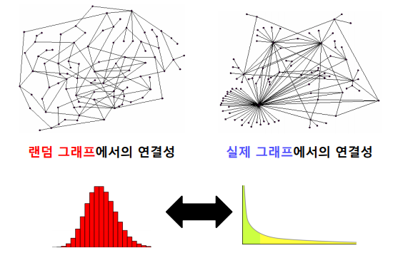

# 수업 복습

## 그래프
---


### 그래프는 왜 중요 할까 ? 
우리 주변에는 다양한 복잡계가 있다.
그래프는 복잡계를 효과적으로 표현하고 분석하기 위한 언어이다.


sns상 관계를 그래프로 표현할 수있다.


온라인 쇼핑몰의 구매이력등을 그래프로 표현할 수 있다.

복잡계는 구성 요소들 간의 상호작용으로 이루어지낟.
상호작용을 표현하기 위한 수단으로 그래프가 널리 사용된다.

그래프를 공부함으로써 복잡계가 등장하는 수많은 분야에 활용가능
전산학, 물리학,생물학,화학,사회과학 등

## 그래프 관련 인공지는 문제

- 정점 분류 문제
    - 트위터에서의 공유 관계를 분석하여, 각 사용자의 정치적 성향을 알 수 있을까 ?
    - 단백질의 상호작용을 분석하여 단백질의 역할을 알아낼 수 있을까 ?
- 연결예측 문제
    - 페이스북 소셜네트워크는 어떻게 진화할까 ?
    - 미시적 관점에서의 연결예측
        - 추천 문제
            - 앞으로 어떤 정점과 연결 될지 예측하는 문제
            - 각자에게 필요한 물건은 무엇일까? 어떤 물건을 구매해야 만족도가 높을까?
- 군집 분석(Community Detection) 문제
    - 연결 관계로부터 사회적 무리(Social Circle)를 찾아낼 수 있을까 ? 
- 랭킹 및 정보 검색 문제
    - 웹이라는 거대한 그로프로부터 어떻게 중요한 웹페이지를 찾아낼 수 있을까 ?
- 정보 전파 및 바이럴 마케팅 문제
    - 정보는 네트워크를 통해 어떻게 전달될까? 어떻게 정보 전달을 최대화 할 수 있을까 ?
          
            
    

### 그래프 유형 및 분류
---
![그래프][그래프4.PNG]
![그래프][그래프5.PNG]
![그래프][그래프6.PNG]

## NetworkX 실습
---


```python
import networkx as nx # NetworkX
import numpy as np    # 선형대수를 위한 라이브러리
import matplotlib.pyplot as plt  # 그림을 그리기 위한 라이브러리 
```


```python
# 그래프 초기화

print('##### Graph Init #####')
G = nx.Graph()  #방향성이 없는 그래프 초기화
DiGraph = nx.DiGraph() #방향성이 있는 그래프 초기화

```

    ##### Graph Init #####
    


```python
# 정점을 추가, 정점의 수를세고 목록 반환
print('##### 정점 추가 ######')
print('# Add node 1')
G.add_node(1) # 정점 1추가
print('Num of nodes in G : ' + str(G.number_of_nodes())) # 정점의 수반환
print('Graph : ' + str(G.nodes) + '\n') #정점의 목록 반환
```

    ##### 정점 추가 ######
    # Add node 1
    Num of nodes in G : 1
    Graph : [1]
    
    


```python
print('# Add vertex 2 ~ 10')
for i in range(1,11):
    G.add_node(i)
print('Num of nodes in G : ' + str(G.number_of_nodes()))
print('Graph :'  + str(G.nodes) + "\n")
```

    # Add vertex 2 ~ 10
    Num of nodes in G : 10
    Graph :[1, 2, 3, 4, 5, 6, 7, 8, 9, 10]
    
    


```python
# 간선 추가
print('##### Add Edge to Graph #####')
print('# Add edge(1,2)')
G.add_edge(1,2)
print('Graph :'  + str(G.edges) + "\n")
```

    ##### Add Edge to Graph #####
    # Add edge(1,2)
    Graph :[(1, 2)]
    
    


```python
# 간선 추가
print('# Add edge (1,i) for i = 2 ~10')
for i in range(2,11):
    G.add_edge(1,i)
print('Graph :' + str(G.edges) + '\n')
```

    # Add edge (1,i) for i = 2 ~10
    Graph :[(1, 2), (1, 3), (1, 4), (1, 5), (1, 6), (1, 7), (1, 8), (1, 9), (1, 10)]
    
    


```python
# 그래프 시각화
# 정점의 위치 결정
pos =  nx.spring_layout(G)
#정점의 색과 크기를 지정하여 출력
im = nx.draw_networkx_nodes(G,pos,node_color = 'red', node_size = 100)
# 간선 출력
nx.draw_networkx_edges(G,pos)
# 각 정점이 라벨을 출력
nx.draw_networkx_labels(G, pos, font_size= 10, font_color = 'black')
plt.show()
```


## 그래프의 표현 및 저장


`간선 리스트(Edge List)` : 그래프를 간선들의 리스트로 저장
각 간선은 해당 간선이 연결하는 두 정점들의 순서쌍(Pair)으로 저장됨.
![그래프][그래프7.PNG]
방향성이 있는 경우에는`(출발점,도착점)` 순서로 저장된다.
![그래프][그래프8.PNG]

`인접 리스트(Adjacent list) - 방향성이 없는 경우` : 각 점정의 이웃들을 리스트로 저장
![그래프][그래프9.PNG]

`인접 리스트(Adjacent list) - 방향성이 있는 경우` 
: 각 정점의 나가는 이웃들과 들어오는 이웃들을 각각 리스트로 저장
![그래프][그래프10.PNG]

`인접 행렬(Adjacency Matrix) - 방향성이 없는 경우`

정점 수 x 정점 수 크기의 행렬
정점 $i$와 $j$ 사이에 간선이 **있는** 경우, 행렬의 $i$행 $j$열 (그리고 $j$행 $i$열) 원소가 **1**
정점 $i$와 $j$ 사이에 간선이 **없는** 경우, 행렬의 $i$행 $j$열 (그리고 $j$행 $i$열) 원소가 **0**
![그래프][그래프11.PNG]

`인접 행렬(Adjacency Matrix) - 방향성이 있는 경우`

정점 수 x 정점 수 크기의 행렬
정점 $i$와 $j$ 사이에 간선이 **있는** 경우, 행렬의 $i$행 $j$열 원소가 **1**
정점 $i$와 $j$ 사이에 간선이 **없는** 경우, 행렬의 $i$행 $j$열  원소가 **0**
![그래프][그래프12.PNG]

<br/>
<br/>
NetworkX를 이용하여 그래프를 표현하고 저장하기
![그래프][그래프13.PNG]

## 실제 그래프 vs 랜덤 그래프
---
본 수업에서는 MSN메신저 그래프를 실제 그래프 예로 시릅

`랜덤 그래프(Random Graph)`는 확률적 가정을 통해 생성한 그래프를 의미

#### 에르되스-레니 랜덤 그래프

임의의 두 정점 사이에 간선이 존재하는지 여부는 동일한 확률 분포에 의해 결정됨
에르되스-레니 램덤그래프G$(n,p)$는
    - n개의 정점을 가짐
    - 임의의 두 개의 정점사이에 간선이 존재할 확률은 p
    - 정점 감의 연결은 서로 독립적.

Q. G(3,0.3)에 의해 생성될 수 있느 그래프와 각각의 확률은 ?  


## 작은 세상 효과


### 경로, 거리 및 지름
---
**정점 $u$와 $v$사이의 경로는 아래 조건을 만족하는 정점들의 순열(Sequence)이다.**

(1) u에서 시작해서 v에서 끝나야한다.  
(2) 순열에서 연속된 정점은 간선으로 연결되어 있어야 한다.


**경로의 길이는 해당 경로 상에 놓이는 간선의 수로 정의**
 
경로 1, 4, 6, 8의 길이는 3
경로 1, 3, 4, 6, 8의 길이는 4
경로 1, 4, 3, 4, 6, 8의 길이는 5

**정점 $u$와 $v$사이의 거리는 $u$와 $v$ 사이의 최단 경로의 길이이다.**


**그래프의 지름은 정점 간  거리의 최댓값이다.**


### 작은 세상 효과 

임의의 두 사람을 골랐을 때, 몇 단계의 지인을 거쳐 연결되어 있을까 ?

`여섯 단계 분리(Six Degrees of Separataion) 실험`

- 사회학자 스탠리 밀그램(Stanley Milgram)에 의해 1960년대에 수행된 실험입니다
- 오마하 (네브라스카 주)와 위치타 (켄사스 주)에서 500명의 사람을 뽑았습니다
- 그들에게 보스턴에 있는 한 사람에게 편지를 전달하게끔 하였습니다
- 단, 지인를 통해서만 전달하게끔 하였습니다

평균 25%의 편지만 도착했지만, 평균적으로 6 단계만을 거침


- MSN 메신저 그래프에서는 어떨까 ?
    - 정점 간의  평균 거리는 7 정도 밖에 되지 않는다.
    - 단 거대 연결 구조만 고려.


이러한 현상을 `작은 세상 효과` 라고 부른다

작은 세상 효과는  높은 확률로 랜덤 그래프에도 존재한다.

모든 사람이 100명의 지인이 있다고 가정해보자.
다섯 단계를 거치면 최대 100억(=$100^5$)명과 연결 될 수 있따.

하지만 모든 그래프에서 작은 세상  효과가 존재하는 것은 아님
체인(chain) 사이클(Cycle), 격자(Grid) 그래프에는 작은 세상 효과가 존재하지 않음


## 연결성의 두터운 꼬리 분포
---


### 연결성
정점의 연결성은 그 정점과 연결된 간선의 수를 의미

정점 v의연결성은 해당 정점의 이웃들의 수와 같다.
보통 정점 v의 나가는 연결성은 $d_{out}(v)$ 혹은 $|N_{out}(v)|$로 표시 합니다.

정점의 들어오는 연결성은 그 정점으로 들어오는 간선의 수를 의미 합니다.
보통 저점 v의 들어오는 연결성은 $d_{in}(v)$ 혹은 $|N_{in}(v)|$로 표시합니다.


실제 그래프의 연결성 분포는 두터운 꼬리(Heavy Tail)를 갖는다.
즉, 연결성이 매우 높은 허브 정점이 존재함을 의미한다.


랜덤 그래프의 연결성 분포는 높은 확률로 정규 부높와 유사

이  경우, 연결성이 매우 높은 허브 정점이 존재할 가능성은 0에 가깝다.




## 겨대 연결 요소

## 연결 요소
---
연결 요소는 다음 조건들을 만족하는 정점들의 집합을 의미한다.

(1) 연결 요소에 속하는 정점들은 경로로 연결될 수 있다  
(2) (1)의 조건을 ㅁ나족하면서 정점을 추가할 수 없다.


실제 그래프에는 `거대 연결 요소`가 존재한다.
거대 연결 요소는 대다수의 정점을 포함한다.

MSN 메신저 그래프에는 99.9%의 정점이 하나의 거대 연결 요소에 포함된다.


랜덤 그래프에도 높은 확률로 거대 연결 요소가 존재한다.
단, 정점들의 평균 연결성이 1보다 충분히 커야한다.
자세한 이유는 Random Graph Theory를 참고.


## 군집 구조
---

군집이란 다음조건들을 만족하는 정점들의 집합이다.

(1) 집합에 속하는 점점 사이에는 많은 간선이 존재
(2) 집합에 속하는 정점과 그렇지 않은 정점 사이에는 적은 수의 간선이 존재.

### 지역적 군집 계수

지역적 군집 계수는한 정점에서 군집의 형성 정도를 측정한다.

정점 i 의 적역적 군집 계수는 정점i의 이웃 쌍 중 간선으로 직접 연겨로딘 것의 비율을 의미한다.
정점  i의 지역적 군집 계수를 $C_i$로 표현한다


참고로 연결성이 0인 정점에서는 지역적 군집 계수가 정의되지 않는다.


지역적 군집 계수가 군집이랑 어떻게 연결 될까 ?

정점 i의 지역적 군집 계수가 매우 높다고 하면 정점 i의 이웃들도 높은 확률로 서로 간선으로 직접 연결되어 있다.
정점 i와 그 이웃들은 높은 확률로 군집을 형성 한다.


### 전역 군집 계수

전역 군집 계수는 전체 그래프에서 군집의 형성 정도를 측정한다.

그래프 G의 전역 군집 계수는 각 정점에서의 지역적 군집 계수의 평균이다.
단, 지역적 군집 계수가 정의되지 않는 정점은 제외한다.

### 높은 군집 게수

실제 그래프에서는 군집 계수가 높다. 즉 많은 군집이 존재한다.

여러가지 이유가 있을 수 있다.
동질성 : 서로 ㅇ사한 정점끼리 간선으로 연결될 가능성이 높다
같은 동네에 사는 같은 나이의 아이들이 친구가 되는 경우가 그 예시이다.

전이성 : 공통 이웃이 있는 경우, 공통 이웃이 매개 역할을 해줄 수 있다. 친구를 서로에게 소개해주는 경우가 그 예시이다.

반맨 랜덤 그래프에서는 지역적 혹은 전역 군집 계수가 높지 않다.

구체적으로 랜덤 그래프 G(n,p)에서의 군집 계수는 p 이다.
랜덤 그래프에서의 간선 연결이 독립적인 것을 고려하면 당연한 결과이다.
즉 공통 이웃의 존재 여부가 간선  연결 확률에 영향을 미치지 않는다.

## 실습
---


```python
# 파일에 저장된 균일 그래프를 읽어온다
import os
regular_graph = nx.Graph()
data = osp.abspath(osp.join(os.getcwd(), 'regular.txt'))
f = open(data)
for line in f:
    v1,v2 = map(int,line.split())
    regular_graph.add_edge(v1,v2)
```


    ---------------------------------------------------------------------------

    NameError                                 Traceback (most recent call last)

    <ipython-input-6-092ee131a046> in <module>
          2 import os
          3 regular_graph = nx.Graph()
    ----> 4 data = osp.abspath(osp.join(os.getcwd(), 'regular.txt'))
          5 f = open(data)
          6 for line in f:
    

    NameError: name 'osp' is not defined


```python

```
