# 수업복습

## 페이지랭크의 배경

웹은 웹페이지와 하이퍼링크로 구성된 거대한 방향성 있는 그래프 이다.

### 구글 이전의 검색 엔진
----
1. 웹을 거대한 디렉토리로 정리
    - 웹페이지 수가 증가함에 따라서 카테고리의 수와 깊이도 무한정 커짐 
    - 카테고리 구분이 모호한 경우가 잦음
2. 웹페이지에 포함된 키워드에 의존한 검색엔진
    - 사용자가 입력한 키워드에 대해, 해당 키워드를 (여러 번) 포함한 웹페이지를 반환
    - 악의적 키워드에 취약
   

### 페이지 랭크의 정의 : 투표 관점
---
페이지랭크의 핵심 아이디어는 `투표` 이다.
즉, 투표를 통해 사용자 키워드와 관련성이 높고 신롸할 수 있는 웹페이지를 찾는다.

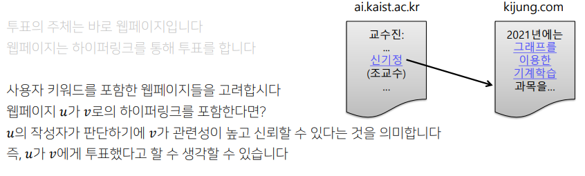
즉,들어오는 간선이 많을 수록 신뢰할 수 있다는 뜻

Q) 들어오는 간선의 수를 세는 것만으로 충분 ?
A) no. 악용될 소지가 있다. 웹페이지를 여러개 만들어 간선의 수를 부풀릴 수 있다. 즉 조작 가능.

이런 악용을 줄이기 위해 페이지랭크에서는 가중 투표를 한다.
    - 관련성이 높고 신뢰할 수 있는 웹사이트의 투표를더 중요하게 간주한다.
각 페이지에는 $\frac{자신의 페이지 랭크 점수}{나가는 이웃의 수}$ 만큼의 가중치로 투표한다
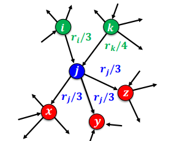
위의 예시에서 웹페이지 j의 페이지 랭크 점수는 $
\frac{r_i}{3}+\frac{r_k}{4}$ 가된다.
$
\frac{r_i}{3}+\frac{r_k}{4}$

### 페이지 랭크의 정의 : 임의 보행 관점
---
웹서퍼가 t번째 방문한 웹페이지가 웹페이지 i일 확률을 $p_i(t)$라고 하면
$p(t)$는 길이가 웹페이지의 수(노드 수)와 같은 확률 분포 벡터가 된다.
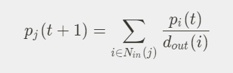
위의 식은 t+1번째에 방문한 페이지가 j일 확률이다. t + 1 번째에 j에 방문하기 위해서는 t번째에는 j 에들어오는 이웃에 있어야한다.($p_i(t)$) 해당 들어오는 이웃들에서 나가는 개수들로 나누어주면 각페이지에서 j로 올 확률이 된다.

- 웹 서퍼가 이과정을 무한히 반복한다면 (t가 무한히 커지면) 확률 분포 $p(t)$는 수렴한다.
    - $p(t) = p(t+1) = p$
    - 수렴한 확률 분포 p 는 정상분포이라한다.
    - 그럼 위의 수식은 투표의 관점에서 나온 식과 같아진다.
    - 투표 관점에서 정의한 페이지 랭크 점수는 임의 보행 관점에서의 정상분포와 동일 하다.
    
    

## 페이지 랭크 계산

페이지랭크 점수의 계산에는 반복곱(Power iteration)을 사용한다.
 

#### 반복곱
  1. 각 웹페이지 i의 페이지랭크 점수르 동일하게 $\frac{1}{웹페이지의 수}$로 초기화 한다.
  2. $r_t^{(t+1)}=\displaystyle\sum_{i\in{N_{in}}(j)}\frac{r_i^{(t)}}{d_{out}(i)}$ 를 사용해 페이지 랭크 점수를 갱신한다.
  3. 페이지랭크 점수가 수렴하면 종료한다.
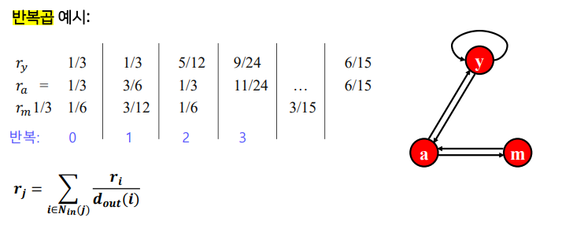
 

#### 반복곱의 문제

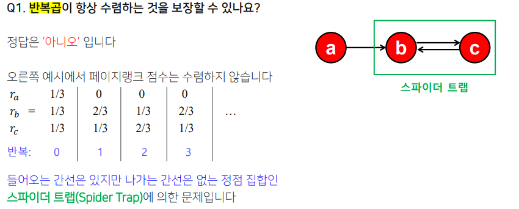
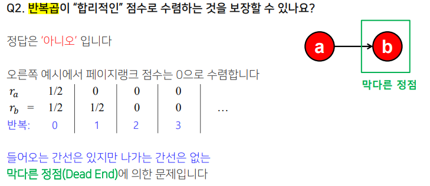

#### 반복곱의 문제 해결
- 문제 해결을 위해 순간이동(Teleport)를 도입
- 임의 보행 관점에서 우베서퍼의 행동을 수정
    1. 현재 웹페이지에 하이퍼링크가 없다면 임의의 페이지로 순간이동 한다.
    2. 현재 웹페에지의 하이퍼링크가 있다면, 앞면이 나올 확률이 $
\alpha$인 동전을 던진다.
    3. 앞면이라면 하이퍼링크 중 하나를 균일한 롹률로 선택해 클릭한다.
    4. 뒷면이라면 임의의 웹페이지로 순간이동한다.
        - 임의의 페이지는 저네 웹페이지들 중 하나를 균일 확률로 선택한다.
        - $\alpha$는 감폭비율이라고 부르며 보통 0.8정도를 사용 한다.
- 순간이동 도입 계산
    - 각 막다른 정점에서 모든 다른 정점으로 가는 간선을 추가한다.
    - $r_i = \displaystyle\sum_{i\in{N_{in}}(j)}(\alpha\frac{r_i}{d_{out}(i)})+(1-\alpha)\frac{1}{|V|}$
    - 위의 수식을 이용해 반복곱을 수행한다.
    - |V|는 전체 웹페이지의 수를 의미 한다.
    - 수식의 앞의 항은 하이퍼링크를 따라 정점 j에 도착할 확률, 뒤의 항은 순간이동을 통해 정점 j에 도착할 확률을 의미 한다.
    

## 그래프를 바이럴 마케팅에 어떻게 활용 할까 ?

### 그래프를 통한 전파의 예시

`그래프를 통한 정보의 전파`
- 온라인 소셜 네트워크를 통해 다양한 정보가 전파된다.
  
`그래프를 통한 행동의 전파`
- 아이스버킷챌린지, 펭귄 문제 등
  
`그래프를 통한 고장의 전파`
- 컴퓨터 네트워크에서의 일부 장비의 고장이 전파되어 전체 네트워크를 마비시킬 수 있다.
일부 장비의 고장이, 다른 장비의 과부화로 이어지기 때문

`그래프를 통한 질병의 전파`
- 사회라는 거대한 소셜 네트워크를 통한 질병의 전파
- 코로나-19, 메르스

전파과정은 다양할 뿐 아니라 매우 복잡하다.
이를 체게적으로 이해하고 대처하기 위해서는 `수학적 모형화`가 필요함.

## 의사결정 기반의 전파 모형
---
### 언제 의사결정 기반의 전파 모형을 사용할까?
주변 사람들의 의사결정을 고려하여 각자 의사결정을 내리는 경우에 의사결정 기반의 전파 모형을 사용

본수업에서는  가장 간단한 형태의 의사결정 기반의 전파 모형인 `선형 임계치 모형`을 소개.

### 선형 임계치 모형
---
- 이상황을 수학적으로 추상화 해보자

친구 관계인 두사람 v와 v를 가정
둘은 두 개의 호환되지 않는 기술 A와 B중에서 하나를 선택한다.

둘 모두 A 기술을 사용할 경우, 행복이 a만큼 증가
둘 모두 B 기술을 사용할 경우, 행복이 b만큼 증가
하지만, 둘이 서로 다른 기술을 사요할 경우, 행복이 증가하지 않는다.
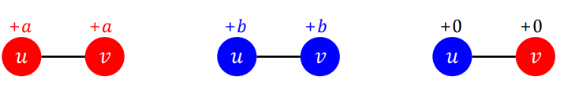

소셜 네트워크를 고려해보자

우리는 동시에 여러 사람과 친구 관계를 맺는다
각각의 친구, 즉 소셜네트워크 상의 이웃과이ㅡ 사이에서 발생하는 행복을 고려해얗나다.
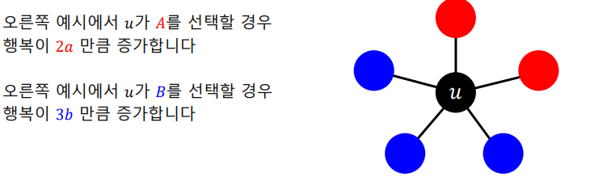
각자의 행복이 최대화 되는 선택을 한다고 가정해보자.
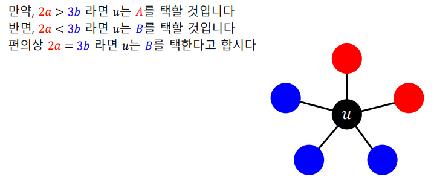
좀더 일반화 해보자
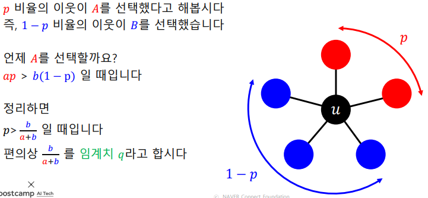

위와 같은 모델을 선형 임계치 모형(Linear Threshold Model)이라 하고 특정 임게치를 넘을 때 A를 선택하는 방식으로 전파가 이루어진다. 처음 A를 선택한 집합을 시드 집합이라고 한다.

### 확률적 전파 모형
---
질병의 전파같은 의사결정을 내리는 것이 아닌 확률적인 과정을 통해 전파가 이루어지는 경우 확률적 전파 모형을 고려해야 한다.
- 독립 전파 모형(Independent Cascade Model)
    - 가장 간단한 형태의 확률적 전파 모형이다.
    - 독립적 전파 모형에서는 방향성이 있고 가중치가 있는 그래프를 가정한다.
    - 각 간선(u,v)의 가중치는 u가 감염되어쏙, v가 감염되지 않았을 때 u가 v를 감염시킬 확률이다.
    - 서로 다른 이웃이 전염되는 확률은 독립적이다.
    - 최초 감염자들을 시드 집합이라고 한다.
    - 독립적 전파 모형은 한번 감염된 사람은 계속 감염자 상태로 남아있다고 가정한다.
        - 감염자의 회복을 가정하는 SIS,SIR등의 전파 모형이 있다.
        
    

## 바이럴 마케팅
- 바이럴 마케팅은 소비자들로 하여금 상품에 대한 긍정적인 임소문을 내게하는 기법이다.
- 바이럴 마케팅이 효과적이기 위해서는 소무의 시작점이 중요하다. 시작점이 어디인지에 따라 입소문이 전파되는 범위가 영향을 받는다.

### 전파 최대화 문제(Influence Maximizaion)
---
- 시드 집합을 어떻게 선택하느냐에 다라 전파가 크게 달라진다.
- 그래프, 전파 모형, 시드 집합의 크기가 주어졌을 때 전파를 최대화하는 시드 집합을 찾는 문제를 전파 최대화 문제라고 한다.
- 이러한 최고의 시드를 찾는 문제는 NP-hard임이 증명되었기 떄문에 다른 방법을 찾아야 한다.

### 정점 중심성 휴리스틱
대표적 휴리스틱으로 정점의 중심성을 사용.

즉, 시드 집합의 크기가k개로 고정되 어 있을 때,  
정점의 중심성이 높은 순으로 k 개 정점을 선택하는 방법이다.  

정점의 중심성으로는 페이지랭크 점수, 연결 중심성, 근접 중심성, 매개 중심성 등이 있다.  

합리적인 방법이지만 `최고의 시드 집합을 찾는 다는 보장은 없다.`

### 탐욕알고리즘

탐욕 알고리즘 역시 많이 사용됨
탐욕 알고리즘은 시드 집합의 원소, 즉 최초 전파자를 한번에 한명씩 선택
즉, 정점의 집합을 {1,2,...,|V|}라고 할 경우 구체적인 단게는 다음과 같다
집합 {1,},{2,},..,{|v|}를 비교하여, 전파를 최대화하는 시드 집합을 찾는다.
이 때 , 전파의 크기를 비교하기 위해 시뮬레이션을 반복하여 평균 값을 사용한다 뽑힌 집합을 {X}라고 한다.
집합 {X,1},{x,2},...,{x,|V|}를 비교하여 전파를 최대화하는 시드 집합을 찾는다.
뽑힌 집합을 {X,Y}라고 한다.

집합 {x,y,1},{x,y,2},...,{x,y,|V|}를 비교하여, 전파를 최대화하는 시드 집합을 찾는다. 뽑힌 집합을 {x,y,z} 라고 한다.

위 과정을 목표하는 크기의 시드 집합에 도달할 때까지 반복

즉 ,탐욕 알고리즘은 최초 전파자 간의 조합의 효과를 고려하지 않고 근시안적으로 최초 전파자를 선택하는 과정을 반복한다.

탐욕 알고리즘은 독립 전파 모형에 경우, 이론적으로 정확도가 일부 보장됨  
항상 입력 그래프와 무관하게 다음 부등식이 성립한다.
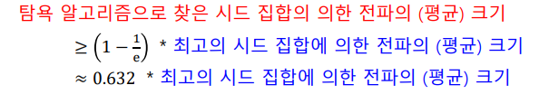
다시 말해, 탐욕 알고리즘의 최저 성능은 수학적으로 보장되어 있다.

