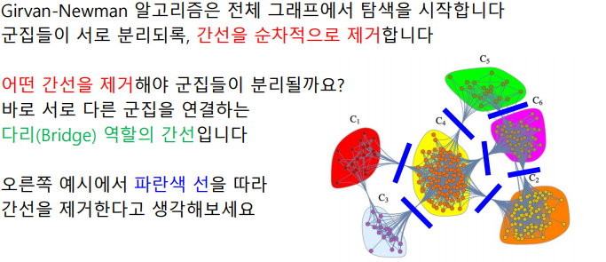
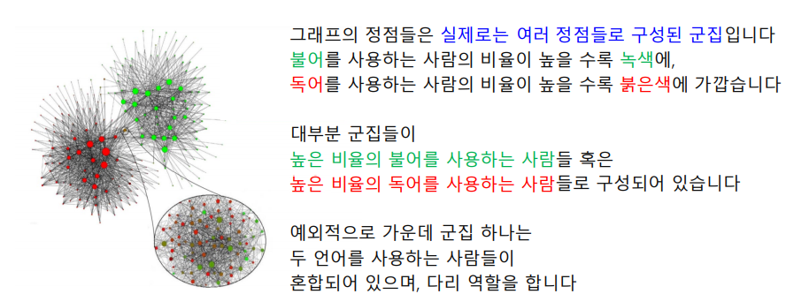

# 수업 복습
---


## 그래프 구조 분석
---
- Girvan-Newman 알고리즘
실제 세상에서 우리는 주변에 여러가지 종류의 군집을 볼 수 있다.  
인관 관계 사이에서, 화학 물질 내부에서 등 어디서나 군집을 발견할 수 있다. 그렇다면, 우리는 그래프 데이터에서 군집을 어떻게 정의하고, 어떻게 찾아내야 할까 ?


### 군집 구조와 군집 탐색 문제
---
- 군집의 정의 
`군집(Community)` 이란 다음 조건들을 만족하는 정점들의 집합
1. 집합에 속하는 정점 사이에는 많은 간선이 존재한다.
2. 집합에 속하는 정점과 그렇지 않은 정점 사이에는 적은 수의 간선이 존재한다.


### 실제 그래프에서의 군집들
---
- `온라인 소셜 네트워크의 군집` 들은 `사회적 무리(Social Circle)`를 의미하는 경우가 많다.


- `조직 내의 분란`이 `소셜 네트워크 상의 군집`으로 표현된 경우


- `키워드 - 광고주 그래프`에서는 `동일한 주제의 키워드`들이 군집을 형성


- `뉴런간 연결 그래프`에서는 군집들이 `뇌의 기능적 구성 단위`를 의미


### 군집 탐색 문제
---
그래프를 여러 군집으로 잘 나누는 문제를 `군집 탐색(Community Detecion) 문제`라고 합니다.

보통은 각 정점이 한 개의 군집에 속하도록 군집을 나눈다.
비지도 기계학습 문제인 클러스터링과 상당히 유사하다.
먼저 `성공적인 군집 탐색`부터 정의해보자.

## 군집 구조의 통계정  유의성과 군집성
### 비교대상 : 배치 모형
성공적인 군집 탐색은 비교를 통해 정의되며, 비교를 위해 `배치 모형(Configuration Model) 사용`

- 주어진 그래프에 대한 `배치 모형`은,  
1) 각 정점의 연결성(Degree)를 보존한 상태에서  
2) 간선들을 무작위로 재배치 하여서 얻은 그래프를 의미  
- 배치 모형에서 임의의 두 정점 i와 j 사이에 `간선이 존재할 확률`은 두 정점의 연결성에 비례


### 군집성의 정의
---
- 군집 탐색의 성공 여부를 판단하기 위해서, `군집성(MOdularity)` 사용
1. 그래프와 군집들의 집합 S가 주어졌다고 가정
2. 각 군집 s ∈ S가 군집의 성질을 잘 만족하는 지를 사펴보기위해, 군집 내부의 간선의 수를 그래프와 배치 모형에서 비교.
3. 구체적으로, 군집성은 다음 수식으로 계산됨

즉, 배치모형과 비교했을 때, 그래프에서 군집 내부 간서의 수가 월등히 많을 수록 성공한 군집 탐색이다.
즉, 군집성은 무작위로 연결된 배치 모형과의 비교를 통해 통계적 유의성을 판단한다.
-> 항상 `-1 ~ 1 사이의 값`을 가지며, 보통 군집성이 `0.3 ~ 0.7 정도의 값`을 가질 때, 그래프에 존재하는 통계적으로 유의미한 군집들을 찾아냈다고 할 수 있음.


## 군집 탐색 알고리즘
### Girvan-Newman 알고리즘
---
대표적인 하향식(Top-Down) 군집 탐색 알고리즘



(1) 전체 그래프에서 탐색을 시작, 군집들이 서로 분리되록, **간선을 순차적으로 제거**

(2) **어떤 간선을 제거해야 군집들이 분리될까요?** 바로 서로 다른 군집을 연결하는 **다리(Bridge) 역할의 간선**입니다

 **다리(Bridge) 역할의 간선**을 어떻게 찾나요?

⇒ 간선의 **매개 중심성(Betweenness Centrality)**을 사용

(해당 간선이 정점 간의 최단 경로에 놓이는 횟수 의미)

정점 𝑖로 부터 𝑗로의 최단 경로 수를 $\sigma_{𝑖,𝑗}$라고 하고  
그 중 간선 (𝑥, 𝑦)를 포함한 것을 $\sigma_{𝑖,𝑗}(𝑥, 𝑦)$ 라고 합시다
간선 (𝑥, 𝑦)의 매개 중심성은 다음 수식으로 계산됨  

$\sum_{i<j} \frac{\sigma_{i, j}(x, y)}{\sigma_{i, j}}$

### Girvan-Newman 알고리즘

 `매개 중심성이 높은 간선을 순차적으로 제거`, 간선이 제거될 때마다, 매개 중심성을 다시 계산하여 갱신, 간선이 모두 제거될 때까지 반복
 


**간선을 어느 정도 제거하는 것이 가장 적합할까 ? **

앞서 정의한 `군집성`을 그 기준으로 삼는다.
즉, `군집성이 최대가 되는 지점`까지 간선을 제거 한다.

단, 현재의 연결 요소들을 군집으로 가정하되, 입력 르패으세어 군집성을 계산한다.

**정리하면, Girvan-Newman 알고리즘은 다음과 같다**

1. 전체 그래프에서 시작
2. `매개 중심성`이 높은 순서로 간선을 제거하면서, 군집성의 변화를 기록
3.`군집성`이 가장 커지는 상황을 복원
4. 이 때, 서로 연결된 정점들, 즉 연결 요소를 하나의 군집으로 간주.

즉, 전체 그래프에서 시작해서 점점 작은 단위를 검색하는 `하향식(Top-Down)` 방법이다.

### Louvain 알고리즘
---
- Louvain 알고리즘
    - 상향식(Bottom-Up)군집 탐색 알고리즘이다.
    - 하나의 정점들을 하나의 군집으로 보고 군집들을 병합한다.
    - 동작
        1. 개별 정점으로 구성된 크기 1의 군집들로 시작한다.
        2. 각 정점 u를 기존 혹은 새로운 군집으로 이동한다. (군집성이 최대화 되도록)
        3. 더이상 군집성이 증가하지 않을 때까지 2번을 반복한다.
        4. 각 군집을 하나의 정점으로 하는 군집 레벨의 그래프를 얻은 뒤 3을 수행한다.
        5. 한개의 정점이 남을 때까지 4를 반복한다.


- Louvain 알고리즘을 이용해 소셜 네트워크의 군집을 탐색한 결과를 살펴보자



## 중첩이 있는 군집 모형
- 가정
    1. 각 정점은 여러개의 군집에 속할 수 있다.
    2. 각 군집 A에 대해 같은 군집에 속하는 두 정점은 $P_A$확률로 간선으로 직접 연결된다.
    3. 두 정점이 여러 군집에 동시에 속할 경우 간선 연결 확률은 독립적이다.

        (두 정점이 군집 A와 B에 동시에 속할 경우 두 정점이 간선으로 직접 연결될 확률은 

        $1-(1-P_A)(1-P_B)$이다.

    4. 어느 군집에도 함께 속하지 않는 두 정점은 낮은 확률 $\epsilon$으로 직접 연결된다.
- 중첩 군집 모형이 주어지면 주어진 그래프의 확률을 계산할 수 있다.

    아래의 두 확률을 곱하여 그래프 확률을 계산할 수 있다.

    1. 그래프의 각 간선의 두 정점이 모형에 의해 직접 연결될 확률
    2. 그래프에서 직접 연결되지 않은 각 정점 쌍이 모형에 의해 직접 연결되지 않을 확률
- 중첩 군집 탐색은 그래프의 확률을 최대화하는 중첩 군집 모형을 찾는 과정이다. (최우도 추정치를 찾는 과정)

### 완화된 중첩 군집 모형

- 중첩 군집 탐색을 용이하게 하기 위해 완호된 중첩 군집 모형을 사용한다.
- 완화된 중첩 군집 모형에서는 각 정점이 각 군집에 속해있는 정도를 실수값으로 표현한다.
- 일반적인 중첩 군집 모형의 경우 이산적이기 때문에 경사하강법 같은 익숙한 최적화 도구를 사용할 수 없었지만 완화된 중첩 군집 모형의 경우 사용할 수있다.

---

# 추천 시스템

- 추천 시스템의 핵심은 사용자별 구매를 예측하거나 선호를 추정하는것이다.
- 그래프 관점에서 추천 시스템은 미래의 간선을 예측하는 문제 혹은 누락된 간선의 가중치를 추정하는 문제로 해석할 수 있다.

### 내용 기반(Content-based)추천

- 각 사용자가 구매/ 만족했던 상품과 유사한것을 추천하는 방법
- 내용기반 추천은 아래의 4가지 단계로 구성된다.
    1. 사용자가 선호했던 상품들의 상품 프로필을 수집한다.

        상품의 프로필이란 해당 상품의 특성을 나열한 벡터이다.(영화의 경우 감독, 장르, 배우등의 원핫 인코딩이 상품 프로필이 될 수 있다.)

    2. 사용자 프로필을 구성한다.

        사용자 프로필은 선호한 상품의 상품 프로필을 선호도로 사용하여 가중 평균하여 계산한다.

    3. 사용자 프로필과 다른 상품들의 상품 프로필을 매칭한다.

        사용자 프로필 벡터와, 상품 프로필 벡터의 코사인 유사도를 계산한다. $\frac{u\cdot v}{||u||||v||}$


    4. 계산한 코사인 유사도가 높은 상품들을 추천한다.

- 장점
    - 다른 사용자의 구매 기록이 필요없다.
    - 독특한 취향의 사용자에게도 추천이 가능하다.
    - 새 상품에 대해서 추천이 가능하다.
    - 추천의 이유를 제공할 수 있다.
- 단점
    - 상품에 대한 부가 정보가 없는 경우 사용할 수 없다.
    - 구매기록이 없는 사용자에게 사용할 수 없다.
    - 과적합으로 지나치게 협소한 추천을 할 위험이 있다.

---

### 사용자-사용자 협업 필터링

- 대상 사용자와 유사한 취향을 가진 사람들이 선호했던 상품을 추천하는 방법
- 사용자-사용자 협업 필터링은 다음 세 단계로 이루어진다.
    1. 추천 대상 사용자 x와 유사한 취향의 사용자들을 찾는다.
    2. 유사한 취향의 사용자들이 선호한 상품을 찾는다.
    3. 이 상품들을 x에게 추천한다.
- 취향의 유사성은 상관 계수 (correlation Coefficient)를 통해 측정한다.


- 장점
    - 상품에 대한 부가 정보가 없는 경우에도 사용할 수 있다.
- 단점
    - 충분한 수의 평점 데이터가 누적되어야 효과적이다.
    - 새 상품, 새로운 사용자에게 추천이 어렵다.


```python

```
