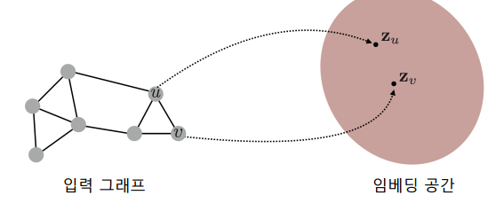
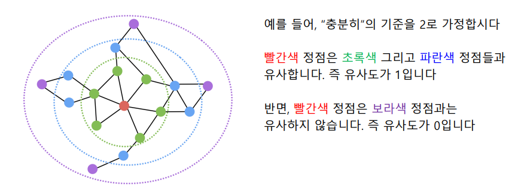
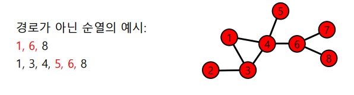
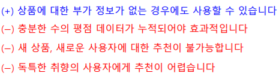

# 수업복습
---

## 노드 임베딩(Node Embedding)
---
- 인접성 기반, 거리 기반, 랜덤 워크 기반 등 그래프의 정점을 벡터로 표현하는 다양한 임베딩 방법에 대해 학습한다.

기계학습의 다양한 툴은 벡터로 표현된 데이터를 입력으로 받는다.
이러한 툴들을 이용해서 그래프를 분석할 수 있을까? 그래프를 벡터로 나타낼 수 있으면 가능 할것이다. 이번 강의에서는 그래프의 정점(Node)을 벡터로 표현하는 방법인 정점 임베딩(Node Embedding)에 대해 배운다. 정점을 어떻게 벡터로 표현하는지, 정점사이의 유사성을 어떻게 표현하는지에 집중하여 강의를 들어보자.

## 정점표현 학습
---
`정점 표현 학습`이란 그래프의 정점들을 벡터의 형태로 표현하는 것이다 

- 정점 표현 학습은 간단히 정점 임베딩(Node Embedding) 이라고도 함
- 정점 임베딩은 벡터 형태의 표현 그 자체를 의미하기도 함.
- 정점이 표현되는 벡터 공간을 임베딩 공간이라고 부름.
`입력` : 그래프
`출력` : 강 정점 $u$에 대한 임베딩, 즉 벡터 표현 $z_u$

### 정점 표현 학습의 이유
- 정점 임베딩의 결과로, 벡터 형태의 데이터를 위한 도구들을 그래프에도 적용할 수 있음(분류기(로지스틱 회귀분석, 다층 페섭트론, 군집분석 알고리즘 등)
- 그래프의 정점들을 벡터 형태로 표현할 수 있다면, 위의 예시와 같은 대표적인 도구들 뿐 아니라, `최신의 기계 학습 도구`들을 **정점 분류(Node Clasffification), 군집분석(Community Detection)** 등에 활용 가능

### 정점 표현 학습의 목표
- 그래프에서의 **정점간 유사도를 임베딩 공간에서도 `보존`** 하는것을 목표

`임베딩 공간에서의 유사도`: 내적(Inner Product)를 사용( 내적은 두 벡터가 클 수록, 그리고 같은 방향을 향할 수록 큰 값을 가짐

`그래프에서 두 정점의 유사도` : 여러가지 답이 있음 ( 아래 더 자세히 나옴 )

> 정리하면, 정점 임베딩은 다음 두 단계로 이루어진다
1. `그래프에서의 정점 유사도를 정의`하는 단계  
2. 정의한 `유사도를 보존하도록 정점 임베딩을 학습` 하는 단계

## 인접성 기반 접근법
---
- `인접성 기반 접근법`에서는 두 정점이 인접할 때 유사하다고 간주
- **두 정점 𝑢와 𝑣가 인접**하다는 것은 둘을 **직접 연결하는 간선 (𝑢, 𝑣)가 있음**을 의미
- `인접행렬(Adjacency Matrix)` 𝐀의 𝑢행 𝑣열 원소 𝐀_{𝑢,𝑣}는 𝑢와 𝑣가 인접한 경우 1아닌 경우 0
-  인접행렬의 원소 𝐀_{𝑢,𝑣} 를 두 정점 𝑢와 𝑣의 유사도로 가정
  
  

#### 인접성 기반 접근법 손실 함수

- 위 손실 함수가 최소가 되는 정점 임베딩을 찾는 것이 목표 [ ( 확률적 ) 경사 하강법 등 이용]

### 인접성 기반 접근 법의 한계

- 빨간색 정점과 파란색 정점은 거리가 3인 반면, 초록색 정점과 파란색 정점은 거리가 2
- 인접성만을 고려할 경우 이러한 사실에 대한 고려 없이, 두 경우의 유사도는 0으로 같음 !
- 군집 관점에서는 빨간색 정점과 파란색 정점은 다른 군집, 초록생 정점과 파란색 정점은 같은 군집
- 인접성만을 고려할 경우 이러한 사실에 대한 고려 없이, 두 경우의 유사도는 0 으로 같음. 

## 거리/경로/중첩 기반 접근법

### 거리 기반 접근법
- 두 정점 사이의 `거리가 충분히 가까운 경우 유사` 하다고 간주

### 경로 기반 접근법
- 두 정점 사이의` 경로가 많을 수록 유사` 하다고 간주
- `경로(Path)` : 정점 $u$와 $v$의 사이의 경로(Path)는 아래 조건을 만족하는 정점들의 순열(Sequence)
    -  𝑢에서 시작해서 𝑣에서 끝나야 함
    -  순열에서 연속된 정점은 간선으로 연결되어 있어야 합니다

- 두 정점 𝑢와 𝑣의 사이의 경로 중 거리가 **𝑘**인 것은 수는 $𝐀_{𝑢,𝑣}^𝑘$ 와 같음

    - 즉, 인접 행렬 𝐀의 **𝑘** 제곱의 𝑢행 𝑣열 원소와 같습니다

- 경로 기반 접근법 손실 함수

### 중첩 기반 접근법
- 두 정점이 `많은 이웃을 공유할 수록 유사` 하다고 간주
- 아래 그림에서 `빨간색 정점`은 `파란색 정점`과 두명의 이웃을 공유하기 때문에 유사도는 2가 된다.

- 공통 이웃수 대신 `자카드 유사도` 혹은 `Adamic Adar`점수를 사용할 수도 있음

## 임의보행 기반 접근법

- 한 정점에서 시작하여 `임의보행을 할 때 다른 정점에 도달할 확률`을 유사도로 간주

`임의 보행 기반 접근법`은 3단계를 거침

1. 각 정점에서 시작하여 임의 보행을 반복 수행
2. 각 정점에서 시작한 임의보행 중 도달한 정점들의 리스트를 구성한다. 이때, 정점 $u$에서 시작한 임의 보행 중 도달한 정점들의 리스트를 $N_R(u)$라고 하면, 한 정점을 여러 번 도달할 경우, 해당 정점은 $N_R(u)$에 여러 번 포함될 수 있다.
3. 다음 손실 함수를 최소화하는 임베딩을 학습한다.

임의 보행 기반은 어떻게 임베딩으로부터 `도달 확률`을 추정 할까 ?

**정점 u에서 시작한 임의 보행이 정점v에 도달할 확률 $P(v|z_u)$를 다음과 같이 추정한다.**

`추정한 도달 확률`을 사용하여 `손실함수`를 완성하고 이를 최소화하는 임베딩을 학습한다.

## DeepWalk와 Node2Vec
- DeepWalk는 앞서 설명한 **기본적인 임의보행** 사용
- 즉, 현재 정점의 이웃 중 균일한 확률로 선택, 이동 반복

- `Node2Vec`은 **2차 치우친 임의보행(Second-order Biased Rndaom Walk)** 사용

- Node2Vec에서는 부여하는 확률에 따라서 다른 종류의 임베딩을 얻음
- 아래 그림은 Node2Vec으로 임베딩을 수행한 뒤, K-means 군집 분석을 수행한 결과이다.

- 임의 보행 기법의 손실함수는 계산에 정점의 수의 제곱에 비례하는 시간이 소요됨.

- 따라서 많은 경우 근사식을 사용한다.
- 모든 정점에 대해서 정규화 하는 대신 몇 개의 정점을 뽑아서 비교 하는 형태이다. 이때 뽑힌 정점들을 네거티브 샘플이라고 부른다
- 연결성에 비례하는 확률로 네거티브 샘플을 뽑으며, 네거티브 샘플이 많을 수록 학습이 더욱 안정적 이다.

## 변환식 정점 표현 학습의 한계
### 변환식 정점 표현 학습과 귀납식 정점 표현 학습

- 지금까지 소개한 정점 임베딩 방법들은 변환식 방법이다

**변환식 임베딩 방법은 여러 한계를 갖는다.**
1. 학습이 진행된 이후에 추가된 정점에 대해서는 임베딩을 얻을 수 없다.
2. 모든 정점에 대한 임베딩을 미리 계산하여 저장해 두어야 한다.
3. 정점이 속성 정보를 가진 경우에 이를 활용할 수 없다.

다음 강의에서는 이런 단점을 극복한 귀납식 임베딩 방법을 소개할 예정인데,
대표적인 귀납식 임베딩 방법이 바로 `그래프 신경망(Graph Neural Network)`이다.

## 추천시스템 (심화)
---

- 잠재적 인수 모형(Latent Factor Model)에 대해서 학습한다.

### 추천 시스템 기본 복습
---
-  추천 시스템 예시
   - Amazon.com , 넷플릭스, 유튜브, 페이스북

### 추천 시스템과 그래프

- 추천 시스템은 사용자 각각이 구매할 만한 혹은 선호할 만한 상품/영화/영상을 추천 
  - 추천 시스템의 핵습인 `사용자별 구매를 예측` 하거나 `선호를 추정`

### 내용 기반 추천 시스템
---
- 내용 기반 추천은 **각 사용자가 구매/만족했던 상품과 유사한 것**을 추천

- 추천시스템의 장/단점

### 협업 필터링
---
협업 필터링은 유사한 취향의 사용자들이 선호/구매한 상품을 추천하는 방법이다.

- 협업 필터링 장단점

### 추천시스템의 평가
