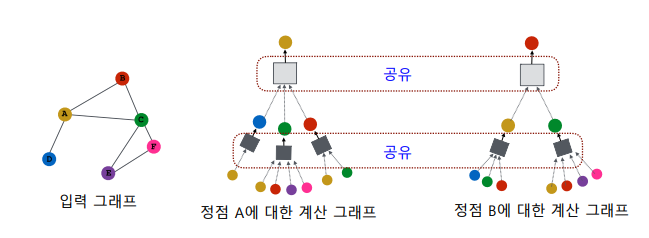
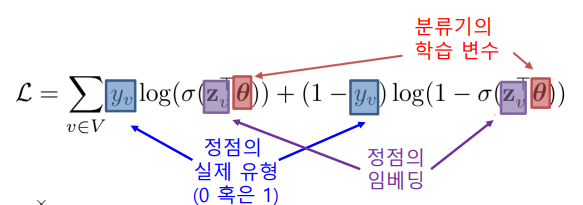
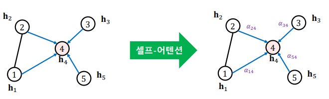
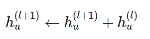
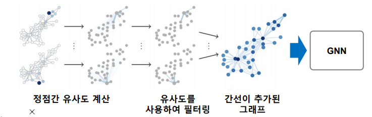

# 그래프 신경망

---
변환식 임베딩 방법의 단점들을 극복한 귀납식 임베딩 방법에선느 출력으로 임베딩 벡터가 아닌 인코더를 얻는다. 그래프 신경망(GNN)은 대표적인 귀납식 임베딩 방법이다

## 그래프 신경망 구조
---
- 그래프 신경망은 **이웃 정점들의 정보를 집계하는 과정을 반복**하여 `임베딩`을 얻는다.
- 예시에서 `대상 정점`의 임베딩을 얻기 위해 이웃들 그리고 이웃의 이웃들의 정보를 집계한다.

- 각 집계 단계를 층(Layer)이라고 부르고, 각 층마다 임베딩을 얻는다.

- 각층에서는 **이웃들의 이전 층 임베딩을 집계하여** 새로운 임베딩을 얻는다.
- 0번층, 즉 입력 층의 임베딩으로는 `정점의 속성` 벡터를 사용한다.

- 서로 다른 대상 정점간에도 **층 별 집계 함수는 공유** 한다.

- 집계 함수는 **(1) 이웃들 정보의 평균을 계산**하고 **(2) 신경망에 적용** 하는 단계를 거친다.

- **마지막 층에서의 정점 별 임베딩**이 해당 정점의 `출력 임베딩` 이다.

### 그래프 신경망의 학습

- 그래프 신경망의 `학습 변수(Trainable Parameter)는 **층 별 신경망의 가중치** 이다

- 먼저 `손실함수`를 결정한다. 정점간 거리를 **보존**하는것을 목표로 할 수 있다.

 
변환식 정점 임베딩에서 처럼 그래프에서의 정점간 거리를 **보존**하는 것을 목표로 할 수 있다.
만약, 인접성을 기반으로 유사도를 정의한다면, `손실 함수는 다음과 같다.

- **후속 과제의 손실함수를 이용한 End-to-End 학습도** 가능하다.

 

이 경우 분류기의 손실함수, 예를 들어 교차 엔트로피(Cross Entropy)를 전체 프로세스의 손실함수로 사용하여 End-to-End 학습을 할 수 있다.

 

그래프 신경망의 End-to-End 학습을 통한 분류는, 변환적 정점 임베딩 이후에 별도의 분류기를 학습하는 것 보다 정확도가 대체로 높다.

- 그래프 신경망의 학습에는 꼭 모든 정점을 활용할 필요는 없다.

- 오차역전파를 통해 신경망의 학습 변수들을 학습
- 일부 대상 정점을 골라서 훈련 가능 파라미터를 학습하여(층별로 공유, 층간은 상이한)다른 정점(학습에 포함되지 않은 or 새로 추가된)에 활용할 수 있음

### 그래프 신경망의 활용
- 다른 그래프에도 적용 가능. 단, 같은 도메인(단백질 1종,2종 등등)

## 그래프 신경망 변형

### 그래프 합성곱 신경망(GCN)
---
- 기존 집계 함수와 GCN의 집계 함수의 가장 큰 차이점
    - 기존 집계 함수 : $B_kh_v^{k-1}$ 현재 집계 되고 있는 정점 v의 이전 레이어 k-1의 임베딩 $h_v^{k-1}$을 별도의 $B_k$라는 신경망을 이용하여 합계 해줬음(기존)

    - GCN : 기존 $W_k$ 신경망을 같이 사용해서 현재 정점 $v$까지 함께 평균 냄!

    +) $\frac{1}{\sqrt{|N(u)||N(v)|}}$(정규화 방법 변화) : 기존 v의 연결성 $|N(v)|$만 사용했으나, u와 v 연결성 $|N(u)|, |N(v)|$의 기하평균(${|N(u)||N(v)|}^\frac{1}{2}$)을 사용하고 있음!

### GraphSAGE
---
- 이전 레이어의 임베딩을 받아옴 {$h_u^{k-1}$, ,,,,}, `AGG`, 집계, $W_k$ 신경망 통과
- $B_kh_v^{k-1}$ : 자기 자신의 이전 레이어의 임베딩을 신경망에 통과한 값
- 위 둘을 더하는 것이 아니라(기존) concatenation 함
- `AGG` : 다양한 옵션 사용 가능!(평균 이외에도 pool, LSTM)
- Pool : 원소별 최대값을 output
- LSTM : 이웃들의 정보를 LSTM의 입력으로! 넣어서 그 결과를 사용

    - $\pi$ : 이웃들의 임베딩을 가져와서 순서를 섞은 다음에 LSTM에 넣어준다는 뜻임(그래프의 이웃들은 순서가 있는 sequential한 정보가 아니므로 무작위화 해주는듯?)

- 차이점

    - 집계 방법을 여러개 활용할 수 있다

    - 위 집계 결과를 신경망 통과 시킨 것과, 자기 자신의 이전 층에서의 임베딩을 신경망에 통과한 값을 concat시킨다

## 합성곱 신경망과의 비교
---
### 4.1 합성곱 신경망과 그래프 신경망의 유사성

- 합성곱은 이웃 픽셀의 정보를 집계 -> 이웃 수가 균일
- 그래프는 대상 정점을 어디로 두냐에 따라 집계하는 이웃 수가 다름

### 4.2 합성곱 신경망과 그래프 신경망의 차이

- i라는 행의 위 i-1 아래 i+1 행들은 i와 직접적인 연관이 있지 않고, 행렬 순서가 임의로 결정되는 경우가 많음 -> 이는 이웃을 의미하는 것도 아님!

## 그래프 신경망에서의 attention

- 기본 그래프 신경망에서는 **이웃들의 정보를 동일한 가중치로 평균**을 냅니다.
- 그래프 합성곱 신경망에서 역시 **단순히 연결성을 고려한 가중치로 평균**을 냅니다.

- Graph Attention Network, GAT)에서는 **가중치 자체도 학습** 한다.

- 실제 래프에서는 이웃 별로 미치는 영향이 다를 수 있기 떄문이다.
- **가중치를 학습하기 위해서 `Self-Attention)`이 사용된다**

- 각 층에서 정점 i로 부터 이웃 j로의 가중치 $a_{ij}$ 는 아래 세 단계를 통해 계산됨.

- 여러 개의 어텐션을 동시에 학습한 뒤, 결과를 연결하여 사용하고 이것을 `Multi-head Attention`이라 부른다.

## 그래프 표현 학습과 그래프 풀링

### 그래프 
표현 학습
---
**그래프 표현 학습(혹은 그래프 임베딩)**은 **그래프 전체를 벡터의 형태로 표현**하는 것을 말한다. 이렇게 임베딩된 벡터는 그래프 자체가 어느 클래스에 속하는지 분류하는 문제 등의 그래프 분류 문제에 활용될 수 있다. 이를 위해 `Graph2Vec` 등의 모델이 존재한다. 이것 역시 word2vec에 상응하는 doc2vec에서 모티브된 모델이라고 볼 수 있을 것 같다. 여기서 따로 Graph2Vec에 대한 기술적 소개는 하지 않는다.

### 그래프 풀링

**그래프 풀링(Graph pooling)은 정점 임베딩들로부터 그래프 임베딩을 얻는 과정**이다. CNN에서의 풀링은 필터 사이즈만큼의 input을 하나로 줄인다. 마찬가지로 그래프 풀링에서도 **군집 구조를 띄는 정점 set을 정점 하나(벡터 하나)로 줄인다.**

물론 군집을 나누고 해당 군집의 임베딩에 대한 평균을 취하는 등 단순한 방법이 있을 수 있겠지만, 그래프의 구조를 고려한 방법을 사용할 경우 당연히 downstream task에서도 더 높은 성능을 얻을 수 있다. 위 그림과 같이 미분 가능한 풀링(Differentiable pooling, DiffPool)은 군집 구조를 활용하여 임베딩을 계층적으로 집계한다.

### Over- smoothing Problem
---
Over-smoothing(지나친 획일화) 문제란 그래프 신경망의 층수가 증가하면서 정점의 임베딩이 서로 유사해지는 현상을 의미한다.

이는 작은 세상 효과와 관련이 있다. GNN에서 layer 수가 $k$개 일 때, 우리는 거리가 
$k$인 정보까지 집계하게되는데, 작은 세상 효과에 따라 $k$가 조금만 커져도 GNN이 그래프 전반을 커버할 수 있게 되어버린다.

일반적인 GNN은 downstream task에 대하여 위와 같이 layer 수가 2 혹은 3 일때 가장 높은 성능을 보여주고 이후부터는 점점 감소하다가 어느 수준을 넘는 순간 그 성능이 급격히 떨어지는 것을 확인할 수 있다. layer를 10개 이상 쌓으면 그래프 전체를 커버할 확률이 상당히 높아, 성능이 감소하는게 당연해보이기도 한다(…)

이를 방지하기 위해 위와 같이 잔차항(Residual)을 넣는 방법도 고안되었지만 효과가 여전히 제한적이다. 위 그래프에서 residual이 붙은 범례가 residual이 추가된 GNN의 경우이다.

따라서 이에 대한 대응으로 JK network(Jumping Knowledge Network)가 제시되었는데, 여기서는 아래와 같이 마지막 층 임베딩 출력 시 모든 층의 임베딩을 함께 활용한다.

또 다른 대응으로 APPNP가 있는데, 여기서는 0번째 층을 제외하고는 신경망 없이 집계함수를 단순화하였다.

즉, 가중치 
$W$를 0번 layer에서만 곱하고 1번 layer부터는 집계 함수에서 $W$를 곱하지 않는다.  연구 결과에 따르면 이렇게 처리했을 때는 layer 수 증가에 따른 정확도 감소 효과가 없었다고 한다.

## Data Augmentation in GNN

- 데이터 증강(Data augmentation)은 이전에 컴퓨터 비전 분야에서 이미 한 번 살펴본 바 있다. 데이터 증강을 통해 추가 혹은 보완된 데이터를 통해 모델을 학습시킴으로써 모델의 성능을 더 높일 수 있다.

그래프에는 누락되거나 부정확한 간선이 있을 수 있다. 이를 보완하기 위해 먼저 임의보행을 통해 정점간 유사도를 계산한 후 유사도가 높은 정점 간의 간선을 추가하는 방법이 제안되었다. 위 그림은 이러한 과정을 통한 데이터 증강의 예시를 보여준다. 이렇게 생성된 데이터로 GNN을 학습시키면 보다 좋은 성능을 기대할 수 있다.

