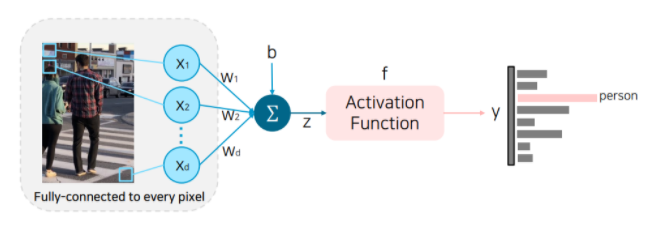
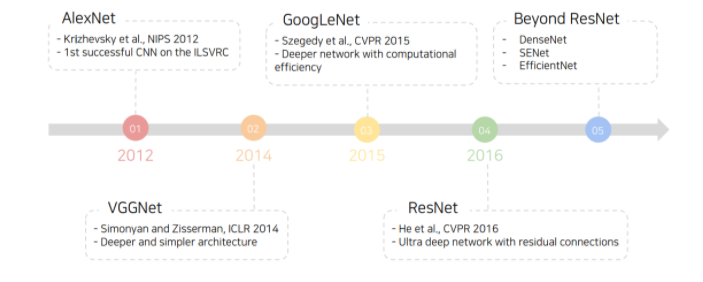
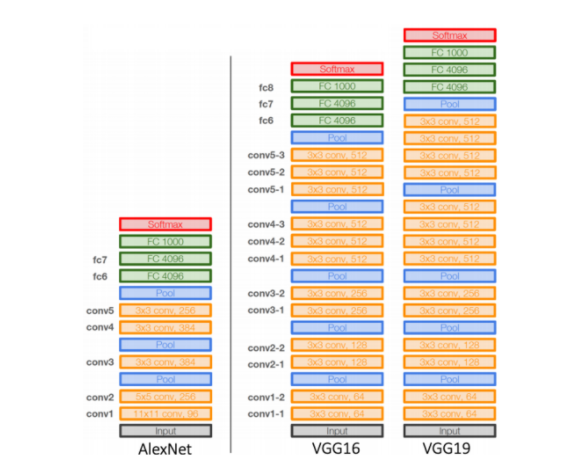
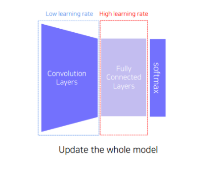
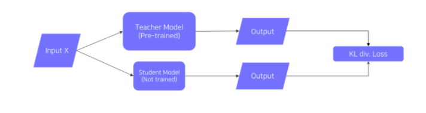
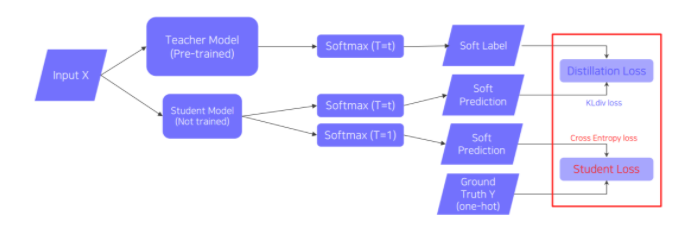
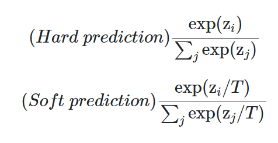
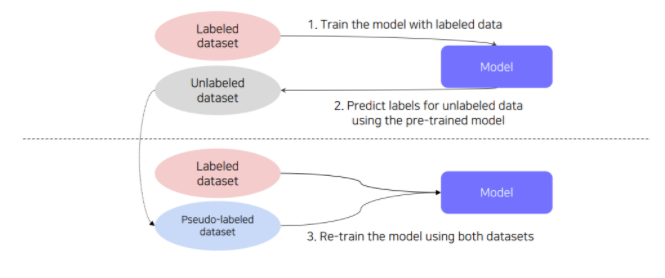
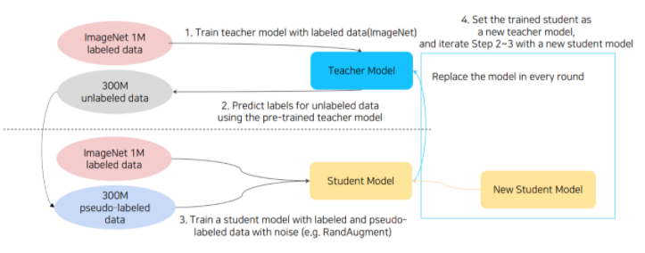
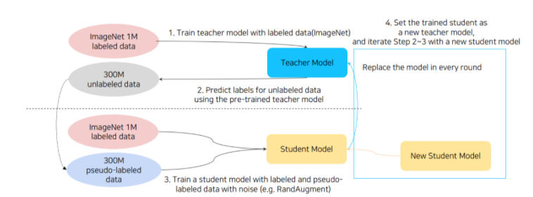

# 학습 정리

## Overview
---

Computer Vision과 Computer Graphics 는 비슷한 분야를 다루고 있지만 서로 지향하는 바가 다름.
 

`Computer graphics`는 우리가 흔히 아는 CG이다.  
CG기술은 현실에 존재하지 않는 어떤 영상을 만들어내는데, 우리가 원하는 description으로부터 원하는 장면을 rendering 한다.
 

`Computer vision`의 경우 실제 세계의 영상으로 무언가 의미 있는 descripition을 만들어 낸다. 즉, computer graphics와는 방향이 완전히 반대이다. 따라서 computer vision은 inverse rendering이라고 부르기도 한다.

 

컴퓨터 비전은 결국 input data인 visual data(image/video)로 부터 visual perception을 할 수 있는 AI를 설계하는 학문이다. 이 visual perception의 종류도 여러가지 있는데, 대표적으로 아래와 같은 것들이 있다.
- Color perception
- Motion perception
- 3D perception
- Semantic-level perception
- Social perception (emotion perception)
- Visuomotor perception

다양한 task가 있지만 결국 사람의 visual perception 능력을 모방하는 것이 첫번째 지향점이고, 더 나아가 사람의 시각 능력의 한계를 극복할 수 있는 모델을 개발 할 수 있다.

## Image Classification
---
세상 모든 이미지를 수집하여 K-NN알고리즘을 돌리면 사실 대부분의 이미지를 분류할 수 있을 것이다. 다만 이것은 이론상 이야기이고, 실제 세계에 이를 적용하려면 많은 한계점이 존재한다. 세상 모든 이미지를 수집 하는것, 세상 모든 이미지를 대상으로 $O(n)$의 알고리즘을 돌리는 것, 세상 모든 이미지를 $O(n)$으로 저장 하는것 모두 현실적으로 불가능 하다. 따라서 우리는 neural network 모델에 압축된 정보를 넣고 원하는 결과를 추출해내고자 한다.

 
우리는 vision perception task 를 하는데에 있어 항상 CNN만을 사용해왔다. 근본적으로 여기에 왜 CNN을 사용해왔는지를 다시 한 번 생각해보자.

위와 같이 FC layer를 사용한 모델은 crop된 이미지나 내부 개체가 살짝 변형된 이미지 등 같이 기존에 학습할 때 못봤던 이미지에 대해서는 동일한 처리를 해내지 못한다. 왜냐하면 FC layer는 한 픽셀 단위로 각각의 연산을 하고 같은 크기만큼의 결과값이 나오기 때문이다. 즉, 국소적으로 압축하는 과정이 없다. 더군다나 parameter가 너무 많다는 점도 또 하나의 한계점이 될 수 있다.  
 

반면 CNN은 **이미지를 압축하는 과정**이 들어가기 때문에 내부 개체가 변형되거나 조금 crop 되더라도 그 압축된 데이터 자체는 형태가 기존과 비슷하기 떄문에 이를 동일하게 처리 할수 있다. 물론 parameter도 훨씬 적기 때문에 메모리나 시간적 측면에서도 좀 더 향상된 성능을 기대할 수 있다. 이에 따라 현재까지도 많은 CV task에 있어 backbone으로서 CNN이 채택 된다.

## CNN architerctures for Image classification
---

위 사진은 CNN의 발전 과정이다. 추가적으로 AlexNet이전에 MNIST dataset 분류를 위한 LeNet-5가 CNN의 포문을 열었다고 할 수 있다.

LeNet-5과 AlexNet은 같은 CNN 구조를 채택했다는 점에서 유사하다고 할 수 있지만, AlexNet이 훨씬 많은 데이터셋을 활용하였고 더 큰 네트워크를 구성하였다. 또한 ReLU라는 activation function, Dropout라는 regularization technique, LRN이라는 normalization technique 등을 활용하여 보다 성능을 높였다. 물론 LRN은 이제 사용하지 않고 모두 Batch Normalization으로 대체 되었다.  

 

VGGNet 이후부터는 AlexNet에서처럼 11 x 11의 거대한 filter를 사용하지 않았다. 그것보다 작은 필터를 여러개 사용하는 것이 receptive field는 유지하면서도 보다 적은 parameter로 모델을 구성 할 수 있기 때문이다.

그래서 VGGNet에서는 3x3 conv block과 2x2 max pooling block만으로 네트워크가 구성되었고 여기서는 LRN 기법을 활용하지 않았다. 여전히 ReLU를 활용하였으며 똑같이 최종 분류에서는 flatten 이후 affine layer를 활용하여 분류를 진행하였다.

## Data augmentation
---
모든 딥러닝 학습이 그러하듯, data augmentation은 이미 거의 필수적 요소가 되었다. 실제 데이터는 샘플로 수집한 데이터보다 훨씬 넓은 범위를 포괄하고 있기 때문에 비슷한 형태의 데이터를 augmentation시켜 이를 학습에 활용해야 한다. 그 대표적인 방법으로 Crop, Shear, Brightness, Perspectionv, Rotate 등이 있다.
 
위 방법론들은 모두 OpenCV나 NumPy의 각종 클래스/메소드를 통해 쉽게 구현할 수 있다. 이를 통해 real data distribution과 좀 더 가까운 training dataset을 구성할 수 있게 된다.
 

특히 요즘은 `RandAugment`라는 기법을 많이 활용 한다. data augmentation에는 많은 기법이 있지만 이를 어디에(to what), 어떻게(which augmentation),얼마나(magnitude) 활용할 것인지 또한 우리에게는 숙제이다. 따라서 random하게 augmentation을 선택 적용하여 가장 성능이 좋은 augmentation policy를 찾아 이를 활용할 수 있다.

## Pre-trained Information
---
data augmentation을 적용한다고 해도 supervised learning에는 많은 한계점이 존재한다. annotation data는 매우 비싸고, 결국 수많은 사람이 붙어서 하는 것이기 때문에 퀄리티가 보장되지 않는다.
 

따라서 `transfer learning(전이학습)`이 도입된다. transfer learning은 많은 데이터가 있는 task에서 미리 모델을 pre-training시키고 이를 적은 데이터 셋을 가진 task에 적용하는 기술 이다. 이러한 기법은 아무리 하고자하는 task가 달라도 이미지는 이미지 이기 때문에 다른 area에서 배운 지식이 원하는 area에도 적용될 수 있다는 배경을 바탕으로 활용한다.
 

pre-training model을 활용하는 방법은 아래와 같이 크게 두 가지로 나눌 수 있다.

먼저 위와 같이 pre-trained된 model에서 CNN만 잘라서 그부분은 학습시키지 않고 task를 위한 새로운 FC layer만 학습시키는 방법이 있다. 이렇게 하면 기존 10개 class에서 학습시켰던 모델을 100개 class에도 활용할 수 있으며, 어느 정도 기존 지식을 들고 간다고 생각해 볼 수 있다.

두 번째 방법은 Fine-tuning 방법으로, 이전처럼 지식을 들고오지만, 여기서는 가져온 CNN 부분도 low learing rate로 학습시킨다. 이렇게 하면 CNN 부분도 학습시키기 위해 첫 번째 방법보다 데이터도 많이 필요하고 시간도 더 많이 필요하겠지만, 앞선 방법보다 더 좋은 성능을 기대해 볼 수 있다.

## Knowledge Distilation
---

거대한 데이터로 학습된 teacher 모델의 지식을 보다 작은 사이즈의 student 모델로 전이 시키는 기법 이다.
 
teacher의 output을 student가 모방하게 되며 backpropagation 역시 당연히 student 쪽으로만 흐르게 된다. 이렇게 간단한 모델을 활용한 학습은 완전한 unsupervised learning으로, teacher의 오답 여부를 고려하지 안흔ㄴ다. 이것은 CV분야에서도 역시 모델 경량화에 활용한다.
 
한편, 만약 student 모델에 사용할 수 있는 labeled data가 일부 존재 할 경우 아래와 같이 모델을 변형해 볼 수있다.

먼저 위에서 soft prediction이란 softmax를 통과하고 one-hot encoding이 되지 않은 logit 값을 말한다. 이 모델에서는 위와 같이 softmax의 결과값을 student가 학습한다.    
 
또한 softmax를 설계할 떄 temperature 값(T)를 활용한다.
이 T는 너무 치중된 예측값을 보다 smooth하게 만들어주는 역할을 한다. 예를 들어 NLP로 치면 단어 예측을 할 때 우리는 상황에 따라 항상 서로 다른 값이 나오기를 바란다. 하지만 같은 값만 나올 것이다. 이를 방지하기 위해 아래와 같이 softmax에 T변수를 추가해주면 softmax의 결과가 보다 균일해질 것이다.

만약 원래 예측 값이 [0.0067, 0.9933]라면 temperature 적용 후 예측 값이 [0.4875, 0.5125]과 같이 smooth해지는 효과를 기대할 수 있다. 이러면 위와 같은 단어 예측에서 상황에 따라 다양한 단어를 모델이 뱉을 수 있다는 것을 상상해볼 수 있다. CV task에서도 같은 이유로 예측이 한쪽에 편향되는 상황을 방지하기 위해 사용한다.

 
단, 위 경우는 teacher를 모방할 때의 이야기이고 labeled data에 대한 학습을 할 때는 T = 1, 즉 일반적인 softmax로 학습을 진행한다.

 
이제 다시 모델 전체 구조로 돌아가서 몇 가지만 더 살펴보자. 먼저 teacher이 내놓은 결과 값에서 또다른 semantic information을 찾는 것은 중요하지 않으므로 distilation 과정에서 이러한 semantic information을 고려하지 않는다. 즉, 그냥 teacher이 내놓은 결과 값 그대로 활용하고 그걸 다른 무언가에 활용하지 않는다.
 
또한 distilation loss로 KL Divergence, student loss로 CrossEntropy를 활용한다. 

## Semi-supervised learning
---
`semi-supervised learing`에서는 labeled data와 unlabeled data를 모두 활용한다. 즉, unsupervised(No label)과 supervised(fully labeled)의 결합 형태이다. 위에서 언급했던 distilation 기법도 일종의 semi-supervised learning이다.
 
그런데 앞서 본 distilation의 바탕이 되는 teacher-student 구조가 비단 모델 경량화에서 뿐만 아니라, 모델 자체의 성능을 높이는데에도 사용될 수 있다.

그러한 첫 번째 기법으로 `pseudo labeling`이 있다.

pseudo labeling은 실제 Kaggle에서도 많이 활용하는 기법인데 unlabeled dataset에 가지고 있는 모델을 통해 임의 label(pseudo-labels)을 붙이는 방법을 말한다.
 
수많은 이미지 데이터셋에 일일이 annotation을 하는 것은 비용이 비싸므로 보통 데이터의 수를 늘리기 위해 많이 활용한다. 뿐만 아니라 이를 활용하는 것이 labeled data만을 활용할 때보다 모델의 성능 향상 자체에도 좋은 효과를 줄 수 있다고 한다. 

## Self-training
---
지금까지 살펴본 다양한 방법들을 잘 결합하면 최근 ImageNet에서 새로운 지평을 연 연구에 도달할 수 있는데, 그것이 바로 self-traing이라는 방법이다.
 
이 방법에서는 augmentation, teacher-student networks, semi-supervised learning을 모두 활용하였다.

이 방법론은 정확히는 self-training with noisy student라고 명명된다. 먼저 teacher을 학습시키고 noise가 포함된 데이터로 pesudo-labeling 이후 이를 이용하여 student를 학습시킨다.

**그리고 다시 학습된 sutdent를 teacher로 두고 새로운 student 모델을 학습시킨다.** 즉, 재귀적으로 student-teacher network를 구성하여 계속하여 새로운 student를 학습시키는 것이다. 이러한 재귀적인 과정을 2~3번 반복하여 최종적인 student 모델을 활용하게 된다.
 
다만, 이전 distilation과 다른 점은 여기서는 studnet model의 size가 점점 커진다는 것이다. 여기서는 경량화가 목적이 아니기 때문에 이는 정확도를 높이기 위한 하나의 수단으로 이해될 수 있다.

최종적으로 이 과정을 위 그림과 같이 요약할 수 있다.