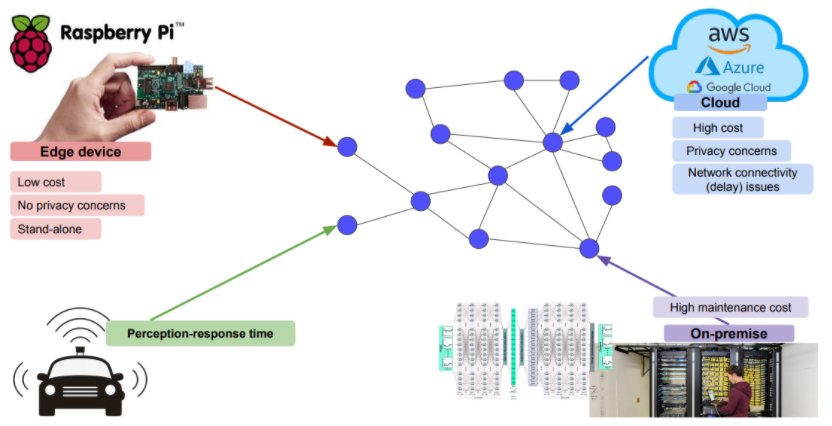
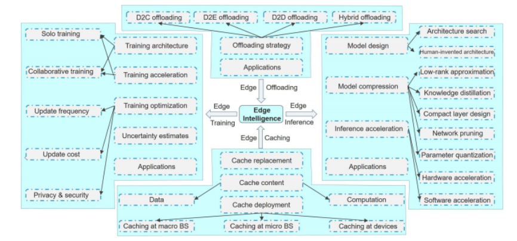

## Edge Device
---

모델을 경량화하는 대개의 이유는, **dege device에 모델을 넣기 위함 이다**.  
여기서 edge device는 우리가 흔히 들고다니는 스마트폰과 같은 것이다.    

위 사진에서 가운데에 그려져 있는 그래프 network graph로, 인터넷으로 연결 될 수 있느 각종 시스템들이 그려져있다. `Edge device`는 위와 같이 네트워크 구조에서 말단(edge)에 있는 것을 말한다.  
 

모델 경량화는 모델을 cloud나 on-premise등 크기가 큰 곳에 원격으로 올리지 않고 edge device 자체에 올리는 한편 그 device에서 돌아갈 수 있도록 모델의 크기나 계산량을 줄이기 위해 존재 한다.  
 

edge device에서 모델을 돌리려는 궁극적인 이유는 당연히 속도 때문이다. LAN을 통해 cloud나 여타 서버에 접속하는 latency를 줄이려면 그 모델이 직접적으로 필요한 곳에 모델을 올려야 한다. 
또한 cloud 등에 올리려면 금전적 비용도 만만치 않다. 이러한 금전적 비용도 줄이기 위해 경량화가 사용 된다.  
 

edge device라는 단어를 찾아보면 'Dumb and fast'라는 구절이 나온다. 같지만(성능은 떨어지지만) 빠르다는 것을 의미한다. 

## Edge Intelligence

우리가 Edge device에 모델을 올린다고 하면 device 상에서 무엇을 할 수 있을까? training? inference? 당연하겠지만 지금 당장의 목표는 inference이다. trainin부터 edge device에서 시작하는 것은 아직 갈길이 멀다. training에는 많은 리소스가 소모된다. 현 시점에서 모델 경량화라고 하면 대부분 모델이 inference에 집중해 있는 편이다.  

  

한편, Edge단에 가까운 서버를 두어 latency를 최소화하되 edge에 직접 모델을 다 올리지 않는 `edge offloading`이나 trainig/inference 시에 필요한 데이터를 미리 캐싱해놓는(hit를 최대화 하고, miss를 최소화하는)`edge caching`등의 literature도 존재 한다.

## Optimization problem

우리가 결국 하고자 하는 것은 최고의 성능을 내는 모델을 만드는 것인데, 문제는 resource가 제한적이라는 것이다. 우리는 주어진 환경(cost constaraint) 내에서 최고의 성능을 내야한다. 현실이 그렇다.
 

그런데 그 제약조건에는 무엇이 있을까? 당연히 GPU등 하드 웨어적인 제한도 있겠지만 그건 당연하고 더 나아가 저작권, 개인정보 보호, 심지어는 이전 특강때 다뤘듯이 온실가스 배출량등도 제약조건이 될 수 있다.  
 

지금, 배우는 단계에서는 제약이라고 해봐야 하드웨어 리소스 제약, 조금 더 넓게 보면 저작권 제약 정도밖에 고려하지 못한다 . 
하지만 추후를 생각해서라도 항상 다양한 제약조건에 대해 고민해보고 이들을 만족하는 모델을 설계할 수 있어야 한다.

