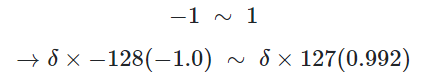
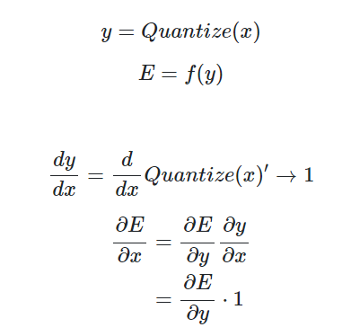

## Quantization

Quantization은 float16, floay32등의 FP number를 int8등의 정수 보다 적은 bit의 자료형으로 mapping하여 정보를 잃는 대신 필요한 메모리를 줄이고 컴퓨팅 속도를 빠르게 하기 위한 compresstion 기법 이다.
 

예를들어 절댓값 1 이하의 FP number를 int 8로 quantization한다고 하면, -128부터 127까지 수에 quantization unit $\delta$를 1/128로 설정하여 mapping할 수 있다.  
  

앞서 quantization의 효과에 메모리 절약 뿐만 아니라 `연산 속도 가속화`도 있다고 언급하였다. 이는 FPU(Floating Poing Unit)가 하던 연산을 ALU(Arithmetic and Logic Unit)가 대체 할 수 있게 되기 때문이다.  
 

한편, 지금까지 보고 떠오르는 생각은 여러 layer들의 weight 값들을 quantization하면 되겠다라는 것인데, 이를 보다 효율적으로 활용하려면 **activation에도 quantization이 적용 되어야 한다.**  
 

잘 생각해보면 결국 어떤 layer에 들어오는 input부터가 quantization되어있는 상태라면 computational cost를 크게 줄일 수 있다. 그래서 보통 아래와 같이 weight과 activation(ReLU) 모두에 quantization을 적용한다.   

  

k-bit quantization + ReLU는 우측 상단에 나와있듯이 해당 bit수로 양자화된 ReLU function을 말한다.  
 

문제는 이렇게 하면 backward pass에서 미분이 안된다는 점인데, 이것은 forward pass에서 quantize되기 이전의 미분 값을 그대로 사용하여 해결할 수 있다.  

  

  

혹은 위와 같이 ReLU function을 아래 함수로 smoothing하여 quantization을 적용하는 동시에 미분 가능하도록 만들어 활용하는 방법도 있다.  
### $\sigma(Tx) = \frac{1}{1 + \exp(-Tx)}$  
   
극단적으로는 BNNs(Binarized Neural Networks)와 같이 activation을 -1과 1만 나오게 해버린느 신경망 구조도 존재한다. 정확도가 엄청 떨어질 것 같지만 생각보다 덜 떨어지는 한편, 메모리 및 속도는 크게 향상시킨 구조이다.  
    

Quantization 기법도 여러 종류가 존재한다. 어떤 것을 양자화할 것인지(weight, actiavation), 어떻게 할 건지(Dynamic, Static), 얼마나 할건지(mixed-precise, 16bit, 8 bit, ...), 언제 할 건지(Post-training,Quantization-aware training) 등으로 나눠볼 수 있다.   
  

 

`Dynamic quantization`은 weight은 미리 quantize해두고 inference time때 activation을 dynamic하게 qunatize하는 기법이다. infernece때만 양자화되기 때문에, 결국 activation 부분에 의한 메모리 절약은 기대할 수 없다.  
 

동적 양자화 기법은 보통 모델의 inference time 대부분을 메모리 로딩 시간이 잡아먹는 경우 많이 활용한다. 실제로 LSTM이나 Transformer등의 모델은 matrix multiplication 시간보다 저장해둔 weight 값들을 불러오는 데에 시간을 많이 소모한다.  
 

`Static quantization`은 inference 때(즉, training 이후) weight과 ativation을 모두 양자화하는 기법이다. post-trainig(PTQ)과 static quantization은 사실상 같은 의미를 지닌다.  
 

`Quantization-aware training`은 학습 도중 `fake node`를 두어 추후 quantize 되었을 때의 영향을 미리 simulation(modeling)한다. 즉, training 단계의 precision과 추후 quantization된 모델의 inference에서의 precision 차이를 최소화 하도록 학습된다. 대략적인 방법을 보자면 (1) training path를 inference path와 최대한 비슷하게 만들어 사용하며 (2) training의 loss와 inference의 loss가 비슷해지도록 학습한다.  
  

위와 같이 fake-quant node를 두어 simulation을 돌려볼 수 있다. 정확도 하락폭은 `Quantization-aware training`이 제일 작은 편이다  
 

Quantization을 수행할 때는 **사용하는 Hardware가 해당 연산을 지원하는지**도 살펴보아야 한다. float16, int 8연산이 당연히 어디서든 된다고 생각 할 수 있지만 지원하지 않는 하드웨어가 존재 할 수 도 있다. 
 

추가적으로, quantization도 fix된 bit을 활용하는 것보다 레이어별로 다른 bit를 두고 quantization(flexible-bit quantization)을 하는 것이 보편적으로 성능이 더 좋았다는 연구 결과도 있다.

