# 수업 복습
---

## 통계학 맛보기
---

- 통계적 모델링은 적절한 가정 위에서 확률분포를 추정 하는 것이 목표이며, 기계학습과 통계학이 공통적으로 추구하는 목표이다.
- 그러나 유한한 개수의 데이터만 관찰해서 모집단의 분포를 정확하게 알아낸다는 것은 불가능하므로, 근사적으로 확률분포를 추정할 수 밖에 없다.
- 데이터가 특정 확률분포를 따른다고 선험적으로 가정한 후 그 분포를 결정하는 모수를 추정하는 방법을 모수적 방법론이라고한다.
- 특정 확률분포를 가정하지 않고 데이터에 따라 모델의 구조 및 모수의 개수가 유연하게 바뀌면 비모수 방법론 이라 부른다.

## 확률분포 가정하기 : 예제
---
확률분포를가정하는방법:우선히스토그램을통해모양을관찰합니다
- 데이터가 2개의 값(0또는1)만 가지는 경우 → 베르누이분포
- 데이터가 n개의 이산적인 값을 가지는 경우 → 카테고리분포
- 데이터가 [0,1]사이에서 값을 가지는 경우 → 베타분포
- 데이터가 0이상의 값을 가지는 경우 → 감마분포,로그정규분포등
- 데이터가 전체에서 값을 가지는 경우 → 정규분포,라플라스분포등
> 기계적으로 확률분포를 가정해서는 안 되며, 데이터를 생성하는 원리를 먼저 고려하는 것이 원칙이다.

- 데이터의 확률분포를 가정했다면 모수를 추정해볼 수 있다.
- 정규분포의 모수는 평균$\mu$과 분산 $\sigma^2$으로 이를 추정하는 통계량은 다음과 같다.

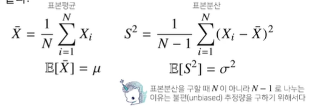

통계량의 확률분포를 표집분포(sampling distrbution)라 부르며, 특히 표본평균의 표집분포는 N이 커질수록 정규 분포 $N(\mu,\frac{\sigma^2}{N})$ 를 따른다.(중심 극한 정리)

## 최대가능도 추정법
---
- 표본평균이나 표본분산은 중요한 통계량이지만 확률분포마다 사용하는 모수가 다르므로 적절한 통계량이 달라지게 된다.
- 이론적으로 가장 가능성이 높은 모수를 추정하는 방법 중 하나로 **최대 가능도 추정법(MLE)** 이다

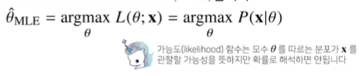

- 데이터 집합 $X$가 독립적으로 추출되었을 경우 로그가능도를 최적화 한다.

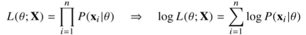

## 로그가능도를 사용하는 이유 ?
---
- 로그가능도를 최적화하는 모수 $\theta$ 는 가능도를 최적화하는 MLE가 된다.
- 데이터의 숫자가 적으면 상관없지만 **만일 데이터의 숫자가 수억 단위가 된다면 컴퓨터의 정확도로는 가능도를 계산하는것은 불가능**하다.
- 데이터가 독립일 경우, 로그를 사용하면 가능도의 곱셈을 로그가능도의 덧셈으로 바꿀 수 있기 때문에 컴퓨터로 연산이 가능해진다.
- 경사하강법으로 가능도를 최적화할 때 미분 연산을 사용하게 되는데, 로그 가능도를 사용하면 **연산량을 $O(n^2)$ 에서 $O(n)$ 으로 줄여준다.**
- 대게의 손실 함수의 경우 경사하강법을 사용하므로 음의 로그가능도를 최적화 하게 된다.

## 최대가능도 추정법 예제 : 정규 분포
---
- 정규분포를 따르는 확률변수 X로부터 독립적인 표본 ${x_1,...,x_n}을 얻었을 때 최대가능도 추정법을 이용하여 모수를 추정하면 ?

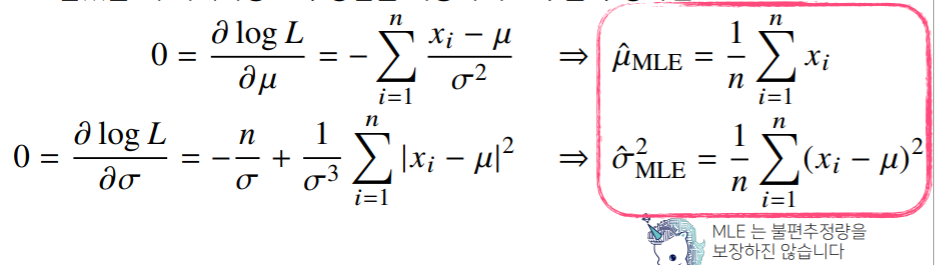

## 최대가능도 추정법 예제: 카테고리 분포
---
- 카테고리 분포 Multinoulli($x:p_1,...,p_d$)를 따르는 확률변수 X로부터 독립적인 표본 ${x_1,...,x_n}을 얻었을 때 최대가능도 추정법을 이용하여 모수를 추정하면 ?

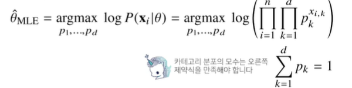

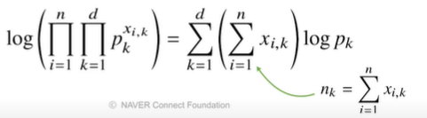

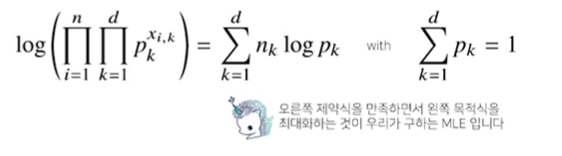

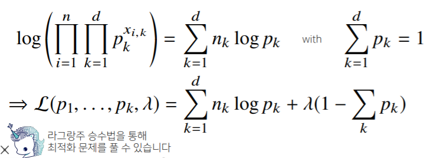

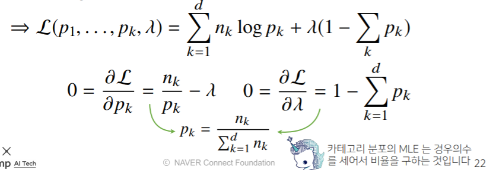

## 딥러닝에서 최대가능도 추정법
---
- 최대가능도 추정법을 이용해서 기계학습 모델을 학습할 수 있다.
- 딥러닝 모델의 가중치를 $\theta = (W^{(1)},...,W^{(l)})$라 표기 했을때 분류문제에서 소프트맥스 벡터는 카테고리분포의 모수$(p_1,...,p_k)를 모델링한다.
- 원핫벡터로 표현한 정답레이블 $y = (y_1,...,.y_k)$를 관찰데이터로 이용해 확률분포인 소프트맥스 벡터의 로그가능도를 최적화할 수 있다.

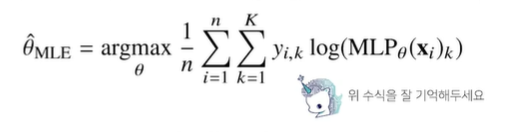

## 확률분포의 거리를 구해보자
---
- 기계학습에서 사용되는 손실함수들은 모델이 학습하는 확률분포와 데이터에서 관찰되는 확률분포의 거리를 통해 유도한다.
- 데이터공간에 두 개의 확률 분포 $P(x),Q(X)$가 있을경우 **두 확률분포 사이의 거리**를 계산할 때 다음과 같은 함수들을 이용한다.
    - 총변동 거리(Total Variation Distance,TV)
    - 쿨백 - 라이블러 발산(Kullback-Leibier Divergence,KL)
    - 바슈타인 거리(Wasserstein Distance)

## 쿨백-라이블러 발산
---
-쿨백-라이블러 발산(KL Divergence)는 다음과 같이 정의한다. 

- 쿨백 라이블러는 다음과 같이 분해할 수 있다.

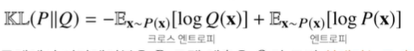

- 분류 문제에서 정답레이블을 $P$, 모델 예측을 $Q$ 라 두면 **최대가능도 추정법은 쿨백-라이블러 발산을 최소화**하는 것과 같다.

