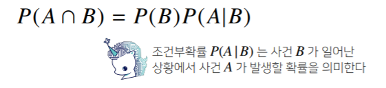
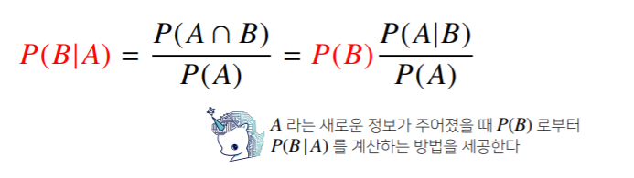
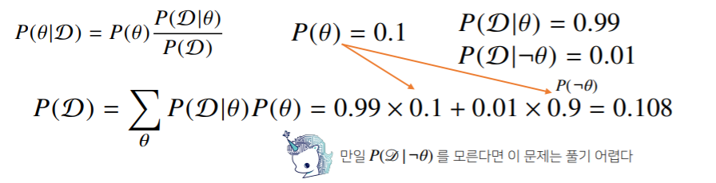
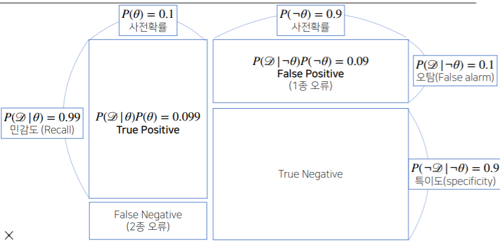
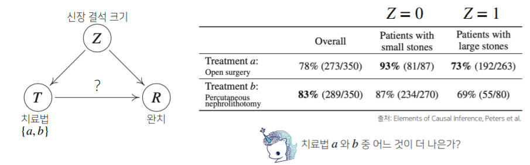
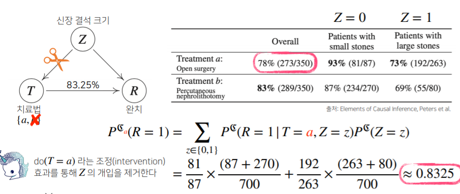

# 수업 복습
---

## 조건부 확률이란 ?
---
- 베이즈 통계학을 이해하기 위해선 조건부확률의 개념을 이해해야 한다.





## 베이즈정리 : 예제
---


```사후확률``` : 데이터를 관찰한 이후에 측정한 확률
```사전확률```: 데이터가 주어지지 않은 상황에서 모델링을  하기전 사전에 측정한 확률
```가능도``` : 어떤 값이 관측되었을 때, 이것이 어떤 확률 분포에서 왔을 지에 대한 확률
```Eviedece``` : 데이터 자체의 분포 


COVID-99의 발별률이 10%로 알려져있다.  
<br/>
COVID-99에 실제로 걸렸을 때 검진될 확률은 99%,  실제로 걸리지 않았을 때 오검진될 확률이 1%라고 할때,   
<br/>
어떤 사람이 **질병에 걸렸다고 검진결과가 나왔을 때 정말로 COVID-99에 감염되었을 확률**은 ?





## 조건부확률 시각화
---


<br/>
False alarm 가 False Negative 중요하므로 False alarm 을 낮추는 쪽으로 설계함..
<br/>

## 베이즈 정리를 통한 정보의 갱신
---
- 베이즈 정리를 통해 새로운 데이터가 들어왔을 때 앞서 계산한 사후확률을 사전확률로 사용하여 **갱신된 사후확률을 계산**할 수있다.
- 정보의 갱신을 통해 모델의 성능을 높일 수 있음.

<br/>

## 조건부 확률 -> 인과관계 ?
---
- 조건부 확률은 유용한 통계적 해석을   제공하지만 **인과관계**를 추론할 때 함부로 사용해서는 안된다.
- 인과관계는 **데이터 분포의 변화에 강건한 예측 모형**을 만들 때 필요함.


<br/>

- 인과관계를 알아내기 위해서는 **중첩요인의 효과를 제거**하고 원인에 해당하는 변수만의 인과관계를 개선해야 한다.

<br/>

## 인과관계 추론 : 예제
---

 


## 딥러닝 기초
---
- 인공지능 : 인간의 지능을 모방


### Key Components of Deep Learning
---
1. the **data** that the model can learn from
2. the **model** how to transform the data
3. The **loss** function that quantifies the badness of the model
4. The **algorithm** to adjust the parameters to minimize the loss

## PyTorch
---
- Numpy 구조를 가지는 Tensor객체로 array 표현
- 자동미분을 지원하여 DL 연산을 지원
- 다양한 형태의 DL을 지원하는 함수와 모데을 지원함.

## Neural Networks
---


### Linear Neural Networks
---


