# 수업복습
---

## RNN 첫걸음 - 임성빈 교수님
---


## 시퀀스 데이터 이해하기
---
- 소리, 문자열, 주가 등의 데이터를 시퀀스 데이터로 분류한다.
- 시퀀스 데이터는 독립동등분포(i,i,d) 가정을 잘 위배하기 때문에 순서를 바꾸거나 과거 정보에 손실이 발생하면 데이터의 확률 분포도 바뀌게 된다.

## 시퀀스 데이터는 어떻게 다룰까 ?
---
- 이전 시퀀스의 정보를 가지고 앞으로 발생할 데이터의 확률분포를 다루기 위해 조건부확률을 이용할 수 있다.  
<br/>  

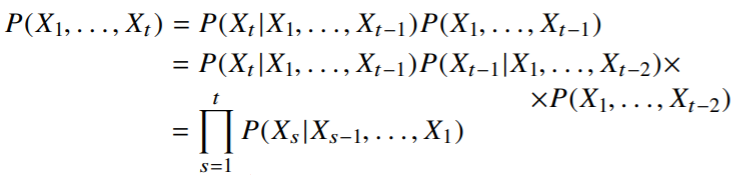

> 위 조건부 확률은 과거의 모든 정보를 사용하지만 시퀀스 데이터를 분석할 때 모든 과거 정보들이 필요한 것은 아니다.

- 시퀀스 데이터를 다루기 위해선 길이가 가변적인 데이터를 다룰 수 있는 모델이 필요하다.

- 조건부에 들어가는 데이터 길이는 가변적이다.
- 고정된 길이 $\tau$만큼의 시퀀스만 사용하는 경우 ```AR($\tau$)(Autoregressive Model)``` 자기 회뒤모델이라고 부른다.
- 또 다른 방법은 바로 이전 정보를 제외한 나머지 정보들을 $H_t$라는 잠재변수로 인코딩해서 활용하는 잠재 AR 모델이다. 
- 잠재변수 $H_t$를 신경망을 통해 반복해서 사용하여 시퀀스 데이터의 패턴을 학습하는 모델이 RNN 이다.

## Recurrent Neural Network을 이해하기
---
- 가장 기본적인 RNN 모형은 MLP와 유사한 모양이다.
- $w^{(1)},w^{(2)}$은 시퀀스와 상관없이 불변인 행렬이다.
- 이 모델의 과거의 정보는 다룰 수 없다.
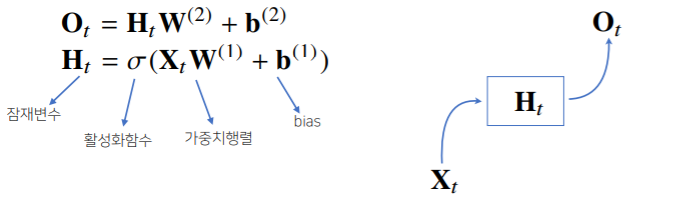

- RNN은 이전  순서의 잠재 변수와 현재의 입력을 활용하여 모델링한다.
- 잠재변수 $H_t$를 복제해서 다음 순서의 잠재변수를 인코딩하는데 사용한다.
- 이를 ```Backpropagation Through Time(BPTT)```라 하며 RNN의 역전파 방법이다.
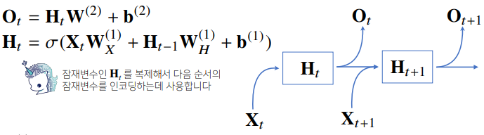

### BPTT
--- \
BPTT를 통해 RNN의 가중치행렬을 미분을 계산해보면 아래와 깉이 미분의 곱으로 이루어진 항이 계산된다.
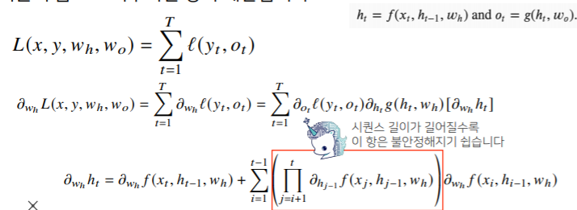


### 기울기 소실의 해결책? 
---
- 시퀀스 길이가 길어지는 경우 BPTT를 통한 역전파 알고리즘의 계산이 불안정 해지므로 길이를 끊는 것이 필요하다. 이를 ```trucated BPTT```라 부른다.  

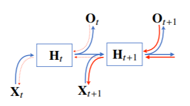  

- 이런 문제들 때문에 Vanila RNN은 길이가 긴 시퀀스를 처리하는데 문제가 있다.  
- 이를 해결하기위해 등장한 RNN 네트워크가 LSTM과 GRU이다.

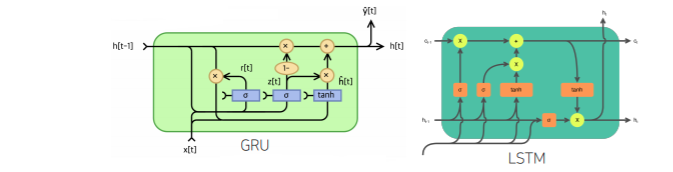


## Sequential Model - 최성준 교수님
---

#### Naive sequence model
<br/>  

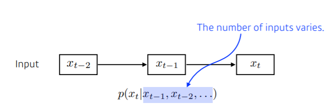  

- Suquentail Model의 문제점은 입력의 차원을 알수 없다 -> CNN같은 것을 사용 불가.

#### Autoregressive model
<br/>   
- 과거의 몇개만 정해서 보는것   

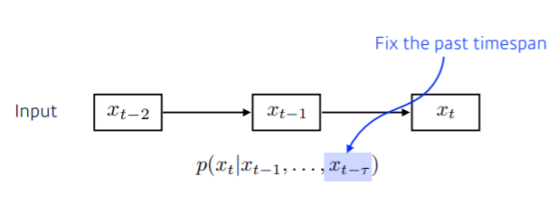


#### Markov model (first-order autoregressive model)
<br/> 
- 나의 현재는 바로 이전의 과거에만 의존한다는 가정 -> 허무맹랑한 소리 ..수능 점수는 수능 전날 공부한 것을 기준으로 나오지 않음 
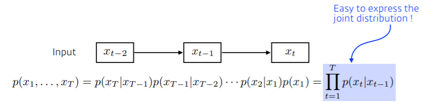


#### Latent autoregessive model
<br/>  

- 중간에 ```Hidden state``` 가 들어 있고 이 Hidden state가 과거의 정보를 요약.  

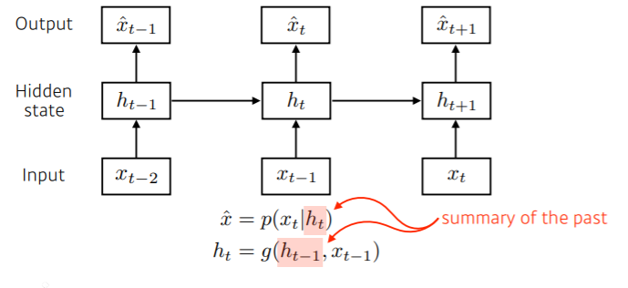

## RNN
---
- mlp랑 차이점은 자기 자신으로 돌아오는 구조가 하나 추가됨.
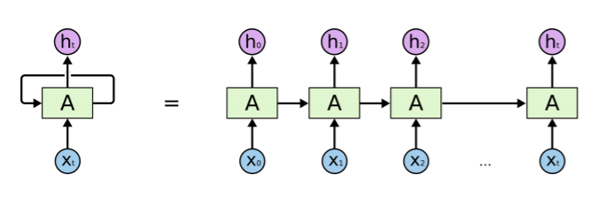

- RNN은 현재에서 멀리 떨어진 정보에 대한 반영이 어려움

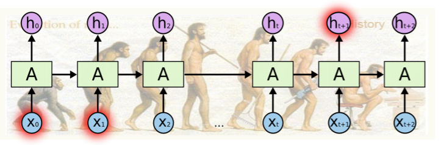

## RNN학습 구조
---
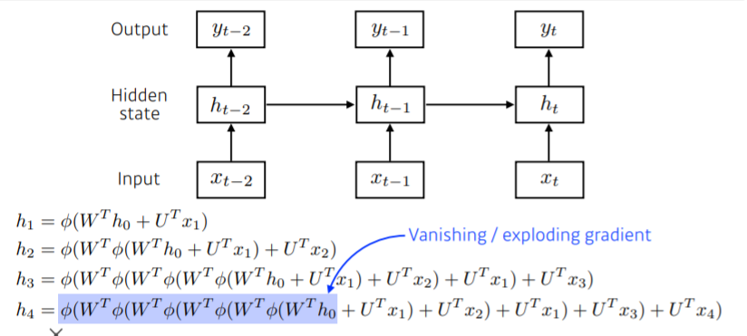

## LSTM
---
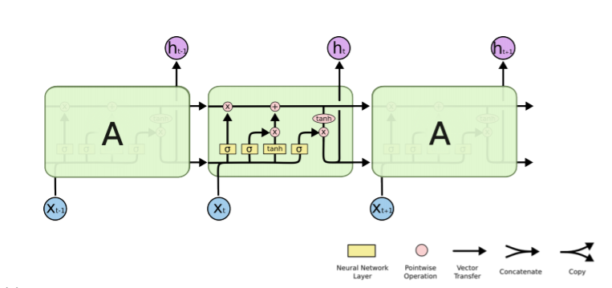
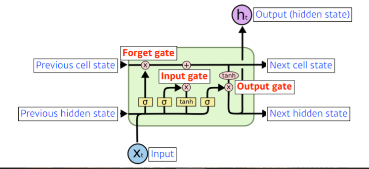
```Forget Gate``` : 이전의 cell state와 현재 input data 를 바탕으로 필요 없는 데이터를 지움
```InputGate``` :  이전의 cell state와 현재 input data 를 조합
```update cell``` : 현재의 cell state를 forget gate 데이터를 지우고 input gate를 바탕으로 업데이트
``` ouput Gate``` : updeate cell 을 한번더 조작해서 어떤 값을 밖으로 내보낼지 정함

### GRU
<br/>  
  
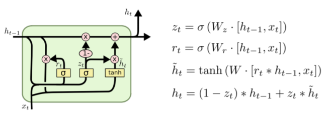

- 게이트가 2개  (reste gate , update gate)

- cell state 가 없고 hidden state 만 존재 - > output gate가 필요 없음 


```python

```


```python

```


```python

```


```python

```


```python

```


```python

```


```python

```
