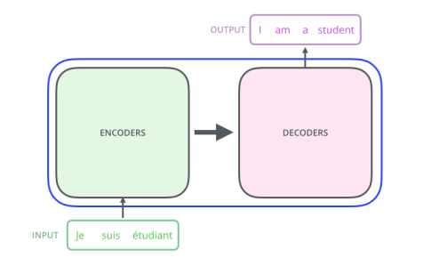
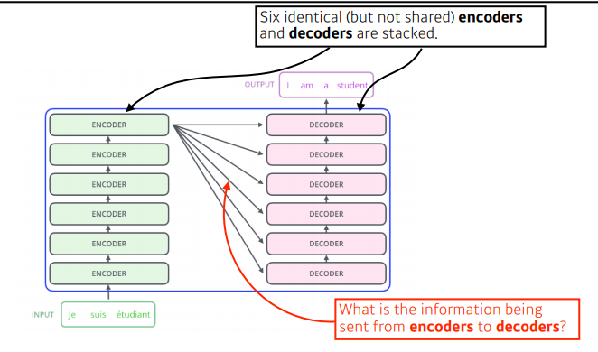
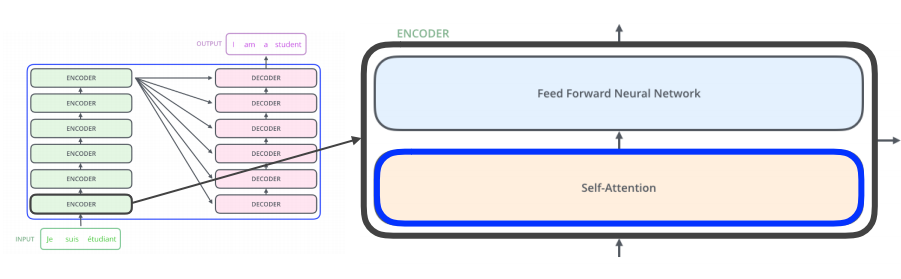

# 수업복습
---

## RNN 첫걸음 - 임성빈 교수님
---


## 시퀀스 데이터 이해하기
---
- 소리, 문자열, 주가 등의 데이터를 시퀀스 데이터로 분류한다.
- 시퀀스 데이터는 독립동등분포(i,i,d) 가정을 잘 위배하기 때문에 순서를 바꾸거나 과거 정보에 손실이 발생하면 데이터의 확률 분포도 바뀌게 된다.

## 시퀀스 데이터는 어떻게 다룰까 ?
---
- 이전 시퀀스의 정보를 가지고 앞으로 발생할 데이터의 확률분포를 다루기 위해 조건부확률을 이용할 수 있다.  
<br/>  


> 위 조건부 확률은 과거의 모든 정보를 사용하지만 시퀀스 데이터를 분석할 때 모든 과거 정보들이 필요한 것은 아니다.

- 시퀀스 데이터를 다루기 위해선 길이가 가변적인 데이터를 다룰 수 있는 모델이 필요하다.

- 조건부에 들어가는 데이터 길이는 가변적이다.
- 고정된 길이 $\tau$만큼의 시퀀스만 사용하는 경우 ```AR($\tau$)(Autoregressive Model)``` 자기 회뒤모델이라고 부른다.
- 또 다른 방법은 바로 이전 정보를 제외한 나머지 정보들을 $H_t$라는 잠재변수로 인코딩해서 활용하는 잠재 AR 모델이다. 
- 잠재변수 $H_t$를 신경망을 통해 반복해서 사용하여 시퀀스 데이터의 패턴을 학습하는 모델이 RNN 이다.

## Recurrent Neural Network을 이해하기
---
- 가장 기본적인 RNN 모형은 MLP와 유사한 모양이다.
- $w^{(1)},w^{(2)}$은 시퀀스와 상관없이 불변인 행렬이다.
- 이 모델의 과거의 정보는 다룰 수 없다.


- RNN은 이전  순서의 잠재 변수와 현재의 입력을 활용하여 모델링한다.
- 잠재변수 $H_t$를 복제해서 다음 순서의 잠재변수를 인코딩하는데 사용한다.
- 이를 ```Backpropagation Through Time(BPTT)```라 하며 RNN의 역전파 방법이다.


### BPTT
--- \
BPTT를 통해 RNN의 가중치행렬을 미분을 계산해보면 아래와 깉이 미분의 곱으로 이루어진 항이 계산된다.


### 기울기 소실의 해결책? 
---
- 시퀀스 길이가 길어지는 경우 BPTT를 통한 역전파 알고리즘의 계산이 불안정 해지므로 길이를 끊는 것이 필요하다. 이를 ```trucated BPTT```라 부른다.  

  

- 이런 문제들 때문에 Vanila RNN은 길이가 긴 시퀀스를 처리하는데 문제가 있다.  
- 이를 해결하기위해 등장한 RNN 네트워크가 LSTM과 GRU이다.


## Sequential Model - 최성준 교수님
---

#### Naive sequence model
<br/>  

  

- Suquentail Model의 문제점은 입력의 차원을 알수 없다 -> CNN같은 것을 사용 불가.

#### Autoregressive model
<br/>   
- 과거의 몇개만 정해서 보는것   


#### Markov model (first-order autoregressive model)
<br/> 
- 나의 현재는 바로 이전의 과거에만 의존한다는 가정 -> 허무맹랑한 소리 ..수능 점수는 수능 전날 공부한 것을 기준으로 나오지 않음 


#### Latent autoregessive model
<br/>  

- 중간에 ```Hidden state``` 가 들어 있고 이 Hidden state가 과거의 정보를 요약.  


## RNN
---
- mlp랑 차이점은 자기 자신으로 돌아오는 구조가 하나 추가됨.


- RNN은 현재에서 멀리 떨어진 정보에 대한 반영이 어려움


## RNN학습 구조
---


## LSTM
---


```Forget Gate``` : 이전의 cell state와 현재 input data 를 바탕으로 필요 없는 데이터를 지움
```InputGate``` :  이전의 cell state와 현재 input data 를 조합
```update cell``` : 현재의 cell state를 forget gate 데이터를 지우고 input gate를 바탕으로 업데이트
``` ouput Gate``` : updeate cell 을 한번더 조작해서 어떤 값을 밖으로 내보낼지 정함

### GRU
<br/>  
  


- 게이트가 2개  (reste gate , update gate)

- cell state 가 없고 hidden state 만 존재 - > output gate가 필요 없음 

<br/>  <br/>  <br/>  


## Transformer
---

### Sequence model의 문제점
<br/>    

중간에 어떤 데이터가 빠지거나, 순서가 바뀌면 학습이 어려움 .

<br/>    


<br/>  

Transformer 는 sequence를 다루는 모델인지 attetion 구조를 활용한 모델이라고 생각하면 된다.


<br/>    

- 어떤 sequence 데이터를 다른 sequence 데이터로 바꿔 주는 것.  
    - ex ) 영어 입력 -> 한글 출력

<br/>    



<br/>    

- 아래의 사진을 살펴보면 알 수 있듯이 Transformer는 입력 시퀀스와 출력 시퀀스의 갯수가 다를 수 있음
- 그리고 도메인도 다를 수 있다. 
    - 불어, 영어
- RNN의 경우 입력으로 세개의 단어가 주어지면 모델을 3번 돌려야 되는데 Transformer는  RNN과 달리 한번만 돌아간다.
- 




- n개의 단어가 어떻게 인코더에서 한번에 처리 ?
- 인코더와 디코더 사이에 어떤 정보를 주고 받는지 ?
- 디코더가 어떻게 generation 할수 있는지 ?

<br/>    



<br/>    

- 인코더에 n개의 단어가 들어가고, 한개의 인코더에는 Self-Attention과 FFNN으로 나눠 져있다. 
- 그리고 모든 인코더가 그림과 같이 쌓임.


###  ```self-attention``` : transfomer 구조에서 가장 중요함.
---

<br/>  

먼저 아래와 같이 3개의 단어가 있으면 ```self-attention``` 에서는 세개의 단어에 대해 벡터를 찾아준다.


<br/>  


<br/>  
그리고 나머지 단어의 벡터도 함께 고려해서 $x_i$ 를 $z_i$로 바꿔준다.

<br/>  


<br/>

```self-attetion```은 한개의 단어에서 각각의 NN을 통해 Querise, Keys, Values 벡터를 만들어 낸다.


<br/>  


<br/>  

그리고 score 값을 구해주는데 score 값은 내가 인코딩 하고자 하는 단어의 쿼리 벡터와,   
자기 자신을 포함한 n개의 단어에 대한 key 벡터를 내적 한후 합한 값으로 구한다.


<br/>  


<br/>  

그리고나서 정규화된 score 벡터를 softmax 함수에 넣어준다.  
최종적으로 사용할 값은 각각의 단어에서 나오는 value  * score 를 사용.  

위 작업을 거치면 하나의 단어에 대한 인코딩 벡터를 구할 수 있다.

<br/>  


### Positional Encoding
---
```self-attention```을 거쳐 나온 벡터에는 순서에 대한 정보가 사실 포함이 되어 있지않음 .
문장에서 앞뒤 단어 순서는 중요하기 때문에 그것에 대한 작업을 해주는 것이 ```Positional Encoding```이다.

<br/>  


<br/>  

### Decoders
---
**참고 블로그 (http://jalammar.github.io/illustrated-transformer/)**


- ```transformer는``` ```Decoders```로 key와 value를 보냄

- ```Decoders```에 들어가는 단어들로 만들어지는 쿼리벡터와 ```Encoder```에서 가져온 key ,value 벡터를 바탕으로 최종 값을 출력


## Vision Transformer
---
이미지 분류를 할때 활용 .
이미지를 특정 영역으로 나눔 ->  인코더만 활용.

