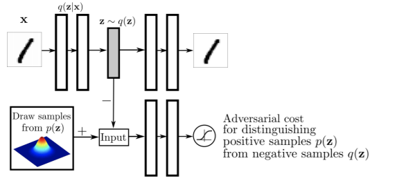

# 수업복습
---

## Generative Models
---
참고 : https://deepgenerativemodels.github.io/

```generative model 이란```

이름에서 알 수 있듯이 무언가를 만들어 내는 모델이지만 단순히 그것이 전부는 아니다.  
<br/>  
강아지 사진 데이터로 예를 들어 보면,
 generative model을 통해 품종별로 강아지를 분류하는 모델을 만들수도 있고, **강아지 사진 자체**를 더 만들어 낼수 있다.
<br/>  
그리고 어떤 이미지가 강아지인지 아닌지 확률을 통해 구분해 내줄수도 있다. ```(explicit model)```

---
#### 이부분은 중요한 내용은 아님

- Bernoulli distribution
    - 숫자가 한개 필요 ( 앞이 나올 확률(P) 한개만있으면  뒷면이 나올확률은 1- p로 구할 수 있음)
- Categorical distribution
    - 6개의 주사위를 던지려면 5개의 파라미터가 필요 나머지 하나의 확률은 1에서 다빼주면됨
---


  숫자를 분류하는 이진 분류 문제에서 경우의 수는 2 x 2 x ... x 2 = $2^n$ 이고,
이 데이터를 분류하는 모델의 파라미터의 갯수는 $2^n$ - 1 개 이다.
 <br/>  
기계학습에서 파라미터의 숫자가 많아 질 수록 학습은 더욱 어렵다.   
->  ```성능을 높이려면 파라미터를 줄여야됨 ```
<br/>  
### Markov assumption (각각의 표본(?)이 독립이라고 가정)
---
위 이진 분류 문제에서 각각의 표본이 독립이라고 가정하면 표현할 수 있는 경우의 수는 $2^n$ 으로 똑같지만, **파라미터의 갯수는 n개로 줄어든다**

>이러한 가정은 말이 안되기 때문에,  어느정도의 타협점(?) 을 찾아야 된다.

<br/>  

## Condition Independence
---

- Chain rule
- Bayes' rule:
- Conditional independece 
    - if $ x \perp y|z$,   $then$   $p(x|y,z)$   =   $p(x|z)$

chain rule 을 쓰면 몇개의 파라미터 필요 할까?
$p(x_1,...,x_n) = p(x_1)p(x_2|x_1)...p(x_n|x_1,...,x_{n-1})$

- $p(x_1)$ = 파라미터 1개
- $p(x_2|x_1)$ = 파라미터 2개
- $p(x_3|x_1,x_2)$ = 파라미터 4개
- **결론적으로 $1 + 2+ 2^2+...+2^{n-1} = 2^n-1$ 개의 파라미터 필요**

<br/>

여기에 ```Markov assumption``` 를 적용하면 필요한 파라미터의 갯수는 어떻게 될까 ?

> $p(x_1,...,x_n) = p(x_1)p(x_2|x_1)p(x_3|x_2)...p(x_n|x_{n-1})$ -> ```2n-1``` 개 필요

<br/>

그래서 이렇게 파라미터를 줄이는 모델을  ```Auto-regressive model``` 이라고 부른다.


## Auto-regressive Model
---


- 우리의 목표는 28 x 28 픽셀을 학습시키는 거다
- 얘를 어떻게 $p(x)$ 로 표현 할 수 있을까 ?
    - chain rule을 가지고 join distribution으로 나누고
    - $p(x_{1:784} = p(x_1)p(x_2|x_1)p(x_3|x_1:2)...$
    - 이게 autoregressive model
    - autoregressive model 이용하려면 순서를 매겨야 한다. 순서를 매기는 방식에 따라 전체 모델의 구조나 성능이 달라 진다.
  

### NADE : Neural Aitoregressive Denstiy Estimator
--- 

  

- i 번째 픽셀은 1번쨰 픽셀부터 i-1번째 픽셀까지 dependent 한다.
- 예를 들어 다섯번째 픽셀의 확률 값은 1~4번째의 값을   neural network를 통해 값을 구하고, sigmoid 함수를 통과시켜 0~1 사이의 확률값으로 바꿔준다 .
- i 번째 픽셀은 i-1개의 픽셀에 dependent -> 5번째 픽셀을  만들때는 4개의입력 에 대한 weight가 필요하다.

- NADE는 ```explict model``` 이다.
  - n개의 픽셀이 주어지면 모덜이 첫번째 픽셀에 대한 확률 분포를 알고있고,
  - 첫번째 픽셀을 통해 두번째 픽셀의 확률 분포도 구할 수 있다.
  - 그래서 이 값들을 다 곱하면 아주 작지만 확률 값 하나를 도출해 낼 수 있다.
- 연속형 확률 분포일 때는 gaussian mixture 모델을 활용 하여 적용 할 수 있다.


i 번재 픽셀은 i-1개의 픽셀에 의존 ? - > 3번째 픽셀ㅇ된 nn만들때는 2개의 입력을 받는 weight가 필요 100번째는 99개의 입력을 받을 수 있는 nn가 필요.

- NADE는 explict model 임 
    - n개으 ㅣ픽셀이 주어지면 
    - 우리의 모델이 첫번째 픽셀에 대한 확률 분포를 알 고 있고 
   첫번째를 알면 두번째를 알수있다.
    - 그래서 이값들을 다곱하면 작지만 확률 값을 하나도출 할 수 있음.
- 연속형 확률 분포일때는 gaussian mixture 모델을 활용하면됨 -> 어떻게 ?

### Pixel RnN
--- 
- n x n image 가 있을때 R G B 를 순서대로 만듦
  <br/>  


```NADE``` 는 fully connected model을 이용 한 것이고, 
 pixel rnn은 rnn을 통해서 generate 한 다는 것이 큰 차이 이다.

- Pixel Rnn 모델은 데이터의 order를 어떻게 하냐에 따라 Row LSTM,Diagonal BiLSTM 으로 나뉜다.


<br/>
Row LSTM은 i번째 픽셀을 만들때 그 위쪽에 있는 정보를 활용 하고 ,Diagonal BiLSTM은 자기 이전 픽셀의 정보를 다 활용한다.


## Latent Variable Models
---
```Variational inference 이란..``` 

: 내가 찾고자하는 poseterior distribution 를 근사할 수 있는 variational distribution 를 찾는 과정 

- poseterior distribution 을 찾는게 목표
  - poseterior distribution는 objectivation(?)이 주어졌을때 내가 찾고 싶어 하는 random variablbe의 확률 분포 
- variational distribution이란..
    - 우리가 일반적으로 poseterior distribution 를 계산하기가 어렵다. 
    - 그래서 얘를 내가 학습할수 잇는 것으로 근사하는게 목적이고
  - 그 근사하는 분포가 variational distribution 임 
  
- 무언가를 찾겠다/최적화하겠다하면 필요한게 loss function 임 .
- 그래서  Variational inference 에서는 KL divergence를 이용해서 variation dis 와 pos dis를 줄여 보겠다.


## 어떻게 ?
---
궁극적으로 이야기하고싶은건 우리의 목저인 variational distribution 와 poseterior distribution의 KL divergence를 줄이는 것이 사실은 목적인데 이게 불가능함 .

그래서 우리는 ELBO를 계산해서 이거를 최대화함으로써 내가 원하는 objective를 얻고자 함.   수식 이해해보셈 ㅋ


---
ELBO 는 내가 계산할수 있으니까 
ELBO를 나눠보면 ```Reconstruction Term```과 ```Prior Fitting Term```으로 나뉨
```Reconstruction Term```는 오토 인코더의 Reconstruction loss에 해당하고, ```Prior Fitting Term```는 오토 인코더의 prior distribution에 해당


결론으로는 KL divergence를 최소화 하고싶은데 불가능 하니 ELOB를 최대화 함으로써 KL divergence를 최소화 시키고 poseterior distribution을 근사

### Variational Auto-encoder limitation
---
- VA는 intractalbe model 이다 
- ELBO가 두개로나눠졌는데 KL ???
- 일반적으로 isotropic Gaussian을 활용함

- 가장 큰 단점은 인코더를 활용할때 Gaussian이 아니면 활용하기 어렵다.
- 가우시안 말고 다른거 쓰고싶은때 사용하는게 ```Adversarial Auto-encoder```이다.

### Adevesarial Auto-encoder 
---

- prior fitting term ? 을 gan objective로 바꾼거 일뿐임 ?
- 사실은 ? 뭐라는건지..,.???


### GAN
--- 

아이디어는 도둑이 위조지폐를 만들고 싶은데 위조지폐를 잘 분별하는 경찰이있음 경찰은 위조지폐를 계속 분별하고 도둑은 분별된 지폐를 바탕으로 더 잘 만들려고 함 

내가 학습하는 dicriminator? 가 점차점차 좋아짐
-> 그래서 제너레이터도 좋아짐 


### GAN vs. VAE
---


- VA는  x라는 이미지가 들어오면 인코더를 통해 $z$로가고 디코더를 통해 다시 x로 감 
- GAN은 $x$를 $G$라는 latent 에 추가하고 $G$를 통해  Fake가 나오고 discriminator는 진짜 이미지와 가짜 데이터를 구분하는 분류기를 학습을 하고
 제너레이터는 그렇게 학습된 $D$의 입장에서 True 가나오도록 제너레이터를 업데이트하고 .. 반복 

 ---

 Gan은 generaotr과 discriminator 사이의 MinMax Game.

보통 discriminator는 아래와 같다.


최적화시키는 optimal discriminator는 아래와 같다.


그러면 이 optimal discriminator를 다시 제너레이터에 집어 넣으면 결국 JSD가 나옴 

엄밀히 말하면 이 discri 가 optimal이라 가정했을떄이걸 gene로 학습하고 jsd라는 식이나왔다 그래서 실제로 봤을떄 disc 가 optimal 에수렴하낟고 보장한다고 어렵고 genen가 이런식으로 안나올수도 있지 
이론적으로는 가능하지만 현실적으로는 좀 어렵긴함 ..

어쨌든 이런 아이디어 알아주면 좋다. 

---
### DCGAN 
---


그래서 얘는뭐 테크닉적으로 좋은게 있음 LEAKY RELU 를 사용 ?


여기는 REAKY RELU 를 쓰자 하이퍼파라미터들이 이미지 만들떄 좋더라 뭐 그런

### INFO-gan
--
![infogan.PNG]
학습을 할떄 단순히 G라는 걸 통해 이미지만 만든는 것이아니라 C라는 클래스도 만듬
결과론적으로 제너레이션을 할때 GAN이 특정 모드에 집중할 수 있게 만들어줌
마치 멀티 모델 DITRIBUTION 을 학습하는 것을 C라는 벡터로 잡아줌 ?


### Text2Image
---


문장이 주어졌을때 이미지를 만듦

### Puzzle-GAN
---


이미지안에 sub patch 가 있음 
자동차면 - 바퀴, 헤드라이트, 창문 등등
이런 sub patc를 가지고 원봉 이미지를 복원

### CycleGan
---


GAN구조를 활용하지만 이미지상의 도메인을 바꿈 얼룩말 -> 그냥 말
- Cycle-consistenct loss 중요


우리가 일반적으로 두개의 도메인 사이에 변환을 주려면 똑같은 이미지상에 얼룩말과 그냥말이있는 사진이 필요함 그런데 CycleGan 은 그런게 필요없음
그냥 야생을 떠도는 말 사진 여러개, 야생을 떠도는 얼룩말 사진 여러개
가 있으면 알아서 임의의 말 사진을 얼룩말로 바꿔줌


### Star -GAN
---

input이 있고 input을 남/여 로 바꾸거나 창백한 얼굴로 바꿀 수있고
뭐 감정에 따른 표정을 바꿀 수 있음

### Progressive -gan

---


고차원의 이미지를 잘 만들 수 있는 방법론

처음에는 4x4 부터시작해서 8x8 -> 1024x1024 까지 픽셀을 키워서 
한번에 고차원 이미지를 만들려고 하면 nn이 힘들어하니까
저차원에서 고차원으로 업데이트 하는거 이게 큰 아이디어 가되서 좋은 성능
