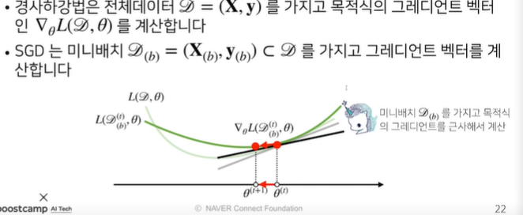
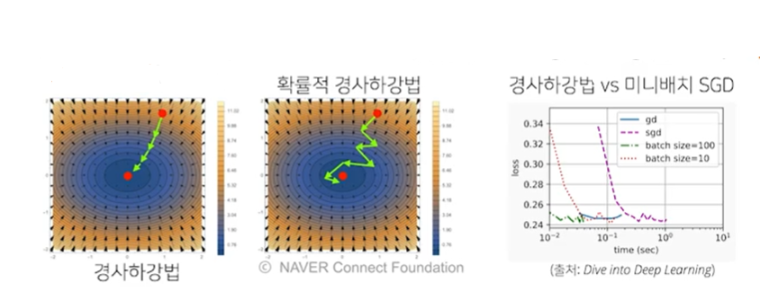

# 강의복습
---


## 경사하강법( 순한 맛 )
---


```python
import sympy as sym
from sympy.abc import x

sym.diff(sym.poly(x**2 + 2*x + 3),x)
```


$\displaystyle \operatorname{Poly}{\left( 2 x + 2, x, domain=\mathbb{Z} \right)}$


- 한 점에서 접선의 기울기를 알면 어느 방향으로 점을 움직여야 함수값이 증가/감소 하는 지 알 수있다.
- 미분값을 더하면 경사상승법이라 하며 함수의 극대값의 위치를 구할 때 사용한다.
- 미분값을 빼면 경사하강법이라 하며 함수의 극소값의 위치를 구할때 사용한다.


```python
# gradient : 미분을 계산하는 함수
# init: 시작점, lr: 학습률, eps: 알고리즘 종료조건

var = init
grad = gradient(var)
while(abs(grad) > eps):
    var = var - lr *grad
    grad = gradient(var)
```


```python
import numpy as np

def func(val):
    fun = sym.poly(x**2 + 2*x + 3)
    return fun.subs(x,val),fun

def func_gradient(fun,val):
    _,function = func(val)
    diff = sym.diff(function, x)
    return diff.subs(x,val),diff

def gradient_descent(fun, init_point, lr_rate = 1e-2, epsilon = 1e-5):
    cnt = 0
    val = init_point
    diff,_ = func_gradient(fun,init_point)
    while np.abs(diff) > epsilon:
        val = val - lr_rate*diff
        diff, _ = func_gradient(fun,val)
        cnt +=1
    print(' 함수 : {}, 연산 횟수 : {} , 최소점 : ({},{})'.format(func(val)[1],cnt,val,fun(val)[0]))
    
gradient_descent(func,np.random.uniform(-2,2))
    
```

     함수 : Poly(x**2 + 2*x + 3, x, domain='ZZ'), 연산 횟수 : 435 , 최소점 : (-1.00000492090000,2.00000000002422)
    

### 변수가 벡터일 경우
- 벡터가 입력인 다변수 함수의 경우 편미분을 사용한다


```python
import sympy as sym
from sympy.abc import x,y

sym.diff(sym.poly(x**2 + 2*x*y + 3) + sym.cos(x+2*y),x)
```


$\displaystyle 2 x + 2 y - \sin{\left(x + 2 y \right)}$


```python
# gradient : 그레디언트 벡터를 계산하는 함수
# init: 시작점, lr: 학습률, eps : 알고리즘 종료 조건

var = init
grad = gradient(var)
while(norm(grad) > eps):
    var = var- lr*grad
    grad = gradient(var)
```

## 그래디언트 벡터
---
- 그래디언트 벡터는 각점(x,y)에서 가장빠르게 증가하는 방향으로 흐르게된다
- -그래디언트벡터는 임의의점 (x,y) 에서 최소점으로 가장 빠른 방향으로 이동한다.
- 


```python
import numpy as np

def eval_(fun,val):
    val_x, val_y = val
    fun_eval = fun.subs(x, val_x).subs(y,val_y)
    return fun_eval

def func_multi(val):
    x_, y_ = val
    func = sym.poly(x**2 + 2*y**2)
    return eval_(func, [x_,y_]),func
    


def func_gradient(fun,val):
    x_,y_ = val
    _,function = func(val)
    diff_x = sym.diff(function, x)
    diff_y = sym.diff(function, y)
    grad_vec = np.array([eval_(diff_x,[x_,y_]), eval_(diff_y,[x_,y_])], dtype=float)
    return grad_vec, [diff_x,diff_y]

def gradient_descent(fun, init_point, lr_rate = 1e-2, epsilon = 1e-5):
    cnt = 0
    val = init_point
    diff,_ = func_gradient(fun,val)
    while np.linalg.norm(diff) > epsilon:
        val = val - lr_rate*diff
        diff, _ = func_gradient(fun,val)
        cnt +=1
        
    print(' 함수 : {}, 연산 횟수 : {} , 최소점 : ({},{})'.format(func(val)[1],cnt,val,fun(val)[0]))

pt = [np.random.uniform(-2,2),np.random.uniform(-2,2),2]    
gradient_descent(func,init_point*pt)
    
```

## 경사하강법 (매운맛)
---


### 선형회귀분석 복습
---
```np.linalg.pinv```
를 이용하면 데이터를 선형모델로 해석하는 선형회귀식을 찾을수 있다

### 경사하강법으로 선형회귀 계수 구하기
---
- 선형회귀의 목적식은 ```||y-Xb||\_2``` 이고 이를 최소화 하는 베타(b)를 찾는 것이 목표이다.
- 목적식을 최소화하는 b(베타)를 구하는 경사하강법 알고리즘은 다음과 같다.


### 경사하강법 기반 선형회귀 알고리즘
---


```python
# norm: L2-노름을 계산하는 함수
# lr: 학습률, T: 학습횟수

for t in range(T):
    error = y - x @ beta
    grad = np.transpose(X) @ error
    beta = beta - lr * grad
```


```python
X = np.array([[1,1],[1,2],[2,2,],[2,3]])

y = np.dot(X,np.array([1,2])) + 3

beta_gd = [10.1,15.1,-6.5]
X_ = np.array([np.append(x,[1]) for x in X])

for t in range(100):
    error = y - X_ @ beta_gd
    grad = np.transpose(X_) @ error
    beta_gd = beta_gd - 0.01 * grad
print(beta_gd)
```

    [4.27704114e+12 5.78036824e+12 2.63692982e+12]
    

## 경사하강법은 만능 ?
---
- 이론적으로 경사하강법은 미분가능하고 ```볼록(convex)```한 함수에 대해선 **적절한 학습률과 학습횟수를 선택 했을때 수렴이 보장**되어 있다.
- 하지만 ```비선형회귀``` 문제의 경우 목적식이 볼록하지 않을 수 있으므로 **수렴이 항상 보장되지 않는다**
 

## 확률적 경사하강법
---
- ```확률적 경사하강법(stochastic gradient descent)```은 모든 데이터를 사용해서 업데이트하는 대신 데이터 한개 또는 일부 활용하여 업데이트한다.
- ```볼록이 아닌(non-convex)``` 목적식은 SGD를 통해 최적화할 수 있다.
- SGD는 데이터의 일부를 가지고 패러미터를 업데이트하기 때문에 연산자원을 좀 더 효율적으로 활용하는데 도움이 된다.

- ```학습률```을 너무 작게 설정하면 시간이 오래걸리고 너무 높게 하면 경사하강법이 불안정하게 수렴한다.
- ```학습횟수```가 너무 작으면 경사하강법에 수렴하지않으니 주의 해야한다.
- ```학습률```과 ```학습 횟수```는 적절히 조정해야하는 중요한 하이퍼 파라미터이다.
### 확률적 경사하강법의 원리: 미니배치 연산
--- 


SGD는 볼록이 아닌 목적식에도 사용 가능하므로 경사하강법보다 ```머신러닝 학습에 더 효율적``` 이다.




### 확률적 경사하강법의 원리 : 하드웨어
---
GPU에서 행렬 연산과 모델 파라미터를 업데이트 하는 동안  
CPU는 전처리와 GPU에서 업로드할 데이터를 준비한다.


## 피어세션
---
- 오늘 강의 내용이 수학적으로 조금 이해하기 어려운 부분이 있어서 관련 내용 토론

