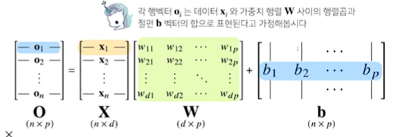
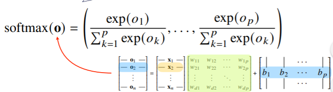
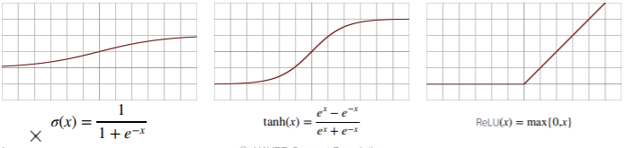
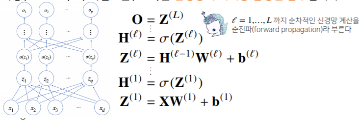
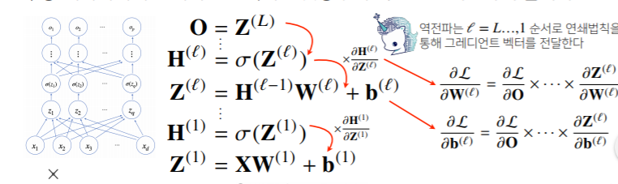

# 수업 복습
---


## 신경망을 수식으로 분해해보자.
---




## 소프트맥스 연산
---
- 소프트맥스(softmax) 함수는 ```모델의 출력을 확률로 해석```할 수 있게 변환해 주는 연산 이다.
- ```분류 문제```를 풀 때 선형모델과 소포트맥스 함수를 결합하여 예측한다.




```python
import numpy as np
def softmax(vec):
    denumerator = np.exp(vec - np.max(vec,axis = -1 ),keepdims=True)
    numerator = np.sum(denumerator, axis = -1, keepdins= True)
    val = denumerator / numerator
    return val

vec = np.array([[1,2,0],[-1,0,1,[-10,0,10]]])
print(one_hot_encoding(vec))
print(one_hot_encoding(softmax(vec)))
```


```python
softmax(vec)
```


## 활성함수
---
- 활성함수는 실수 위에 정의된 ```비선형 함수```이다.
- 활성함수를 쓰지 않으면 딥러닝은 선형모형과 차이가 없다.
- 시그모이드 함수나 tanh 함수는 전통적으로 많이 쓰이던 활성함수지만 ```딥러닝에선 ReLU함수를 많이 쓰고 있다.



- 신경망은 ```선형모델과 활성함수를 합성한 함수```입니다.
- 다층(multi-layer) 퍼셉트론(MLP)는 ```신경망이 여러층 합성된 함수```입니다.



## 층을 여러가 쌓는 이유
---
- 이론적으로 2층 신경망으로도 임의의 연속함수를 근사할 수 있음.
- 그러나 층이 깊을수록 **목적함수를 근사하는데 필요한 뉴런(노드)의 숫자가 훨씬 빨리 줄어들어 좀 더 효율적으로 학습이 가능** 하다.

## 딥러닝 학습원리 : 역전파 알고리즘
---
- 딥러닝은 ```역전파(backpropagation) 알고리즘```을 이용하여 각 층에 사용된 패러미터를 학습한다.
- 각층 패러미터의 그레디언트 벡터는 윗층부터 역순으로 계산하게 된다.
---




## 예제 : 2층 신경망
---


## 퀴즈
---
Q) 신경망에서 활성화 함수를 사용하는 가장 큰 이유는 ```비선형 근사를 하기 위해서`` 이다.

## Further Question

- 분류 문제에서 softmax 함수가 사용되는 이유가 뭘까요?
> https://mongxmongx2.tistory.com/30  
분류 결과를 확률값으로 해석하기 위함이다.


 softmax 함수의 결과값을 분류 모델의 학습에 어떤식으로 사용할 수 있을까요?
---
세 개이상의 정답지에서 정답을 구하는 경우 각각의 정답지에 대한 확률을 구하고 확률이 가장 높은것으로 분류, 확률의 합은 1

# 피어세션
---
- https://www.youtube.com/watch?v=k7RM-ot2NWY 

- ```피어세션이 피어(peer)씁니다~``` 준비


