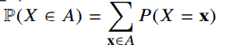
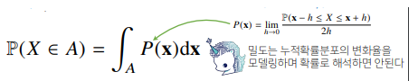
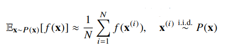

# 수업 복습
---


## Group by(1)
---
- SQL groupby 명령어와 같음
- split -> apply -> combine 과정을 거쳐 연산함


```python
import pandas as pd

# data from:
ipl_data = {
    "Team": [
        "Riders",
        "Riders",
        "Devils",
        "Devils",
        "Kings",
        "kings",
        "Kings",
        "Kings",
        "Riders",
        "Royals",
        "Royals",
        "Riders",
    ],
    "Rank": [1, 2, 2, 3, 3, 4, 1, 1, 2, 4, 1, 2],
    "Year": [2014, 2015, 2014, 2015, 2014, 2015, 2016, 2017, 2016, 2014, 2015, 2017],
    "Points": [876, 789, 863, 673, 741, 812, 756, 788, 694, 701, 804, 690],
}

df = pd.DataFrame(ipl_data)
df.head()
```


<div>
<style scoped>
    .dataframe tbody tr th:only-of-type {
        vertical-align: middle;
    }

    .dataframe tbody tr th {
        vertical-align: top;
    }

    .dataframe thead th {
        text-align: right;
    }
</style>
<table border="1" class="dataframe">
  <thead>
    <tr style="text-align: right;">
      <th></th>
      <th>Team</th>
      <th>Rank</th>
      <th>Year</th>
      <th>Points</th>
    </tr>
  </thead>
  <tbody>
    <tr>
      <th>0</th>
      <td>Riders</td>
      <td>1</td>
      <td>2014</td>
      <td>876</td>
    </tr>
    <tr>
      <th>1</th>
      <td>Riders</td>
      <td>2</td>
      <td>2015</td>
      <td>789</td>
    </tr>
    <tr>
      <th>2</th>
      <td>Devils</td>
      <td>2</td>
      <td>2014</td>
      <td>863</td>
    </tr>
    <tr>
      <th>3</th>
      <td>Devils</td>
      <td>3</td>
      <td>2015</td>
      <td>673</td>
    </tr>
    <tr>
      <th>4</th>
      <td>Kings</td>
      <td>3</td>
      <td>2014</td>
      <td>741</td>
    </tr>
  </tbody>
</table>
</div>


```python
df.groupby('Team')['Points'].sum()
```


    Team
    Devils    1536
    Kings     2285
    Riders    3049
    Royals    1505
    kings      812
    Name: Points, dtype: int64


```python
h_index = df.groupby(['Team','Year'])['Points'].sum()
h_index
```


    Team    Year
    Devils  2014    863
            2015    673
    Kings   2014    741
            2016    756
            2017    788
    Riders  2014    876
            2015    789
            2016    694
            2017    690
    Royals  2014    701
            2015    804
    kings   2015    812
    Name: Points, dtype: int64


```python
h_index.index
```


    MultiIndex(levels=[['Devils', 'Kings', 'Riders', 'Royals', 'kings'], [2014, 2015, 2016, 2017]],
               codes=[[0, 0, 1, 1, 1, 2, 2, 2, 2, 3, 3, 4], [0, 1, 0, 2, 3, 0, 1, 2, 3, 0, 1, 1]],
               names=['Team', 'Year'])


```python
h_index["Devils":'Kings']
```


    Team    Year
    Devils  2014    863
            2015    673
    Kings   2014    741
            2016    756
            2017    788
    Name: Points, dtype: int64


```python
h_index.unstack()
```


    Team    Year
    Devils  2014    863.0
            2015    673.0
    Kings   2014    741.0
            2016    756.0
            2017    788.0
    Riders  2014    876.0
            2015    789.0
            2016    694.0
            2017    690.0
    Royals  2014    701.0
            2015    804.0
    kings   2015    812.0
    dtype: float64


```python
h_index.unstack().stack()
```


    Team    Year
    Devils  2014    863.0
            2015    673.0
    Kings   2014    741.0
            2016    756.0
            2017    788.0
    Riders  2014    876.0
            2015    789.0
            2016    694.0
            2017    690.0
    Royals  2014    701.0
            2015    804.0
    kings   2015    812.0
    dtype: float64


```python
h_index.reset_index()
```


<div>
<style scoped>
    .dataframe tbody tr th:only-of-type {
        vertical-align: middle;
    }

    .dataframe tbody tr th {
        vertical-align: top;
    }

    .dataframe thead th {
        text-align: right;
    }
</style>
<table border="1" class="dataframe">
  <thead>
    <tr style="text-align: right;">
      <th></th>
      <th>Team</th>
      <th>Year</th>
      <th>Points</th>
    </tr>
  </thead>
  <tbody>
    <tr>
      <th>0</th>
      <td>Devils</td>
      <td>2014</td>
      <td>863</td>
    </tr>
    <tr>
      <th>1</th>
      <td>Devils</td>
      <td>2015</td>
      <td>673</td>
    </tr>
    <tr>
      <th>2</th>
      <td>Kings</td>
      <td>2014</td>
      <td>741</td>
    </tr>
    <tr>
      <th>3</th>
      <td>Kings</td>
      <td>2016</td>
      <td>756</td>
    </tr>
    <tr>
      <th>4</th>
      <td>Kings</td>
      <td>2017</td>
      <td>788</td>
    </tr>
    <tr>
      <th>5</th>
      <td>Riders</td>
      <td>2014</td>
      <td>876</td>
    </tr>
    <tr>
      <th>6</th>
      <td>Riders</td>
      <td>2015</td>
      <td>789</td>
    </tr>
    <tr>
      <th>7</th>
      <td>Riders</td>
      <td>2016</td>
      <td>694</td>
    </tr>
    <tr>
      <th>8</th>
      <td>Riders</td>
      <td>2017</td>
      <td>690</td>
    </tr>
    <tr>
      <th>9</th>
      <td>Royals</td>
      <td>2014</td>
      <td>701</td>
    </tr>
    <tr>
      <th>10</th>
      <td>Royals</td>
      <td>2015</td>
      <td>804</td>
    </tr>
    <tr>
      <th>11</th>
      <td>kings</td>
      <td>2015</td>
      <td>812</td>
    </tr>
  </tbody>
</table>
</div>


swaplevel : 인덱스 레벨을 바꿈


```python
h_index.swaplevel()
```


    Year  Team  
    2014  Devils    863
    2015  Devils    673
    2014  Kings     741
    2016  Kings     756
    2017  Kings     788
    2014  Riders    876
    2015  Riders    789
    2016  Riders    694
    2017  Riders    690
    2014  Royals    701
    2015  Royals    804
          kings     812
    Name: Points, dtype: int64


**정령**


```python
h_index.sort_index(level=0)
```


    Team    Year
    Devils  2014    863
            2015    673
    Kings   2014    741
            2016    756
            2017    788
    Riders  2014    876
            2015    789
            2016    694
            2017    690
    Royals  2014    701
            2015    804
    kings   2015    812
    Name: Points, dtype: int64


```python
h_index.sort_index(level=1)
```


    Team    Year
    Devils  2014    863
    Kings   2014    741
    Riders  2014    876
    Royals  2014    701
    Devils  2015    673
    Riders  2015    789
    Royals  2015    804
    kings   2015    812
    Kings   2016    756
    Riders  2016    694
    Kings   2017    788
    Riders  2017    690
    Name: Points, dtype: int64


```python
h_index.sort_values()
```


    Team    Year
    Devils  2015    673
    Riders  2017    690
            2016    694
    Royals  2014    701
    Kings   2014    741
            2016    756
            2017    788
    Riders  2015    789
    Royals  2015    804
    kings   2015    812
    Devils  2014    863
    Riders  2014    876
    Name: Points, dtype: int64


## Group by(2)
---
- Groupby에 의해 Split된 상태를 추출 가능함


### grouped
---
- 추출된 group 정보에는 세 가지 유형의 apply가 가능함
- Aggregation: 요약된 통계정보를 추출해 줌
- Transformation: 해당 정보를 변환해 줌
- Filtration : 특정 정보를 제거 하여 보여주는 필터링 기능


```python
grouped = df.groupby('Team')

for name,group in grouped:
    print(name)
    print(group)
```

    Devils
         Team  Rank  Year  Points
    2  Devils     2  2014     863
    3  Devils     3  2015     673
    Kings
        Team  Rank  Year  Points
    4  Kings     3  2014     741
    6  Kings     1  2016     756
    7  Kings     1  2017     788
    Riders
          Team  Rank  Year  Points
    0   Riders     1  2014     876
    1   Riders     2  2015     789
    8   Riders     2  2016     694
    11  Riders     2  2017     690
    Royals
          Team  Rank  Year  Points
    9   Royals     4  2014     701
    10  Royals     1  2015     804
    kings
        Team  Rank  Year  Points
    5  kings     4  2015     812
    

- 특정 Key값을 가진 그룹의 정보만 추출 가능


```python
grouped.get_group('Devils')
```


<div>
<style scoped>
    .dataframe tbody tr th:only-of-type {
        vertical-align: middle;
    }

    .dataframe tbody tr th {
        vertical-align: top;
    }

    .dataframe thead th {
        text-align: right;
    }
</style>
<table border="1" class="dataframe">
  <thead>
    <tr style="text-align: right;">
      <th></th>
      <th>Team</th>
      <th>Rank</th>
      <th>Year</th>
      <th>Points</th>
    </tr>
  </thead>
  <tbody>
    <tr>
      <th>2</th>
      <td>Devils</td>
      <td>2</td>
      <td>2014</td>
      <td>863</td>
    </tr>
    <tr>
      <th>3</th>
      <td>Devils</td>
      <td>3</td>
      <td>2015</td>
      <td>673</td>
    </tr>
  </tbody>
</table>
</div>


### Groupby - arrgegation
---


```python
grouped.agg(sum)
```


<div>
<style scoped>
    .dataframe tbody tr th:only-of-type {
        vertical-align: middle;
    }

    .dataframe tbody tr th {
        vertical-align: top;
    }

    .dataframe thead th {
        text-align: right;
    }
</style>
<table border="1" class="dataframe">
  <thead>
    <tr style="text-align: right;">
      <th></th>
      <th>Rank</th>
      <th>Year</th>
      <th>Points</th>
    </tr>
    <tr>
      <th>Team</th>
      <th></th>
      <th></th>
      <th></th>
    </tr>
  </thead>
  <tbody>
    <tr>
      <th>Devils</th>
      <td>5</td>
      <td>4029</td>
      <td>1536</td>
    </tr>
    <tr>
      <th>Kings</th>
      <td>5</td>
      <td>6047</td>
      <td>2285</td>
    </tr>
    <tr>
      <th>Riders</th>
      <td>7</td>
      <td>8062</td>
      <td>3049</td>
    </tr>
    <tr>
      <th>Royals</th>
      <td>5</td>
      <td>4029</td>
      <td>1505</td>
    </tr>
    <tr>
      <th>kings</th>
      <td>4</td>
      <td>2015</td>
      <td>812</td>
    </tr>
  </tbody>
</table>
</div>


```python
import numpy as np
grouped.agg(np.mean)
```


<div>
<style scoped>
    .dataframe tbody tr th:only-of-type {
        vertical-align: middle;
    }

    .dataframe tbody tr th {
        vertical-align: top;
    }

    .dataframe thead th {
        text-align: right;
    }
</style>
<table border="1" class="dataframe">
  <thead>
    <tr style="text-align: right;">
      <th></th>
      <th>Rank</th>
      <th>Year</th>
      <th>Points</th>
    </tr>
    <tr>
      <th>Team</th>
      <th></th>
      <th></th>
      <th></th>
    </tr>
  </thead>
  <tbody>
    <tr>
      <th>Devils</th>
      <td>2.500000</td>
      <td>2014.500000</td>
      <td>768.000000</td>
    </tr>
    <tr>
      <th>Kings</th>
      <td>1.666667</td>
      <td>2015.666667</td>
      <td>761.666667</td>
    </tr>
    <tr>
      <th>Riders</th>
      <td>1.750000</td>
      <td>2015.500000</td>
      <td>762.250000</td>
    </tr>
    <tr>
      <th>Royals</th>
      <td>2.500000</td>
      <td>2014.500000</td>
      <td>752.500000</td>
    </tr>
    <tr>
      <th>kings</th>
      <td>4.000000</td>
      <td>2015.000000</td>
      <td>812.000000</td>
    </tr>
  </tbody>
</table>
</div>


```python
grouped.agg(np.mean)
```


<div>
<style scoped>
    .dataframe tbody tr th:only-of-type {
        vertical-align: middle;
    }

    .dataframe tbody tr th {
        vertical-align: top;
    }

    .dataframe thead th {
        text-align: right;
    }
</style>
<table border="1" class="dataframe">
  <thead>
    <tr style="text-align: right;">
      <th></th>
      <th>Rank</th>
      <th>Year</th>
      <th>Points</th>
    </tr>
    <tr>
      <th>Team</th>
      <th></th>
      <th></th>
      <th></th>
    </tr>
  </thead>
  <tbody>
    <tr>
      <th>Devils</th>
      <td>2.500000</td>
      <td>2014.500000</td>
      <td>768.000000</td>
    </tr>
    <tr>
      <th>Kings</th>
      <td>1.666667</td>
      <td>2015.666667</td>
      <td>761.666667</td>
    </tr>
    <tr>
      <th>Riders</th>
      <td>1.750000</td>
      <td>2015.500000</td>
      <td>762.250000</td>
    </tr>
    <tr>
      <th>Royals</th>
      <td>2.500000</td>
      <td>2014.500000</td>
      <td>752.500000</td>
    </tr>
    <tr>
      <th>kings</th>
      <td>4.000000</td>
      <td>2015.000000</td>
      <td>812.000000</td>
    </tr>
  </tbody>
</table>
</div>


특정 컬럼에 여러개의 function을 Apply 할 수 도 있음


```python
grouped['Points'].agg([np.sum,np.mean,np.std])
```


<div>
<style scoped>
    .dataframe tbody tr th:only-of-type {
        vertical-align: middle;
    }

    .dataframe tbody tr th {
        vertical-align: top;
    }

    .dataframe thead th {
        text-align: right;
    }
</style>
<table border="1" class="dataframe">
  <thead>
    <tr style="text-align: right;">
      <th></th>
      <th>sum</th>
      <th>mean</th>
      <th>std</th>
    </tr>
    <tr>
      <th>Team</th>
      <th></th>
      <th></th>
      <th></th>
    </tr>
  </thead>
  <tbody>
    <tr>
      <th>Devils</th>
      <td>1536</td>
      <td>768.000000</td>
      <td>134.350288</td>
    </tr>
    <tr>
      <th>Kings</th>
      <td>2285</td>
      <td>761.666667</td>
      <td>24.006943</td>
    </tr>
    <tr>
      <th>Riders</th>
      <td>3049</td>
      <td>762.250000</td>
      <td>88.567771</td>
    </tr>
    <tr>
      <th>Royals</th>
      <td>1505</td>
      <td>752.500000</td>
      <td>72.831998</td>
    </tr>
    <tr>
      <th>kings</th>
      <td>812</td>
      <td>812.000000</td>
      <td>NaN</td>
    </tr>
  </tbody>
</table>
</div>


```python
grouped.describe().T
```


<div>
<style scoped>
    .dataframe tbody tr th:only-of-type {
        vertical-align: middle;
    }

    .dataframe tbody tr th {
        vertical-align: top;
    }

    .dataframe thead th {
        text-align: right;
    }
</style>
<table border="1" class="dataframe">
  <thead>
    <tr style="text-align: right;">
      <th></th>
      <th>Team</th>
      <th>Devils</th>
      <th>Kings</th>
      <th>Riders</th>
      <th>Royals</th>
      <th>kings</th>
    </tr>
  </thead>
  <tbody>
    <tr>
      <th rowspan="8" valign="top">Rank</th>
      <th>count</th>
      <td>2.000000</td>
      <td>3.000000</td>
      <td>4.000000</td>
      <td>2.000000</td>
      <td>1.0</td>
    </tr>
    <tr>
      <th>mean</th>
      <td>2.500000</td>
      <td>1.666667</td>
      <td>1.750000</td>
      <td>2.500000</td>
      <td>4.0</td>
    </tr>
    <tr>
      <th>std</th>
      <td>0.707107</td>
      <td>1.154701</td>
      <td>0.500000</td>
      <td>2.121320</td>
      <td>NaN</td>
    </tr>
    <tr>
      <th>min</th>
      <td>2.000000</td>
      <td>1.000000</td>
      <td>1.000000</td>
      <td>1.000000</td>
      <td>4.0</td>
    </tr>
    <tr>
      <th>25%</th>
      <td>2.250000</td>
      <td>1.000000</td>
      <td>1.750000</td>
      <td>1.750000</td>
      <td>4.0</td>
    </tr>
    <tr>
      <th>50%</th>
      <td>2.500000</td>
      <td>1.000000</td>
      <td>2.000000</td>
      <td>2.500000</td>
      <td>4.0</td>
    </tr>
    <tr>
      <th>75%</th>
      <td>2.750000</td>
      <td>2.000000</td>
      <td>2.000000</td>
      <td>3.250000</td>
      <td>4.0</td>
    </tr>
    <tr>
      <th>max</th>
      <td>3.000000</td>
      <td>3.000000</td>
      <td>2.000000</td>
      <td>4.000000</td>
      <td>4.0</td>
    </tr>
    <tr>
      <th rowspan="8" valign="top">Year</th>
      <th>count</th>
      <td>2.000000</td>
      <td>3.000000</td>
      <td>4.000000</td>
      <td>2.000000</td>
      <td>1.0</td>
    </tr>
    <tr>
      <th>mean</th>
      <td>2014.500000</td>
      <td>2015.666667</td>
      <td>2015.500000</td>
      <td>2014.500000</td>
      <td>2015.0</td>
    </tr>
    <tr>
      <th>std</th>
      <td>0.707107</td>
      <td>1.527525</td>
      <td>1.290994</td>
      <td>0.707107</td>
      <td>NaN</td>
    </tr>
    <tr>
      <th>min</th>
      <td>2014.000000</td>
      <td>2014.000000</td>
      <td>2014.000000</td>
      <td>2014.000000</td>
      <td>2015.0</td>
    </tr>
    <tr>
      <th>25%</th>
      <td>2014.250000</td>
      <td>2015.000000</td>
      <td>2014.750000</td>
      <td>2014.250000</td>
      <td>2015.0</td>
    </tr>
    <tr>
      <th>50%</th>
      <td>2014.500000</td>
      <td>2016.000000</td>
      <td>2015.500000</td>
      <td>2014.500000</td>
      <td>2015.0</td>
    </tr>
    <tr>
      <th>75%</th>
      <td>2014.750000</td>
      <td>2016.500000</td>
      <td>2016.250000</td>
      <td>2014.750000</td>
      <td>2015.0</td>
    </tr>
    <tr>
      <th>max</th>
      <td>2015.000000</td>
      <td>2017.000000</td>
      <td>2017.000000</td>
      <td>2015.000000</td>
      <td>2015.0</td>
    </tr>
    <tr>
      <th rowspan="8" valign="top">Points</th>
      <th>count</th>
      <td>2.000000</td>
      <td>3.000000</td>
      <td>4.000000</td>
      <td>2.000000</td>
      <td>1.0</td>
    </tr>
    <tr>
      <th>mean</th>
      <td>768.000000</td>
      <td>761.666667</td>
      <td>762.250000</td>
      <td>752.500000</td>
      <td>812.0</td>
    </tr>
    <tr>
      <th>std</th>
      <td>134.350288</td>
      <td>24.006943</td>
      <td>88.567771</td>
      <td>72.831998</td>
      <td>NaN</td>
    </tr>
    <tr>
      <th>min</th>
      <td>673.000000</td>
      <td>741.000000</td>
      <td>690.000000</td>
      <td>701.000000</td>
      <td>812.0</td>
    </tr>
    <tr>
      <th>25%</th>
      <td>720.500000</td>
      <td>748.500000</td>
      <td>693.000000</td>
      <td>726.750000</td>
      <td>812.0</td>
    </tr>
    <tr>
      <th>50%</th>
      <td>768.000000</td>
      <td>756.000000</td>
      <td>741.500000</td>
      <td>752.500000</td>
      <td>812.0</td>
    </tr>
    <tr>
      <th>75%</th>
      <td>815.500000</td>
      <td>772.000000</td>
      <td>810.750000</td>
      <td>778.250000</td>
      <td>812.0</td>
    </tr>
    <tr>
      <th>max</th>
      <td>863.000000</td>
      <td>788.000000</td>
      <td>876.000000</td>
      <td>804.000000</td>
      <td>812.0</td>
    </tr>
  </tbody>
</table>
</div>


### Groupby -transformation
---


```python
score = lambda x :(x)
grouped.transform(score)
```


<div>
<style scoped>
    .dataframe tbody tr th:only-of-type {
        vertical-align: middle;
    }

    .dataframe tbody tr th {
        vertical-align: top;
    }

    .dataframe thead th {
        text-align: right;
    }
</style>
<table border="1" class="dataframe">
  <thead>
    <tr style="text-align: right;">
      <th></th>
      <th>Rank</th>
      <th>Year</th>
      <th>Points</th>
    </tr>
  </thead>
  <tbody>
    <tr>
      <th>0</th>
      <td>1</td>
      <td>2014</td>
      <td>876</td>
    </tr>
    <tr>
      <th>1</th>
      <td>2</td>
      <td>2015</td>
      <td>789</td>
    </tr>
    <tr>
      <th>2</th>
      <td>2</td>
      <td>2014</td>
      <td>863</td>
    </tr>
    <tr>
      <th>3</th>
      <td>3</td>
      <td>2015</td>
      <td>673</td>
    </tr>
    <tr>
      <th>4</th>
      <td>3</td>
      <td>2014</td>
      <td>741</td>
    </tr>
    <tr>
      <th>5</th>
      <td>4</td>
      <td>2015</td>
      <td>812</td>
    </tr>
    <tr>
      <th>6</th>
      <td>1</td>
      <td>2016</td>
      <td>756</td>
    </tr>
    <tr>
      <th>7</th>
      <td>1</td>
      <td>2017</td>
      <td>788</td>
    </tr>
    <tr>
      <th>8</th>
      <td>2</td>
      <td>2016</td>
      <td>694</td>
    </tr>
    <tr>
      <th>9</th>
      <td>4</td>
      <td>2014</td>
      <td>701</td>
    </tr>
    <tr>
      <th>10</th>
      <td>1</td>
      <td>2015</td>
      <td>804</td>
    </tr>
    <tr>
      <th>11</th>
      <td>2</td>
      <td>2017</td>
      <td>690</td>
    </tr>
  </tbody>
</table>
</div>


```python
scord = lambda x: (x-x.mean())/x.std()
grouped.transform(score)
```


<div>
<style scoped>
    .dataframe tbody tr th:only-of-type {
        vertical-align: middle;
    }

    .dataframe tbody tr th {
        vertical-align: top;
    }

    .dataframe thead th {
        text-align: right;
    }
</style>
<table border="1" class="dataframe">
  <thead>
    <tr style="text-align: right;">
      <th></th>
      <th>Rank</th>
      <th>Year</th>
      <th>Points</th>
    </tr>
  </thead>
  <tbody>
    <tr>
      <th>0</th>
      <td>1</td>
      <td>2014</td>
      <td>876</td>
    </tr>
    <tr>
      <th>1</th>
      <td>2</td>
      <td>2015</td>
      <td>789</td>
    </tr>
    <tr>
      <th>2</th>
      <td>2</td>
      <td>2014</td>
      <td>863</td>
    </tr>
    <tr>
      <th>3</th>
      <td>3</td>
      <td>2015</td>
      <td>673</td>
    </tr>
    <tr>
      <th>4</th>
      <td>3</td>
      <td>2014</td>
      <td>741</td>
    </tr>
    <tr>
      <th>5</th>
      <td>4</td>
      <td>2015</td>
      <td>812</td>
    </tr>
    <tr>
      <th>6</th>
      <td>1</td>
      <td>2016</td>
      <td>756</td>
    </tr>
    <tr>
      <th>7</th>
      <td>1</td>
      <td>2017</td>
      <td>788</td>
    </tr>
    <tr>
      <th>8</th>
      <td>2</td>
      <td>2016</td>
      <td>694</td>
    </tr>
    <tr>
      <th>9</th>
      <td>4</td>
      <td>2014</td>
      <td>701</td>
    </tr>
    <tr>
      <th>10</th>
      <td>1</td>
      <td>2015</td>
      <td>804</td>
    </tr>
    <tr>
      <th>11</th>
      <td>2</td>
      <td>2017</td>
      <td>690</td>
    </tr>
  </tbody>
</table>
</div>


### group-filter
---
- 특정 조건으로 데이터를 검색할 때 사용


```python
df['Team'].value_counts()
```


    Riders    4
    Kings     3
    Royals    2
    Devils    2
    kings     1
    Name: Team, dtype: int64


```python
df.groupby('Team').filter(lambda  x: len(x) >= 3)
```


<div>
<style scoped>
    .dataframe tbody tr th:only-of-type {
        vertical-align: middle;
    }

    .dataframe tbody tr th {
        vertical-align: top;
    }

    .dataframe thead th {
        text-align: right;
    }
</style>
<table border="1" class="dataframe">
  <thead>
    <tr style="text-align: right;">
      <th></th>
      <th>Team</th>
      <th>Rank</th>
      <th>Year</th>
      <th>Points</th>
    </tr>
  </thead>
  <tbody>
    <tr>
      <th>0</th>
      <td>Riders</td>
      <td>1</td>
      <td>2014</td>
      <td>876</td>
    </tr>
    <tr>
      <th>1</th>
      <td>Riders</td>
      <td>2</td>
      <td>2015</td>
      <td>789</td>
    </tr>
    <tr>
      <th>4</th>
      <td>Kings</td>
      <td>3</td>
      <td>2014</td>
      <td>741</td>
    </tr>
    <tr>
      <th>6</th>
      <td>Kings</td>
      <td>1</td>
      <td>2016</td>
      <td>756</td>
    </tr>
    <tr>
      <th>7</th>
      <td>Kings</td>
      <td>1</td>
      <td>2017</td>
      <td>788</td>
    </tr>
    <tr>
      <th>8</th>
      <td>Riders</td>
      <td>2</td>
      <td>2016</td>
      <td>694</td>
    </tr>
    <tr>
      <th>11</th>
      <td>Riders</td>
      <td>2</td>
      <td>2017</td>
      <td>690</td>
    </tr>
  </tbody>
</table>
</div>


```python
df.groupby('Team').filter(lambda  x: x['Points'].max() > 800)
```


<div>
<style scoped>
    .dataframe tbody tr th:only-of-type {
        vertical-align: middle;
    }

    .dataframe tbody tr th {
        vertical-align: top;
    }

    .dataframe thead th {
        text-align: right;
    }
</style>
<table border="1" class="dataframe">
  <thead>
    <tr style="text-align: right;">
      <th></th>
      <th>Team</th>
      <th>Rank</th>
      <th>Year</th>
      <th>Points</th>
    </tr>
  </thead>
  <tbody>
    <tr>
      <th>0</th>
      <td>Riders</td>
      <td>1</td>
      <td>2014</td>
      <td>876</td>
    </tr>
    <tr>
      <th>1</th>
      <td>Riders</td>
      <td>2</td>
      <td>2015</td>
      <td>789</td>
    </tr>
    <tr>
      <th>2</th>
      <td>Devils</td>
      <td>2</td>
      <td>2014</td>
      <td>863</td>
    </tr>
    <tr>
      <th>3</th>
      <td>Devils</td>
      <td>3</td>
      <td>2015</td>
      <td>673</td>
    </tr>
    <tr>
      <th>5</th>
      <td>kings</td>
      <td>4</td>
      <td>2015</td>
      <td>812</td>
    </tr>
    <tr>
      <th>8</th>
      <td>Riders</td>
      <td>2</td>
      <td>2016</td>
      <td>694</td>
    </tr>
    <tr>
      <th>9</th>
      <td>Royals</td>
      <td>4</td>
      <td>2014</td>
      <td>701</td>
    </tr>
    <tr>
      <th>10</th>
      <td>Royals</td>
      <td>1</td>
      <td>2015</td>
      <td>804</td>
    </tr>
    <tr>
      <th>11</th>
      <td>Riders</td>
      <td>2</td>
      <td>2017</td>
      <td>690</td>
    </tr>
  </tbody>
</table>
</div>


## 실습
---


```python
import dateutil
df_phone = pd.read_csv("https://raw.githubusercontent.com/TeamLab/machine_learning_from_scratch_with_python/master/code/ch5/data/phone_data.csv")
df_phone.head()
```


<div>
<style scoped>
    .dataframe tbody tr th:only-of-type {
        vertical-align: middle;
    }

    .dataframe tbody tr th {
        vertical-align: top;
    }

    .dataframe thead th {
        text-align: right;
    }
</style>
<table border="1" class="dataframe">
  <thead>
    <tr style="text-align: right;">
      <th></th>
      <th>index</th>
      <th>date</th>
      <th>duration</th>
      <th>item</th>
      <th>month</th>
      <th>network</th>
      <th>network_type</th>
    </tr>
  </thead>
  <tbody>
    <tr>
      <th>0</th>
      <td>0</td>
      <td>15/10/14 06:58</td>
      <td>34.429</td>
      <td>data</td>
      <td>2014-11</td>
      <td>data</td>
      <td>data</td>
    </tr>
    <tr>
      <th>1</th>
      <td>1</td>
      <td>15/10/14 06:58</td>
      <td>13.000</td>
      <td>call</td>
      <td>2014-11</td>
      <td>Vodafone</td>
      <td>mobile</td>
    </tr>
    <tr>
      <th>2</th>
      <td>2</td>
      <td>15/10/14 14:46</td>
      <td>23.000</td>
      <td>call</td>
      <td>2014-11</td>
      <td>Meteor</td>
      <td>mobile</td>
    </tr>
    <tr>
      <th>3</th>
      <td>3</td>
      <td>15/10/14 14:48</td>
      <td>4.000</td>
      <td>call</td>
      <td>2014-11</td>
      <td>Tesco</td>
      <td>mobile</td>
    </tr>
    <tr>
      <th>4</th>
      <td>4</td>
      <td>15/10/14 17:27</td>
      <td>4.000</td>
      <td>call</td>
      <td>2014-11</td>
      <td>Tesco</td>
      <td>mobile</td>
    </tr>
  </tbody>
</table>
</div>


```python
df_phone.groupby('month')['duration'].sum()
```


    month
    2014-11    26639.441
    2014-12    14641.870
    2015-01    18223.299
    2015-02    15522.299
    2015-03    22750.441
    Name: duration, dtype: float64


```python
df_phone[df_phone['item']=='call'].groupby('network')['duration'].sum()
```


    network
    Meteor        7200.0
    Tesco        13828.0
    Three        36464.0
    Vodafone     14621.0
    landline     18433.0
    voicemail     1775.0
    Name: duration, dtype: float64


```python
df_phone.groupby(['month','item'])['date'].count()
```


    month    item
    2014-11  call    107
             data     29
             sms      94
    2014-12  call     79
             data     30
             sms      48
    2015-01  call     88
             data     31
             sms      86
    2015-02  call     67
             data     31
             sms      39
    2015-03  call     47
             data     29
             sms      25
    Name: date, dtype: int64


```python
df_phone.groupby(['month','item'])['date'].count().unstack()
```


<div>
<style scoped>
    .dataframe tbody tr th:only-of-type {
        vertical-align: middle;
    }

    .dataframe tbody tr th {
        vertical-align: top;
    }

    .dataframe thead th {
        text-align: right;
    }
</style>
<table border="1" class="dataframe">
  <thead>
    <tr style="text-align: right;">
      <th>item</th>
      <th>call</th>
      <th>data</th>
      <th>sms</th>
    </tr>
    <tr>
      <th>month</th>
      <th></th>
      <th></th>
      <th></th>
    </tr>
  </thead>
  <tbody>
    <tr>
      <th>2014-11</th>
      <td>107</td>
      <td>29</td>
      <td>94</td>
    </tr>
    <tr>
      <th>2014-12</th>
      <td>79</td>
      <td>30</td>
      <td>48</td>
    </tr>
    <tr>
      <th>2015-01</th>
      <td>88</td>
      <td>31</td>
      <td>86</td>
    </tr>
    <tr>
      <th>2015-02</th>
      <td>67</td>
      <td>31</td>
      <td>39</td>
    </tr>
    <tr>
      <th>2015-03</th>
      <td>47</td>
      <td>29</td>
      <td>25</td>
    </tr>
  </tbody>
</table>
</div>


```python
df_phone.groupby('month',as_index = False).agg({'duration':'sum'})
```


<div>
<style scoped>
    .dataframe tbody tr th:only-of-type {
        vertical-align: middle;
    }

    .dataframe tbody tr th {
        vertical-align: top;
    }

    .dataframe thead th {
        text-align: right;
    }
</style>
<table border="1" class="dataframe">
  <thead>
    <tr style="text-align: right;">
      <th></th>
      <th>month</th>
      <th>duration</th>
    </tr>
  </thead>
  <tbody>
    <tr>
      <th>0</th>
      <td>2014-11</td>
      <td>26639.441</td>
    </tr>
    <tr>
      <th>1</th>
      <td>2014-12</td>
      <td>14641.870</td>
    </tr>
    <tr>
      <th>2</th>
      <td>2015-01</td>
      <td>18223.299</td>
    </tr>
    <tr>
      <th>3</th>
      <td>2015-02</td>
      <td>15522.299</td>
    </tr>
    <tr>
      <th>4</th>
      <td>2015-03</td>
      <td>22750.441</td>
    </tr>
  </tbody>
</table>
</div>


```python
df_phone.groupby(['month','item']).agg({'duration':sum,
                                       'network_type' : 'count',
                                       'date':'first'})
```


<div>
<style scoped>
    .dataframe tbody tr th:only-of-type {
        vertical-align: middle;
    }

    .dataframe tbody tr th {
        vertical-align: top;
    }

    .dataframe thead th {
        text-align: right;
    }
</style>
<table border="1" class="dataframe">
  <thead>
    <tr style="text-align: right;">
      <th></th>
      <th></th>
      <th>duration</th>
      <th>network_type</th>
      <th>date</th>
    </tr>
    <tr>
      <th>month</th>
      <th>item</th>
      <th></th>
      <th></th>
      <th></th>
    </tr>
  </thead>
  <tbody>
    <tr>
      <th rowspan="3" valign="top">2014-11</th>
      <th>call</th>
      <td>25547.000</td>
      <td>107</td>
      <td>15/10/14 06:58</td>
    </tr>
    <tr>
      <th>data</th>
      <td>998.441</td>
      <td>29</td>
      <td>15/10/14 06:58</td>
    </tr>
    <tr>
      <th>sms</th>
      <td>94.000</td>
      <td>94</td>
      <td>16/10/14 22:18</td>
    </tr>
    <tr>
      <th rowspan="3" valign="top">2014-12</th>
      <th>call</th>
      <td>13561.000</td>
      <td>79</td>
      <td>14/11/14 17:24</td>
    </tr>
    <tr>
      <th>data</th>
      <td>1032.870</td>
      <td>30</td>
      <td>13/11/14 06:58</td>
    </tr>
    <tr>
      <th>sms</th>
      <td>48.000</td>
      <td>48</td>
      <td>14/11/14 17:28</td>
    </tr>
    <tr>
      <th rowspan="3" valign="top">2015-01</th>
      <th>call</th>
      <td>17070.000</td>
      <td>88</td>
      <td>15/12/14 20:03</td>
    </tr>
    <tr>
      <th>data</th>
      <td>1067.299</td>
      <td>31</td>
      <td>13/12/14 06:58</td>
    </tr>
    <tr>
      <th>sms</th>
      <td>86.000</td>
      <td>86</td>
      <td>15/12/14 19:56</td>
    </tr>
    <tr>
      <th rowspan="3" valign="top">2015-02</th>
      <th>call</th>
      <td>14416.000</td>
      <td>67</td>
      <td>15/01/15 10:36</td>
    </tr>
    <tr>
      <th>data</th>
      <td>1067.299</td>
      <td>31</td>
      <td>13/01/15 06:58</td>
    </tr>
    <tr>
      <th>sms</th>
      <td>39.000</td>
      <td>39</td>
      <td>15/01/15 12:23</td>
    </tr>
    <tr>
      <th rowspan="3" valign="top">2015-03</th>
      <th>call</th>
      <td>21727.000</td>
      <td>47</td>
      <td>12/02/15 20:15</td>
    </tr>
    <tr>
      <th>data</th>
      <td>998.441</td>
      <td>29</td>
      <td>13/02/15 06:58</td>
    </tr>
    <tr>
      <th>sms</th>
      <td>25.000</td>
      <td>25</td>
      <td>19/02/15 18:46</td>
    </tr>
  </tbody>
</table>
</div>


```python
grouped = df_phone.groupby('month').agg({'duration':[min,max,np.mean]})
grouped.columns = grouped.columns.droplevel(level  = 0)
grouped.rename(columns = {'min':'min_duration','max':'max_duration','mean':'mean_duration'})
```


<div>
<style scoped>
    .dataframe tbody tr th:only-of-type {
        vertical-align: middle;
    }

    .dataframe tbody tr th {
        vertical-align: top;
    }

    .dataframe thead th {
        text-align: right;
    }
</style>
<table border="1" class="dataframe">
  <thead>
    <tr style="text-align: right;">
      <th></th>
      <th>min_duration</th>
      <th>max_duration</th>
      <th>mean_duration</th>
    </tr>
    <tr>
      <th>month</th>
      <th></th>
      <th></th>
      <th></th>
    </tr>
  </thead>
  <tbody>
    <tr>
      <th>2014-11</th>
      <td>1.0</td>
      <td>1940.0</td>
      <td>115.823657</td>
    </tr>
    <tr>
      <th>2014-12</th>
      <td>1.0</td>
      <td>2120.0</td>
      <td>93.260318</td>
    </tr>
    <tr>
      <th>2015-01</th>
      <td>1.0</td>
      <td>1859.0</td>
      <td>88.894141</td>
    </tr>
    <tr>
      <th>2015-02</th>
      <td>1.0</td>
      <td>1863.0</td>
      <td>113.301453</td>
    </tr>
    <tr>
      <th>2015-03</th>
      <td>1.0</td>
      <td>10528.0</td>
      <td>225.251891</td>
    </tr>
  </tbody>
</table>
</div>


### Pivot Table
---
- excel 그거 맞음
- Index 축은 groupby와 동일
- Column에 추가로 labeling 값을 추가하여, Value에 numeric type 값을 aggregation 하는 형태


```python
df_phone.pivot_table(['duration'],
                     index=[df_phone.month, df_phone.item],
                     columns=df_phone.network,
                     aggfunc='sum',
                     fill_value=0# nan 값채우는거
                    )
```


<div>
<style scoped>
    .dataframe tbody tr th:only-of-type {
        vertical-align: middle;
    }

    .dataframe tbody tr th {
        vertical-align: top;
    }

    .dataframe thead tr th {
        text-align: left;
    }

    .dataframe thead tr:last-of-type th {
        text-align: right;
    }
</style>
<table border="1" class="dataframe">
  <thead>
    <tr>
      <th></th>
      <th></th>
      <th colspan="9" halign="left">duration</th>
    </tr>
    <tr>
      <th></th>
      <th>network</th>
      <th>Meteor</th>
      <th>Tesco</th>
      <th>Three</th>
      <th>Vodafone</th>
      <th>data</th>
      <th>landline</th>
      <th>special</th>
      <th>voicemail</th>
      <th>world</th>
    </tr>
    <tr>
      <th>month</th>
      <th>item</th>
      <th></th>
      <th></th>
      <th></th>
      <th></th>
      <th></th>
      <th></th>
      <th></th>
      <th></th>
      <th></th>
    </tr>
  </thead>
  <tbody>
    <tr>
      <th rowspan="3" valign="top">2014-11</th>
      <th>call</th>
      <td>1521</td>
      <td>4045</td>
      <td>12458</td>
      <td>4316</td>
      <td>0.000</td>
      <td>2906</td>
      <td>0</td>
      <td>301</td>
      <td>0</td>
    </tr>
    <tr>
      <th>data</th>
      <td>0</td>
      <td>0</td>
      <td>0</td>
      <td>0</td>
      <td>998.441</td>
      <td>0</td>
      <td>0</td>
      <td>0</td>
      <td>0</td>
    </tr>
    <tr>
      <th>sms</th>
      <td>10</td>
      <td>3</td>
      <td>25</td>
      <td>55</td>
      <td>0.000</td>
      <td>0</td>
      <td>1</td>
      <td>0</td>
      <td>0</td>
    </tr>
    <tr>
      <th rowspan="3" valign="top">2014-12</th>
      <th>call</th>
      <td>2010</td>
      <td>1819</td>
      <td>6316</td>
      <td>1302</td>
      <td>0.000</td>
      <td>1424</td>
      <td>0</td>
      <td>690</td>
      <td>0</td>
    </tr>
    <tr>
      <th>data</th>
      <td>0</td>
      <td>0</td>
      <td>0</td>
      <td>0</td>
      <td>1032.870</td>
      <td>0</td>
      <td>0</td>
      <td>0</td>
      <td>0</td>
    </tr>
    <tr>
      <th>sms</th>
      <td>12</td>
      <td>1</td>
      <td>13</td>
      <td>18</td>
      <td>0.000</td>
      <td>0</td>
      <td>0</td>
      <td>0</td>
      <td>4</td>
    </tr>
    <tr>
      <th rowspan="3" valign="top">2015-01</th>
      <th>call</th>
      <td>2207</td>
      <td>2904</td>
      <td>6445</td>
      <td>3626</td>
      <td>0.000</td>
      <td>1603</td>
      <td>0</td>
      <td>285</td>
      <td>0</td>
    </tr>
    <tr>
      <th>data</th>
      <td>0</td>
      <td>0</td>
      <td>0</td>
      <td>0</td>
      <td>1067.299</td>
      <td>0</td>
      <td>0</td>
      <td>0</td>
      <td>0</td>
    </tr>
    <tr>
      <th>sms</th>
      <td>10</td>
      <td>3</td>
      <td>33</td>
      <td>40</td>
      <td>0.000</td>
      <td>0</td>
      <td>0</td>
      <td>0</td>
      <td>0</td>
    </tr>
    <tr>
      <th rowspan="3" valign="top">2015-02</th>
      <th>call</th>
      <td>1188</td>
      <td>4087</td>
      <td>6279</td>
      <td>1864</td>
      <td>0.000</td>
      <td>730</td>
      <td>0</td>
      <td>268</td>
      <td>0</td>
    </tr>
    <tr>
      <th>data</th>
      <td>0</td>
      <td>0</td>
      <td>0</td>
      <td>0</td>
      <td>1067.299</td>
      <td>0</td>
      <td>0</td>
      <td>0</td>
      <td>0</td>
    </tr>
    <tr>
      <th>sms</th>
      <td>1</td>
      <td>2</td>
      <td>11</td>
      <td>23</td>
      <td>0.000</td>
      <td>0</td>
      <td>2</td>
      <td>0</td>
      <td>0</td>
    </tr>
    <tr>
      <th rowspan="3" valign="top">2015-03</th>
      <th>call</th>
      <td>274</td>
      <td>973</td>
      <td>4966</td>
      <td>3513</td>
      <td>0.000</td>
      <td>11770</td>
      <td>0</td>
      <td>231</td>
      <td>0</td>
    </tr>
    <tr>
      <th>data</th>
      <td>0</td>
      <td>0</td>
      <td>0</td>
      <td>0</td>
      <td>998.441</td>
      <td>0</td>
      <td>0</td>
      <td>0</td>
      <td>0</td>
    </tr>
    <tr>
      <th>sms</th>
      <td>0</td>
      <td>4</td>
      <td>5</td>
      <td>13</td>
      <td>0.000</td>
      <td>0</td>
      <td>0</td>
      <td>0</td>
      <td>3</td>
    </tr>
  </tbody>
</table>
</div>


```python
df_phone.groupby(['month','item','network'])['duration'].sum().unstack()
```


<div>
<style scoped>
    .dataframe tbody tr th:only-of-type {
        vertical-align: middle;
    }

    .dataframe tbody tr th {
        vertical-align: top;
    }

    .dataframe thead th {
        text-align: right;
    }
</style>
<table border="1" class="dataframe">
  <thead>
    <tr style="text-align: right;">
      <th></th>
      <th>network</th>
      <th>Meteor</th>
      <th>Tesco</th>
      <th>Three</th>
      <th>Vodafone</th>
      <th>data</th>
      <th>landline</th>
      <th>special</th>
      <th>voicemail</th>
      <th>world</th>
    </tr>
    <tr>
      <th>month</th>
      <th>item</th>
      <th></th>
      <th></th>
      <th></th>
      <th></th>
      <th></th>
      <th></th>
      <th></th>
      <th></th>
      <th></th>
    </tr>
  </thead>
  <tbody>
    <tr>
      <th rowspan="3" valign="top">2014-11</th>
      <th>call</th>
      <td>1521.0</td>
      <td>4045.0</td>
      <td>12458.0</td>
      <td>4316.0</td>
      <td>NaN</td>
      <td>2906.0</td>
      <td>NaN</td>
      <td>301.0</td>
      <td>NaN</td>
    </tr>
    <tr>
      <th>data</th>
      <td>NaN</td>
      <td>NaN</td>
      <td>NaN</td>
      <td>NaN</td>
      <td>998.441</td>
      <td>NaN</td>
      <td>NaN</td>
      <td>NaN</td>
      <td>NaN</td>
    </tr>
    <tr>
      <th>sms</th>
      <td>10.0</td>
      <td>3.0</td>
      <td>25.0</td>
      <td>55.0</td>
      <td>NaN</td>
      <td>NaN</td>
      <td>1.0</td>
      <td>NaN</td>
      <td>NaN</td>
    </tr>
    <tr>
      <th rowspan="3" valign="top">2014-12</th>
      <th>call</th>
      <td>2010.0</td>
      <td>1819.0</td>
      <td>6316.0</td>
      <td>1302.0</td>
      <td>NaN</td>
      <td>1424.0</td>
      <td>NaN</td>
      <td>690.0</td>
      <td>NaN</td>
    </tr>
    <tr>
      <th>data</th>
      <td>NaN</td>
      <td>NaN</td>
      <td>NaN</td>
      <td>NaN</td>
      <td>1032.870</td>
      <td>NaN</td>
      <td>NaN</td>
      <td>NaN</td>
      <td>NaN</td>
    </tr>
    <tr>
      <th>sms</th>
      <td>12.0</td>
      <td>1.0</td>
      <td>13.0</td>
      <td>18.0</td>
      <td>NaN</td>
      <td>NaN</td>
      <td>NaN</td>
      <td>NaN</td>
      <td>4.0</td>
    </tr>
    <tr>
      <th rowspan="3" valign="top">2015-01</th>
      <th>call</th>
      <td>2207.0</td>
      <td>2904.0</td>
      <td>6445.0</td>
      <td>3626.0</td>
      <td>NaN</td>
      <td>1603.0</td>
      <td>NaN</td>
      <td>285.0</td>
      <td>NaN</td>
    </tr>
    <tr>
      <th>data</th>
      <td>NaN</td>
      <td>NaN</td>
      <td>NaN</td>
      <td>NaN</td>
      <td>1067.299</td>
      <td>NaN</td>
      <td>NaN</td>
      <td>NaN</td>
      <td>NaN</td>
    </tr>
    <tr>
      <th>sms</th>
      <td>10.0</td>
      <td>3.0</td>
      <td>33.0</td>
      <td>40.0</td>
      <td>NaN</td>
      <td>NaN</td>
      <td>NaN</td>
      <td>NaN</td>
      <td>NaN</td>
    </tr>
    <tr>
      <th rowspan="3" valign="top">2015-02</th>
      <th>call</th>
      <td>1188.0</td>
      <td>4087.0</td>
      <td>6279.0</td>
      <td>1864.0</td>
      <td>NaN</td>
      <td>730.0</td>
      <td>NaN</td>
      <td>268.0</td>
      <td>NaN</td>
    </tr>
    <tr>
      <th>data</th>
      <td>NaN</td>
      <td>NaN</td>
      <td>NaN</td>
      <td>NaN</td>
      <td>1067.299</td>
      <td>NaN</td>
      <td>NaN</td>
      <td>NaN</td>
      <td>NaN</td>
    </tr>
    <tr>
      <th>sms</th>
      <td>1.0</td>
      <td>2.0</td>
      <td>11.0</td>
      <td>23.0</td>
      <td>NaN</td>
      <td>NaN</td>
      <td>2.0</td>
      <td>NaN</td>
      <td>NaN</td>
    </tr>
    <tr>
      <th rowspan="3" valign="top">2015-03</th>
      <th>call</th>
      <td>274.0</td>
      <td>973.0</td>
      <td>4966.0</td>
      <td>3513.0</td>
      <td>NaN</td>
      <td>11770.0</td>
      <td>NaN</td>
      <td>231.0</td>
      <td>NaN</td>
    </tr>
    <tr>
      <th>data</th>
      <td>NaN</td>
      <td>NaN</td>
      <td>NaN</td>
      <td>NaN</td>
      <td>998.441</td>
      <td>NaN</td>
      <td>NaN</td>
      <td>NaN</td>
      <td>NaN</td>
    </tr>
    <tr>
      <th>sms</th>
      <td>NaN</td>
      <td>4.0</td>
      <td>5.0</td>
      <td>13.0</td>
      <td>NaN</td>
      <td>NaN</td>
      <td>NaN</td>
      <td>NaN</td>
      <td>3.0</td>
    </tr>
  </tbody>
</table>
</div>


### Crosstab
---
- 특히 두 칼럼에 교차 빈도, 비율, 덧셈 등을 구할 때 사용
- Pivot table의 특수한 형태
- User-Item Rating Matrix 등을 만들 때 사용가능함


```python
df_movie = pd.read_csv("https://raw.githubusercontent.com/TeamLab/machine_learning_from_scratch_with_python/master/code/ch5/data/movie_rating.csv")
```


```python
df_movie.pivot_table(['rating'],
                    index = df_movie.critic,
                    columns = df_movie.title,
                    aggfunc = 'sum',
                    fill_value = 0)
```


<div>
<style scoped>
    .dataframe tbody tr th:only-of-type {
        vertical-align: middle;
    }

    .dataframe tbody tr th {
        vertical-align: top;
    }

    .dataframe thead tr th {
        text-align: left;
    }

    .dataframe thead tr:last-of-type th {
        text-align: right;
    }
</style>
<table border="1" class="dataframe">
  <thead>
    <tr>
      <th></th>
      <th colspan="6" halign="left">rating</th>
    </tr>
    <tr>
      <th>title</th>
      <th>Just My Luck</th>
      <th>Lady in the Water</th>
      <th>Snakes on a Plane</th>
      <th>Superman Returns</th>
      <th>The Night Listener</th>
      <th>You Me and Dupree</th>
    </tr>
    <tr>
      <th>critic</th>
      <th></th>
      <th></th>
      <th></th>
      <th></th>
      <th></th>
      <th></th>
    </tr>
  </thead>
  <tbody>
    <tr>
      <th>Claudia Puig</th>
      <td>3.0</td>
      <td>0.0</td>
      <td>3.5</td>
      <td>4.0</td>
      <td>4.5</td>
      <td>2.5</td>
    </tr>
    <tr>
      <th>Gene Seymour</th>
      <td>1.5</td>
      <td>3.0</td>
      <td>3.5</td>
      <td>5.0</td>
      <td>3.0</td>
      <td>3.5</td>
    </tr>
    <tr>
      <th>Jack Matthews</th>
      <td>0.0</td>
      <td>3.0</td>
      <td>4.0</td>
      <td>5.0</td>
      <td>3.0</td>
      <td>3.5</td>
    </tr>
    <tr>
      <th>Lisa Rose</th>
      <td>3.0</td>
      <td>2.5</td>
      <td>3.5</td>
      <td>3.5</td>
      <td>3.0</td>
      <td>2.5</td>
    </tr>
    <tr>
      <th>Mick LaSalle</th>
      <td>2.0</td>
      <td>3.0</td>
      <td>4.0</td>
      <td>3.0</td>
      <td>3.0</td>
      <td>2.0</td>
    </tr>
    <tr>
      <th>Toby</th>
      <td>0.0</td>
      <td>0.0</td>
      <td>4.5</td>
      <td>4.0</td>
      <td>0.0</td>
      <td>1.0</td>
    </tr>
  </tbody>
</table>
</div>


```python
pd.crosstab(index= df_movie.critic,
            columns = df_movie.title,
            values= df_movie.rating,
           aggfunc='first').fillna(0)
```


<div>
<style scoped>
    .dataframe tbody tr th:only-of-type {
        vertical-align: middle;
    }

    .dataframe tbody tr th {
        vertical-align: top;
    }

    .dataframe thead th {
        text-align: right;
    }
</style>
<table border="1" class="dataframe">
  <thead>
    <tr style="text-align: right;">
      <th>title</th>
      <th>Just My Luck</th>
      <th>Lady in the Water</th>
      <th>Snakes on a Plane</th>
      <th>Superman Returns</th>
      <th>The Night Listener</th>
      <th>You Me and Dupree</th>
    </tr>
    <tr>
      <th>critic</th>
      <th></th>
      <th></th>
      <th></th>
      <th></th>
      <th></th>
      <th></th>
    </tr>
  </thead>
  <tbody>
    <tr>
      <th>Claudia Puig</th>
      <td>3.0</td>
      <td>0.0</td>
      <td>3.5</td>
      <td>4.0</td>
      <td>4.5</td>
      <td>2.5</td>
    </tr>
    <tr>
      <th>Gene Seymour</th>
      <td>1.5</td>
      <td>3.0</td>
      <td>3.5</td>
      <td>5.0</td>
      <td>3.0</td>
      <td>3.5</td>
    </tr>
    <tr>
      <th>Jack Matthews</th>
      <td>0.0</td>
      <td>3.0</td>
      <td>4.0</td>
      <td>5.0</td>
      <td>3.0</td>
      <td>3.5</td>
    </tr>
    <tr>
      <th>Lisa Rose</th>
      <td>3.0</td>
      <td>2.5</td>
      <td>3.5</td>
      <td>3.5</td>
      <td>3.0</td>
      <td>2.5</td>
    </tr>
    <tr>
      <th>Mick LaSalle</th>
      <td>2.0</td>
      <td>3.0</td>
      <td>4.0</td>
      <td>3.0</td>
      <td>3.0</td>
      <td>2.0</td>
    </tr>
    <tr>
      <th>Toby</th>
      <td>0.0</td>
      <td>0.0</td>
      <td>4.5</td>
      <td>4.0</td>
      <td>0.0</td>
      <td>1.0</td>
    </tr>
  </tbody>
</table>
</div>


```python
df_movie.groupby(['critic','title']).agg({'rating':'first'}).unstack()
```


<div>
<style scoped>
    .dataframe tbody tr th:only-of-type {
        vertical-align: middle;
    }

    .dataframe tbody tr th {
        vertical-align: top;
    }

    .dataframe thead tr th {
        text-align: left;
    }

    .dataframe thead tr:last-of-type th {
        text-align: right;
    }
</style>
<table border="1" class="dataframe">
  <thead>
    <tr>
      <th></th>
      <th colspan="6" halign="left">rating</th>
    </tr>
    <tr>
      <th>title</th>
      <th>Just My Luck</th>
      <th>Lady in the Water</th>
      <th>Snakes on a Plane</th>
      <th>Superman Returns</th>
      <th>The Night Listener</th>
      <th>You Me and Dupree</th>
    </tr>
    <tr>
      <th>critic</th>
      <th></th>
      <th></th>
      <th></th>
      <th></th>
      <th></th>
      <th></th>
    </tr>
  </thead>
  <tbody>
    <tr>
      <th>Claudia Puig</th>
      <td>3.0</td>
      <td>NaN</td>
      <td>3.5</td>
      <td>4.0</td>
      <td>4.5</td>
      <td>2.5</td>
    </tr>
    <tr>
      <th>Gene Seymour</th>
      <td>1.5</td>
      <td>3.0</td>
      <td>3.5</td>
      <td>5.0</td>
      <td>3.0</td>
      <td>3.5</td>
    </tr>
    <tr>
      <th>Jack Matthews</th>
      <td>NaN</td>
      <td>3.0</td>
      <td>4.0</td>
      <td>5.0</td>
      <td>3.0</td>
      <td>3.5</td>
    </tr>
    <tr>
      <th>Lisa Rose</th>
      <td>3.0</td>
      <td>2.5</td>
      <td>3.5</td>
      <td>3.5</td>
      <td>3.0</td>
      <td>2.5</td>
    </tr>
    <tr>
      <th>Mick LaSalle</th>
      <td>2.0</td>
      <td>3.0</td>
      <td>4.0</td>
      <td>3.0</td>
      <td>3.0</td>
      <td>2.0</td>
    </tr>
    <tr>
      <th>Toby</th>
      <td>NaN</td>
      <td>NaN</td>
      <td>4.5</td>
      <td>4.0</td>
      <td>NaN</td>
      <td>1.0</td>
    </tr>
  </tbody>
</table>
</div>


###  persistence
---
- Data loagind시 db connection 기능을 제공함


```python
# Database 연결 코드
import sqlite3
conn = sqlite3.connect('./data/flights.db')
cur = conn.cursor()
cur.execute('select * from airlines limit 5;')
results = cur.fetchall()
results


```


```python
df_ariplines = pd.read_sql_query('select * from airlines;',conn)
df_airports = pd.read_sql_query('select * from airports;',conn)
df_routes = pd.read_sql_query('select * from routes;',conn)
```

### Pickle persistence
---
- 가장 일반적은 python 파일 persistence
- to_pickel, read_pickle 함수 사용


```python
df_routes.to_pickle('./data/df_routes.pickle')

df_routes_pickle = pd.raed_pickle('./data/df_routes.pickle')
df_routes_pickle.head()
```

### 딥러닝에서 확률론이 필요한 이유 ?
---
- 딥러닝은 **확률론 기반의 기계학습 이론**에 바탕을 두고 있습니다
- 기계학습에서 사용되는 손실함수(lossfunction)들의 작동 원리는 데이터
공간을 통계적으로 해석해서 유도하게 됩니다
- 회귀분석에서 손실함수로 사용되는 $L_2$노름은 **예측 오차의 분산을 가장 최
소화 하는 방향으로 학습**하도록 유도합니다
- 분류문제에서 사용되는 교차엔트로피(cross-entropy)는 **모델 예측의 불확
실성을 최소화하는 방향으로 학습** 하도록유도합니다
- 분산 및 불확실성을 **최소화하기 위해서는 측정하는 방법**을 알아야 한다.

## 이산확률 변수 vs 연속확률 변수
- 확률 변수는 확률분포 $D$에 따라 **이산형**과 **연속형** 확률변수로 구분하게 된다.
- 이산형 확률변수는 **확률변수가 가질 수 있는 경우의 수 **를 모두 고려하여 확률을 더해서 모델링** 한다.


- 연속형 확률변수는 **데이터 공간에 정의된 확률 변수의 밀도** 위에서의 적분을 통해 모델링 한다.


## 조건부확률과 기계학습
---
- 조건부 확률 $P(y|x)$는 입력변수 $x$에 대해 정답이 $y$일 확률을 의미한다.
- 로지스틱 회귀에서 사용했던 선형모델과 소프트맥스 함수의 결합은 **데이터에서 추출된 패턴을 기반으로 확률을 해석**하는데 사용된다.
- 분류 문제에서 softmax($W\phi+b$)은 데이터 $x$로 부터 추출된 특징패턴 $\phi(x)$과 가중치 행렬 $W$을 통해 조건부확률 $P(y|x)$을 계산한다.
- 회귀 문제의 경우 조건부 기대값 $E[y|x]$을 추정한다.
- 딥러닝은 다층신경망을 사용하여 데이터로부터 특징패턴 $\phi$를 추출한다.

## 몬테카를로 샘플링
---
- 기계학습의 많은 문제들은 확률분포를 명시적으로 모를 때가 대부분이다.
- 확률분포를 모를 때 **데이터를 이용하여 기대값을 계산하라면 몬테카를로(Monte Carlo) 샘플링 방법을 사용**해야 한다.
  - 몬테카를로는 이산형이든 연속형이든 상관없이 성립

- 몬테카를로 샘플링은 독립추출만 보장된다면 **대수의 법칙에 의해 수렴성을 보장**한다.


# 피어세션
---
데이콘 참가 ( 컴퓨터 비전)

http://www.sciweavers.org/free-online-latex-equation-editor

furthur 세션
---


```python
import random

n = 1000
count = 0
for i in range(n):
    x = random.random()
    y = random.random()
    if(x*x+y*y < 1):
        count = count+1
a = 4*count/n

print(a)
```

    3.08
    
