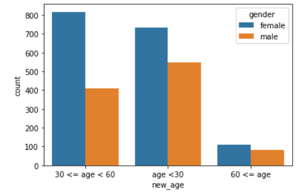

# 프로젝트 회고

1. Competition을 위한 베이스라인 작성
    - 데이터에 라벨링을 직접해줘야 하기 때문에 라벨링 작업을 먼저 해주었다.
    - VGG11 모델을 학습하여 제출해 보았는데 정확도가 11%로 너무 낮음
    - 추후 efficient net 을 통하여 오래 학습 시켜 볼 예정
2. EDA 
    - 데이터 라벨링후 비율을 살펴 보았는데 일정하지 않았다.
    - 남녀 성비는 3:5 정도, 나이대는 5:5:1.5 정도로 불균형 하였기 때문에 추후에 불균형 데이터에 대한 전처리 방법을 연구할 예정.
    
<br/>
<br/>

## 간단한 EDA 결과


```python
train_df['gender'].value_counts()
```

```
female    1658  
male      1042  
Name: gender, dtype: int64  
```

```python
def func(num):
    if num < 30:
        return 'age <30'
    elif num<60 :
        return '30 <= age < 60'
    else :
        return '60 <= age'

train_df['new_age'] = train_df['age'].apply(lambda x : func(x))
train_df['new_age'].value_counts()
```

```
age < 30           1281  
30 <= age < 60     1227  
60 <= age          192  
Name: new_age, dtype: int64
```

```python
import seaborn as sns

sns.countplot(x = 'new_age',data =train_df, hue  = 'gender')
```
