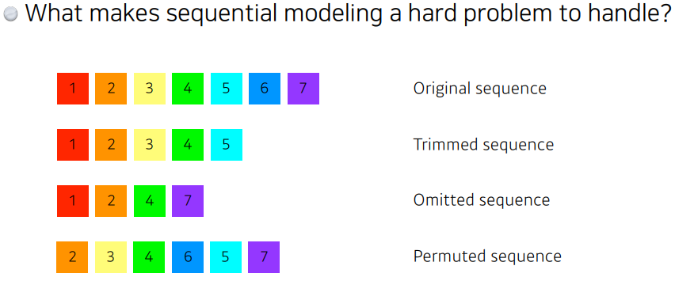
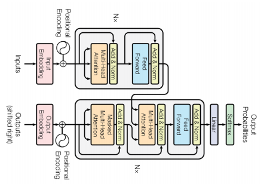
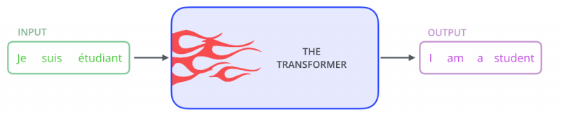
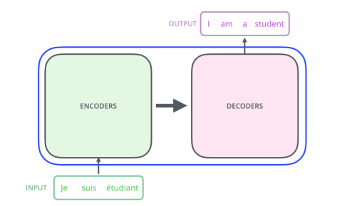
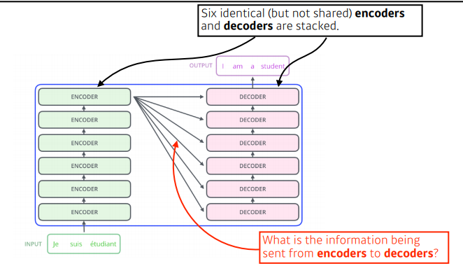
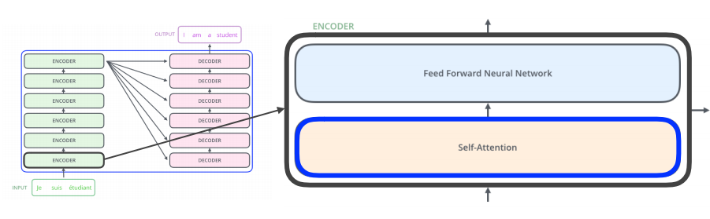
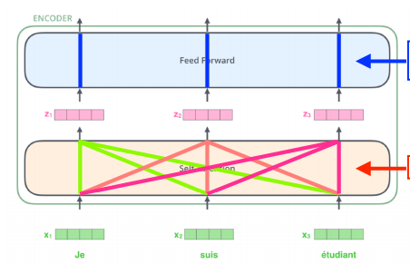
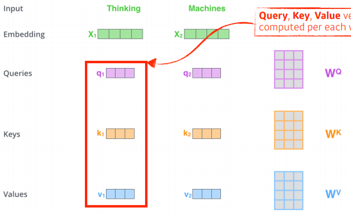
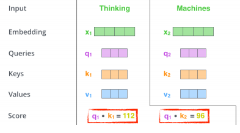
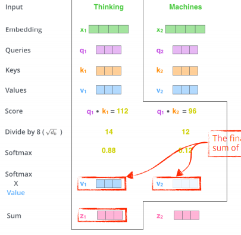

## Transformer
---

### Sequence model의 문제점


- 중간에 어떤 데이터가 빠지거나, 순서가 바뀌면 학습이 어려움 .




- sequence를 다루는 모델인데 attention 구조를 활용한 모델이다. 


- nlp에만 사용되지 않고 다양하게 사용됨 .



- 어떤 문장이 주어지면 그걸 다른 문장으로 바꾸는거 -> 영어를 한글로 번역 하는 거같이




- 입력은 3개의 단어 출력은 4개의 단어
- 입력 시퀀스와 출렧 ㅣ퀀스의 갯수가 다를 수있고 도메인도 다를 수있다.
- 모델은 한개 
- 원래 ㅇRNN 모델은 세개의 단억 ㅏ들어가면 3번 돌아감
- 그러나 trans 는 n개 단어를 한번에 돌림


- n개의 단어가 어떻게 인코더에서 한번에 처리 ?
- 인코더와 디코더 사이에 어떤 정보를 주고 받는지 ?
- 디코더가 어떻게 generation 할수 있는지 ?


- 인코더를 보면 n개의 단어가 들어감
- 한개의 인코더가 self랑 feed 두개로 나누어져있고 그림과 같이 인코더가 쭉쭉 스택됨.
- ```self-attention``` : 이 transfomrer가 왜잘되는지 알 수 있음. 


먼저 3개의 단어가 들어감 -> 3개의 벡터가 있겟지
self-attention 세개의 단어가 주어지면 각 단어의 벡터를 찾아줌


n개의 단어가 주어지면 n-1개의 벡터를 같이 고려해서 zi로 바꿈

self-attention은 


하나의 단어가 주어졌을때 기본적으로 3가지 벡터를 만들어냄 각각의 nn을 통해 ,그게 Querise,Keys,Values임
이 세개의 벡터를 통해 x1이라는 임베딩 벡터를 새로운 벡터로 바꿀것임






score 벡터를 만들어
내가인코딩을 하고자하는 벡터의 쿼리 벡터와 자기 자신을 포함한 나머지 n개의 단어에대한 key 벡터를 내적함
어떤 단어와 interationc 이자주 일어나야되는지 파악 ?
그래서 score 가나오면 normallize 함 

그리고나서 정규화된 score 벡터를 softmax 함수에 넣어줌 .
최종적으로 사용할 값은 각각의 단어에서 나오는 value  * score를 사용.
이렇게하면 하나의 단어에 대한 인코딩 벡터가 나옴 


학습단계에서는 마스킹을 하는데 이전단어만 디펜던듵하고 뒤에있는 단어들에대해서는 디펜던트 하지 않게 하는거


## Vision Transformer
---
이미지 분류를 할때 활용 .
이미지를 특정 영역으로 나눔 ->  인코더만 활용.


```python

```


```python

```


```python

```
