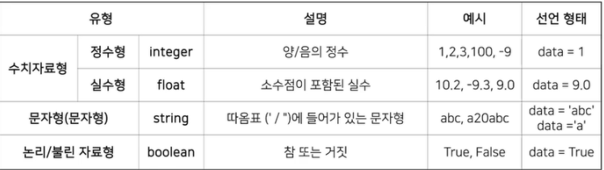
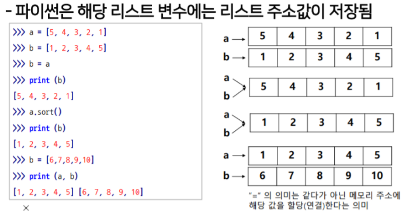
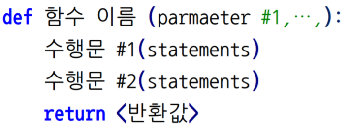
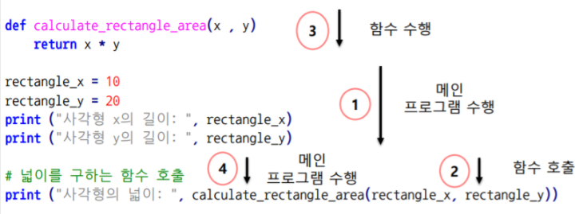
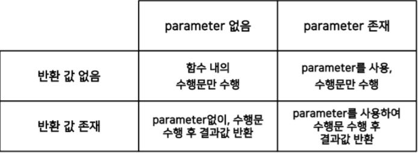
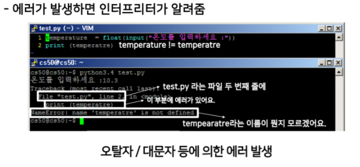
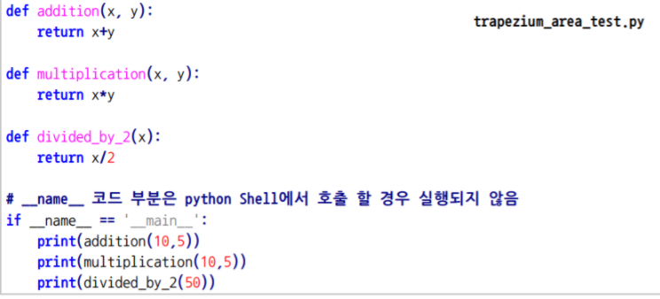
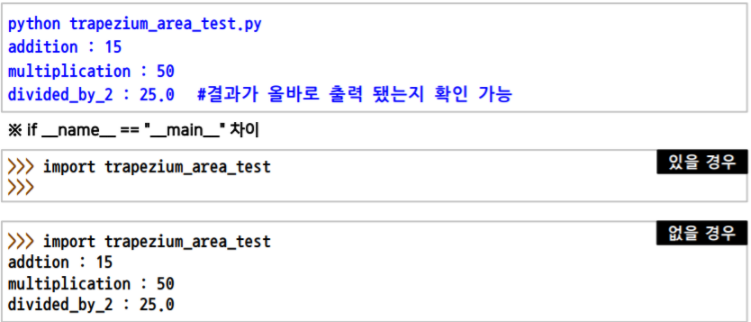
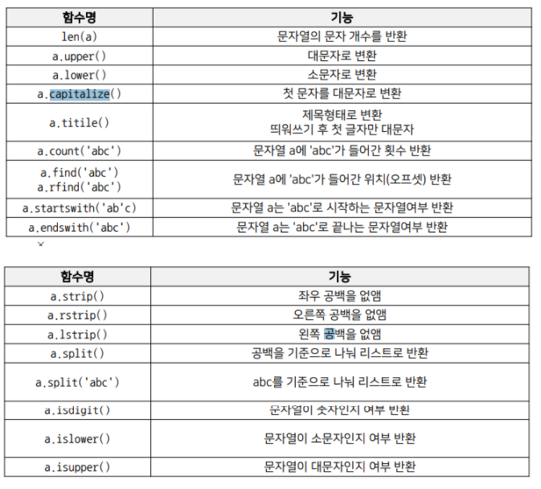
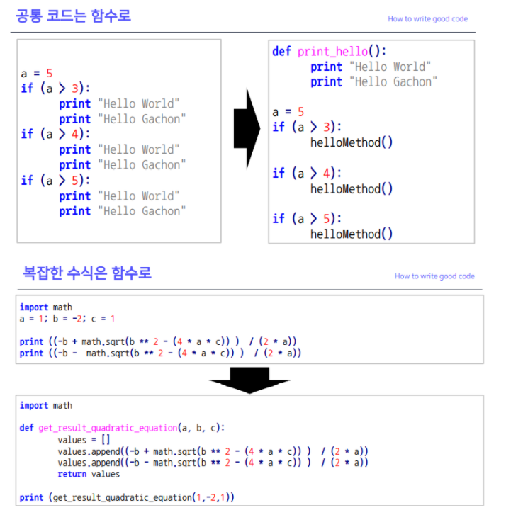

# 강의 복습


## 변수
---
- 가장 기초적인 프로그래밍 문법 개념
- 데이터(값)을 저장하기 위한 메모리 공간의 프로그래밍상 이름


```python
a = 5
b = 3
print(a + 5)
```

    10
    

a = 'b' 의 의미는
**a 에 b를 넣어라** 이다.  
정확히는 a라는 변수에 'b'라는 값을 넣으라는 의미.

프로그래밍에서 변수는 **값을 저장하는 장소**이고  
변수는 **메모리 주소**를 가지고 있고 변수에 들거나느 **값**은 **메모리 주소**에 할당됨

### 변수이름 작성법
---
- 알파벳, 숫자, 언더스코어(_) 로 선언 가능
    - ex) data = 0, _a12 = 2, _gg = 'afdf’  
      
      
- 변수명은 의미 있는 단어로 표기하는 것이 좋다
    - ex) professor_name = 'Sungchul Choi’
- 변수명은 대소문자가 구분된다.
    - ex) ABC와 Abc는 같지 않다
- 특별한 의미가 있는 예약어는 쓰지 않는다.
    - ex) for, if, else 등 

### Basic Operation (간단한 연산)
---
- 복잡한 프로그램을 작성하기 앞서 간단한 사칙연산과 문자열 처리등의 기초적 연산을 알아야함
    - 기본자료형
    - 연산자와 피연산자
    - 데이터 형번환

### 기본 자료형
---


### Dynamic Typing
---
- 코드 실행시점에 데이터의 Type을 결정하는 방법
- 자료형을 조금 늦게 선언하므로 인터프린터 언어가 속도가 좀 느리다.

### 연산자와 피연산자
---


- +,-,*,/ 같은 기호들을 연산자라고 칭함
- 연산자에 의해 계산이 되는 수자들을 피연산자라 칭함
- '3+2' 에서 3과 2는 피연산자, +는 연산자임
- 수식에서 연산자의 역할은 수학에서 연산자와 동일
- 연산의 순서는 수학에서 연산 순서와 같음
- 문자간에도 + 연산이 가능 - > concatenate

### 데이터 형 변환 : 정수형<-> 실수형
---


```python
a = 10.7
b = 10.3
a = int(a)  # a를 정수형으로 형변환
b = int(b)  # b를 정수형으로 형변환
print(a+b)
print(a)
print(b)
```

    20
    10
    10
    

### 데이터 형 변환 : 문자열<-> 숫자
---


```python
a = '76.3'
b = float(a)   # a를 실수형으로 형 변환 후 b에 할당

print(a)       # a 값 출력

print(b)       # b 값 출력

print(a+b)     # a와 b를 더함 
               #그러나 문자열 숫자열의 덧셈불가로에러발생
```

    76.3
    76.3
    


    ---------------------------------------------------------------------------

    TypeError                                 Traceback (most recent call last)

    <ipython-input-6-750e04ce0f1d> in <module>
          6 print(b)       # b 값 출력
          7 
    ----> 8 print(a+b)     # a와 b를 더함
          9                #그러나 문자열 숫자열의 덧셈불가로에러발생
    

    TypeError: can only concatenate str (not "float") to str


### List 또는 Array
---
- 시퀀스 자료형, 여러 데이터들의 집합
- int, float 같은 다양한 데이터 타입 포함


### List의 특징
---


**인덱싱**
- list에 있는 값들은 주소 값을 가짐
    - 주소를 사용해 할당된 값을 호출


```python
colors = ['red','blue','green']
print(colors[0])
print(colors[1])
print(len(colors)) #  리스트의 길이
```

    red
    blue
    3
    

**슬라이싱**
- list의 값들을 잘라서 쓰는 것이 슬라이싱
- list의 주소 값을 기반으로 부분 값을 반환


```python
cities = ['서울', '부산', '인천', '대구', '대전', '광주', '울산', '수원']
print(cities[0:6], " AND ", a[-9:])  # a 번수의 0부터 5까지, -9부터 끝까지
print(cities[:])  # a변수의 처음부터 끝까지
print(cities[-50:50])  # 범위를 넘어갈 경우 자동으로 최대 범위를 지정
print(cities[::2], " AND ", a[::-1])  # 2칸 단위로, 역으로 슬라이싱
```

    ['서울', '부산', '인천', '대구', '대전', '광주']  AND  76.3
    ['서울', '부산', '인천', '대구', '대전', '광주', '울산', '수원']
    ['서울', '부산', '인천', '대구', '대전', '광주', '울산', '수원']
    ['서울', '인천', '대전', '울산']  AND  3.67
    

**리스트의 연산**
- concatenation,is_in,연산 함수들


```python
color = ['red', 'blue', 'green']
color2 = ['orange', 'black', 'white']
print(color + color2)  # 두 리스트 합치기

print(len(color))  # 리스트 길이

color[0] = 'yellow'  # 0번째 리스트의 값을 변경
print(color * 2)  # color 리스트 2회 반복

print('blue' in color2)  # 문자열 ‘blue‘가 color2 존재 여부 반환

total_color = color + color2
print(total_color)    # concatenation
```

    ['red', 'blue', 'green', 'orange', 'black', 'white']
    3
    ['yellow', 'blue', 'green', 'yellow', 'blue', 'green']
    False
    ['yellow', 'blue', 'green', 'orange', 'black', 'white']
    

**리스트의 연산-추가와 삭제**
---
append, extend, insert, remove, del 등 활용


```python
color.append("white") # 리스트에 “white” 추가
color.extend(["black","purple"]) # 리스트에 새로운 리스트 추가
color.insert(0,"orange") # 0번째 주소에 “orange” 추가
print (color)

['orange', 'yellow', 'blue', 'green', 'white', 'black', 'purple']
color.remove("white") # 리스트에 “white” 삭제
print (color)
del color[0] # 0번째 주소 리스트 객체 삭제
print (color)
```

    ['orange', 'yellow', 'blue', 'green', 'black', 'purple', 'white', 'black', 'purple']
    ['orange', 'yellow', 'blue', 'green', 'black', 'purple', 'black', 'purple']
    ['yellow', 'blue', 'green', 'black', 'purple', 'black', 'purple']
    

### python 리스트만의 특징
---
- 다양한 Data Type가 하나의 List에 들어감


```python
a = ['color',1,0.2]
```




```python
a= [5,4,3,2,1]
b= a[:] # 복사 
print(a)
print(b)
```

    [5, 4, 3, 2, 1]
    [5, 4, 3, 2, 1]
    

### 패킹과 언패킹
---
- 패킹 : 한 변수에 여러 개의 데이터를 넣는것
- 언패킹 : 한 번수의 데이터를 각각의 변수로 반환


```python
t =[1,2,3] # 1,2,3 을 변수 t에패킹
a,b,c = t # t에 있는 값 1,2,3 을 변수 a, b, c에 언패킹
print(t,a,b,c)
```

### 이차원 리스트
-리스트 안에 리스트를 만들어 행렬 생성


```python
kor_score = [49,79,20,100,80]
math_score = [43,59,85,30, 90]
eng_score = [49,79,48,60,100]
midterm_score = [kor_score, math_score, eng_score]
print (midterm_score[0][2])
```

    20
    

**이차원 리스트 복사**


```python
import copy

midterm_copy = copy.deepcopy(midterm_score)
midterm_copy
```


    [[49, 79, 20, 100, 80], [43, 59, 85, 30, 90], [49, 79, 48, 60, 100]]


```python
midterm_copy[0][0] = 100
midterm_copy
```


    [[100, 79, 20, 100, 80], [43, 59, 85, 30, 90], [49, 79, 48, 60, 100]]


```python
midterm_score
```


    [[49, 79, 20, 100, 80], [43, 59, 85, 30, 90], [49, 79, 48, 60, 100]]


## Function 
---
- 어떤 일을 수행하는 코드의 덩어리
- 반복적인 수행을 1회만 작성후 호출
- 코드를 논리적인 단위로 분리
- 캡슐화 : 인터페이스만 알면 타인의 코드 사용


```python
# 사각형의 넓이를 구하는 함수
def calculate_rectangle_area(x,y):
    return x*y
```

**함수 선언 문법**
- 함수이름, parameter, indentation, return value(optional)  



### 함수 선언 예시
---


```python
def func(x,y):
    return x*y

rect_x = 10
rect_y = 20
print('사각형의 넓이 :', func(rect_x,rect_y))
```

    사각형의 넓이 : 200
    

### 함수 수행 순서
---
- 함수 부분을 제외한 메인프로그램부터 시작
- 함수 호출 시 함수 부분을 수행후 되돌아옴  
  


### parameter vs argument
---
- parameter : 함수의 입력 값 인터페이스
- argument : 실제 Parameter에 대입된 값


```python
def f(x) :
    return 2*x+7

print(f(2))
```

    11
    

## 함수형태
- Parameter 유무, 반환 값 유무에 따라 함수의 형태가 다름  


## Console I/O
---

### 콘솔창 입력 - input
--- 
input() 함수는 콘솔창에서 문자열을 입력받는 함수


```python
print ("Enter your name:")
somebody = input() # 콘솔창에서 입력한 값을 somebody에 저장
print ("Hi", somebody, "How are you today?")
```

    Enter your name:
    hyup
    Hi hyup How are you today?
    

### 콘솔창 출력 - print
---
- 콤마(,)를 사용할 경우 print문이 연결됨


```python
print('abc','def') #실행시 두 문장이 연결되어 출력(중간에 공백추가됨)
```

    abc def
    

- 숫자 입력 받기


```python
temperature = float(input("온도를 입력하세요 :")) # 입력 시 바로 형 변환 하기
print('온도는 ? ' ,temperature)
```

    온도를 입력하세요 :20
    온도는 ?  20.0
    

## print formatting
---
- 프린트문은 기본적인 출력외에 출력의 양식을 형식을 지정가능

**old-school formatting**
: 일반적으로 &-format과 str.format()함수를 사용함


```python
print('%s %s' % ('one', 'two'))
print('{} {}'.format('one', 'two'))
print('%d %d' % (1, 2))
print('{} {}'.format(1, 2))
```

    one two
    one two
    1 2
    1 2
    

**% - format**  
    
  : '%datatype' % (variable) 형태로 출력 양식을 표현


```python
print('I eat %d apples.'%3)
print('I eat %s apples.'%'five')

number = 3 ; day = 'three'
print('I ate %d apples. I was sick for %s days.'%(number,day))

print("Product: %s, Price per unit: %f." % ("Apple", 5.243))
```

    I eat 3 apples.
    I eat five apples.
    I ate 3 apples. I was sick for three days.
    Product: Apple, Price per unit: 5.243000.
    


```python
print("Product: %10s, Price per unit: %10.1f." % ("Apple", 5.243))
```

    Product:      Apple, Price per unit:        5.2.
    

**str.format() 함수**


```python
age = 40
name= 'hyup'
print(" I'm {0} years old.".format(age))
```

     I'm 40 years old.
    


```python
print(" My name is {0} and {1} years old.".format(name,age))
```


```python
print(" My name is {0} and {1} years old.".format(name,age))
```

**pading**


```python
print("Product: %5s, Price per unit: %.5f." % ("Apple", 5.243))
print("Product: {0:5s}, Price per unit: {1:.5f}.".format("Apple", 5.243))
print("Product: %10s, Price per unit: %10.3f." % ("Apple", 5.243))
print("Product: {0:<10s}, Price per unit: {1:<10.3f}.".format("Apple", 5.243))
```

    Product: Apple, Price per unit: 5.24300.
    Product: Apple, Price per unit: 5.24300.
    Product:      Apple, Price per unit:      5.243.
    Product: Apple     , Price per unit: 5.243     .
    

**naming**


```python
print("Product: %(name)10s, Price per unit: %(price)10.5f." %
      {"name": "Apple", "price": 5.243})
```

    Product:      Apple, Price per unit:    5.24300.
    

**f-string**


```python
name = "hyup"
age = 27
print(f"Hello, {name}. You are {age}.")
print(f'{name:20}')
print(f'{name:>20}')
print(f'{name:*<20}')
print(f'{name:*>20}')
print(f'{name:*^20}')
number = 3.141592653589793
print(f'{number:.2f}')
```

    Hello, hyup. You are 27.
    hyup                
                    hyup
    hyup****************
    ****************hyup
    ********hyup********
    3.14
    

**Lab : 화씨 변환기**
---


```python
print('본 프로그램은 섭씨를 화씨로 변환해주는 프로그램입니다.')
print('변환하고 싶은 섭씨 온도를 입력해 주세요:')
cel_value = float(input())
fah_value = (9/5) * cel_value + 32
print('섭씨 온도 :', cel_value)
print('화씨 온도 : ', fah_value)
```

    본 프로그램은 섭씨를 화씨로 변환해주는 프로그램입니다.
    변환하고 싶은 섭씨 온도를 입력해 주세요:
    32.2
    섭씨 온도 : 32.2
    화씨 온도 :  89.96000000000001
    

## 조건문 
---

**if-else 문**


```python
# 학점 프로그램 개발

num = int(input())

if num >= 95 :
    score = 'A+'
elif num >= 85 :
    score = 'B+'
elif num >= 75 :
    score = 'C+'
elif num >= 65 :
    score = 'd+'
else :
    score = 'F'
print(score)
```

    95
    A+
    

**논리 키워드 사용:and, or, not**  
: 조건문을 표현할 때 집합의 논리 키워드를 함께 사용하여 참과 거짓을 판단하기도함


```python
a,b = 8,5
print(a== 8 and b==4) # 거짓
print(a> 7 or b >7)   # 참
print(not(a>7))       # 거짓
```

    False
    True
    False
    

**삼항 연산자**
---
조건문을 사용하여 참일 경우와 거짓일 경우의 결과를 한줄에 표현


```python
value=  12
is_even = True if value %2 == 0 else False
print(is_even)
```

    True
    

## [연습] 무슨 학교 다니세요 ?
---


```python
print('당신이 태어난 년도를 입력하세요')
year = int(input())
age = 2021 - year + 1 
if  age >26 :
    print('학생이 아닙니다.')
elif age>19 :
    print('대학생')
elif age > 16:
    print('중학생')
elif age > 7 :
    print('초등학생')
else :
    print('학생이 아닙니다.')
```

    당신이 태어난 년도를 입력하세요
    2020
    학생이 아닙니다.
    

## 반복문
---


```python
for i in range(0,5):
    print('hello')
```

    hello
    hello
    hello
    hello
    hello
    


```python
for i in [1,2,3,4,5]:
    print('hello')
```

    hello
    hello
    hello
    hello
    hello
    


```python
for i in 'abcdefg':
    print(i)
```

    a
    b
    c
    d
    e
    f
    g
    


```python
for i in ["americano", "latte", "frafuchino"]:
    print (i)
```

    americano
    latte
    frafuchino
    


```python
# 간격을 두고 세기
for i in range(1,10,2):
    print(i)
```

    1
    3
    5
    7
    9
    


```python
# 역순으로 반복문 수행
for i in range(10,1,-1):
    print(i)
```

    10
    9
    8
    7
    6
    5
    4
    3
    2
    

### **while문**


```python
i = 1
while i < 10:
    print(i)
    i +=1
```

    1
    2
    3
    4
    5
    6
    7
    8
    9
    

### **반복의 제어 - break, continue**


```python
for i in range(10):
    if i ==5 :
        break
    print(i)
print('EOP')
```

    0
    1
    2
    3
    4
    EOP
    


```python
for i in range(10):
    if i == 5: continue 
    print (i)
print ("EOP")
```

    0
    1
    2
    3
    4
    6
    7
    8
    9
    EOP
    

### **반복의 제어 - else**   
: 반복 조건이 만족하지 않을 경우 반복 종료시 1회 실행


```python
for i in range(10):
    print(i,)
else:
    print('EOP')
```

    0
    1
    2
    3
    4
    5
    6
    7
    8
    9
    EOP
    


```python
i = 0 
while i< 10:
    print(i,)
    i +=1
else:
    print('EOP')
```

    0
    1
    2
    3
    4
    5
    6
    7
    8
    9
    EOP
    


```python
sentence = "I love you"
reverse_sentence = ''
for char in sentence:
    reverse_sentence = char + reverse_sentence
print (reverse_sentence)
```

    uoy evol I
    

## 반복문 디버깅


```python
print ("input decimal number: ",)
decimal = int(input())
result =""
loop_counter = 0
while (decimal > 0):
    temp_decimal_input = decimal
    temp_result_input=result
    remainder = decimal % 2
    decimal = decimal // 2
    result = str(remainder) + result
    print ("-----------", loop_counter, "loop value check -------- ")
    print ("Initial decimal:", temp_decimal_input,
    ", Remainder:",remainder,
    ", Initial result", temp_result_input)
    print ("Output decimal:", decimal,
    "Output result:", result)
    print ("------------------------------------------------------")
    print ("")
    loop_counter += 1
print ("Binary number is", result)
```

    input decimal number: 
    5
    ----------- 0 loop value check -------- 
    Initial decimal: 5 , Remainder: 1 , Initial result 
    Output decimal: 2 Output result: 1
    ------------------------------------------------------
    
    ----------- 1 loop value check -------- 
    Initial decimal: 2 , Remainder: 0 , Initial result 1
    Output decimal: 1 Output result: 01
    ------------------------------------------------------
    
    ----------- 2 loop value check -------- 
    Initial decimal: 1 , Remainder: 1 , Initial result 01
    Output decimal: 0 Output result: 101
    ------------------------------------------------------
    
    Binary number is 101
    

### 가변적인 중첩 반복문
---
실제 프로그램에서는 반복문은  
**사용자의 입력에 따라 가변적으로** 반복되고  
하나의 반복이 아닌 **중복되어 반복**이 일어남  


```python
# 숫자 찾기 게임
import random # 난수 발생 함수 호출
number = random.randint(1, 100) # 1~100 사이 정수 난수 발생
print ("숫자를 맞춰보세요 (1 ~ 100)")
users_input = int(input()) # 사용자 입력을 받음
while (users_input is not number): # 사용자 입력과 난수가 같은지 판단
    if users_input > number: # 사용자 입력이 클 경우
        print ("숫자가 너무 큽니다")
    else: # 사용자 입력이 작은 경우
        print ("숫자가 너무 작습니다")
        
    users_input = int(input()) # 다시 사용자 입력을 받음
else: print ("정답입니다. ", "입력한 숫자는 ", users_input , "입니다") # 종료 조건
```

    숫자를 맞춰보세요 (1 ~ 100)
    5
    숫자가 너무 작습니다
    10
    숫자가 너무 작습니다
    20
    숫자가 너무 큽니다
    15
    숫자가 너무 작습니다
    14
    숫자가 너무 작습니다
    13
    숫자가 너무 작습니다
    16
    정답입니다.  입력한 숫자는  16 입니다
    

## 디버깅
---
- 코드의 오류를 발견하여 수정하는 과정
- 오류의 '원인'을 알고 '해결책'을 찾아야함
- 문법적 에러를 찾기 위한 에러 메시지 분석
- 논리적 에러를 찾기 위한 테스트도 중요

### 문법적 에러 메시지 분석
---



### 논리적 에러 
---
- 논리적 에러 - 뜻대로 실행이 안되는 코드
- 중간 중간  프린터 문을 찍어서 확인
- loop review 처럼 해보기 






## 문자열
---
- string은 1byte 크기로 한 글자씩 메모리 공간이 할당됨

### 문자열 특징 - 인덱싱(Indexing)
---
- 문자열의 각문자는 개별주소(offset)를 가짐
- 이 주소를 사용해 할당 된 값을 가져오는 것이 인덱싱
- List와 같은 형태로 데이터를 처리함


```python
a = 'abcde'
print(a[0],a[4])
print(a[-1],a[-5])
```

    a e
    e a
    

### 문자열 특징 -슬라이싱(Slicing)
---
: 문자열의 주소값을 기반으로 문자열의 부분값을 반환


```python
a = "Artificial Intelligence and Machine Learning"
print (a[0:6], " AND ", a[-9:]) 
print (a[:]) # a변수의 처음부터 끝까지
```

    Artifi  AND   Learning
    Artificial Intelligence and Machine Learning
    

### 문자열 함수
---



### raw string
---
특수문자 특수 기호인 \ escape 글자를 무시하고 그대로 출력함


```python
raw_string = '체크 \n 줄바꿈'
print(raw_string)
raw_string = r'체크 \n 줄바꿈'
print(raw_string)
```

    체크 
     줄바꿈
    체크 \n 줄바꿈
    

## 함수 호출 방식
---
함수에서 parameter를 전달하는 방식
1. 값에 의한 호출(Call by Value)
2. 참조에 의한 호출(Call by Reference)
3. 객체 찾모에 의한 호출(Call by Object Reference)

### Call by Value
함수에 인자를 넘길때 값만 넘김.
함수내에 인자값 변경 시, 호출자에게 영향을 주지않음

### Call by Reference
함수에 인자를 넘길때 메모리주소를 넘김.
함수내에 인자값 변경시, 호출자의 값도변경됨

### 파이썬 함수 호출 방식 – Call by Object Reference

- 파이썬은 객체의 주소가 함수로 전달되는 방식
- 전달된 객체를 참조하여 변경 시 호출자에게 영향을 주나,
- 새로운 객체를 만들 경우 호출자에게 영향을 주지 않음


```python
def spam(eggs):
    eggs.append(1) # 기존 객체의 주소값에 [1] 추가
    eggs = [2, 3] # 새로운 객체 생성
ham = [0]
spam(ham)
print(ham) # [0, 1]
```

    [0, 1]
    

## function type hints
---
- 파이썬의 가장 큰 특징 – dynamic typing
- 처음 함수를 사용하는 사용자가 interface를 알기 어렵다는 단점이 있음
- python 3.5 버전 이후로는 PEP 484에 기반하여 type hints 기능 제공

### Type hints의 장점
---
1. 사용자에게 인터페이스를 명확히 알려줄 수 있다.
2. 함수의 문서화시 parameter에 대한 정보를 명확히 알 수 있다.
3. mypy 또는 IDE, linter 등을 통해 코드의 발생 가능한 오류를 사전에 확인
4. 시스템 전체적인 안정성을 확보할 수 있다.

## docstring
---
- 파이썬 함수에 대한 상세스펙을 사전에 작성  -> 함수 사용자의 이행도 UP
- 세개의 따옴표로 docstring 영역 표시(함수명 아래)

## 함수 개발가이드라인
---

- 함수는 가능하면 짧게 작성할 것 (줄 수를 줄일 것)  
- 함수 이름에 함수의 역할, 의도가 명확히 들어낼 것


```python
def print_hello_world():
    print("Hello, World")
def get_hello_world():
    return ("Hello, World")
```

**하나의 함수에는 유사한 역할을 하는 코드만 포함**


```python
def add_variables(x,y):
    return x + y
def add_variables(x,y):
    print (x, y)
    return x + y
```

### 함수는 언제 만드는가 ?
---
- 공통적으로 사용되는 코드는 함수로 변환
- 복잡한 수식 → 식별 가능한 이름의 함수로 변환
- 복잡한 조건 → 식별 가능한 이름의 함수로 변환


